# OCR Image Recognition Architecture Documentation

## Overview
PrepSense uses OpenAI's Vision API (GPT-4 Vision) for OCR and image recognition functionality to process receipts and pantry item images. The system supports two main workflows:

1. **Receipt Scanning** - Extract grocery items from shopping receipts
2. **Pantry Image Scanning** - Identify individual pantry items from product photos

## Architecture Components

### 1. Core API Routes

#### OCR Router (`/backend_gateway/routers/ocr_router.py`)
Main router for OCR functionality with three primary endpoints:

##### POST `/api/v1/ocr/scan-receipt`
**Function**: `scan_receipt(request: OCRRequest, pantry_manager: PantryItemManagerEnhanced)`
**Purpose**: Process receipt images to extract grocery items
- **Parameters**:
  - `request`: OCRRequest containing image_base64, user_id, mime_type
  - `pantry_manager`: Dependency injection of PantryItemManagerEnhanced
- **Expected Input**:
  ```json
  {
    "image_base64": "base64_encoded_image_string",
    "user_id": 111,
    "mime_type": "image/jpeg"  // optional
  }
  ```
- **Expected Output**:
  ```json
  {
    "success": true,
    "items": [
      {
        "name": "Milk",
        "quantity": 1.0,
        "unit": "gallon",
        "price": 3.99,
        "category": "Dairy"
      }
    ],
    "raw_text": "original receipt text",
    "message": "Successfully extracted 15 items from receipt"
  }
  ```
- **Call Flow**:
  1. `get_openai_client()` → Gets OpenAI client singleton
  2. `client.chat.completions.create()` → Calls OpenAI Vision API
  3. `pantry_manager.categorization_service.categorize_item()` → Categorizes each item
  4. Returns `OCRResponse` model

##### POST `/api/v1/ocr/scan-items`
**Function**: `scan_items(request: ScanItemRequest, pantry_manager: PantryItemManagerEnhanced)`
**Purpose**: Identify individual pantry items from product images
- **Parameters**:
  - `request`: ScanItemRequest with image_base64, user_id, scan_type, mime_type
  - `pantry_manager`: Dependency injection
- **Expected Input**:
  ```json
  {
    "image_base64": "base64_encoded_image_string",
    "user_id": 111,
    "scan_type": "pantry_item",
    "mime_type": "image/jpeg"
  }
  ```
- **Expected Output**:
  ```json
  {
    "success": true,
    "items": [
      {
        "name": "Oreo Cookies",
        "quantity": 1.0,
        "unit": "package",
        "category": "Snacks",
        "brand": "Oreo",
        "product_name": "Oreo Original Cookies",
        "expiration_date": "2024-03-15"
      }
    ],
    "message": "Successfully identified 1 item(s)"
  }
  ```
- **Call Flow**:
  1. `optimize_image()` → Optimizes large images
  2. `get_mime_type()` → Detects MIME type
  3. `get_openai_client()` → Gets client
  4. `client.chat.completions.create()` → Vision API call
  5. `pantry_manager.categorization_service.categorize_item()` → Categorization

##### POST `/api/v1/ocr/add-scanned-items`
**Function**: `add_scanned_items(items: List[ParsedItem], user_id: int, pantry_manager: PantryItemManagerEnhanced)`
**Purpose**: Add OCR-detected items to user's pantry
- **Parameters**:
  - `items`: List of ParsedItem objects
  - `user_id`: User ID (default 111)
  - `pantry_manager`: Dependency injection
- **Expected Input**:
  ```json
  [
    {
      "name": "Bananas",
      "quantity": 5,
      "unit": "each",
      "category": "Produce"
    }
  ]
  ```
- **Expected Output**:
  ```json
  {
    "success": true,
    "added_count": 3,
    "total_count": 3,
    "results": [
      {
        "item": "Bananas",
        "success": true,
        "message": "Added successfully"
      }
    ],
    "message": "Added 3 out of 3 items to pantry"
  }
  ```
- **Call Flow**:
  1. `pantry_manager.smart_add_item()` → For each item
  2. Returns aggregated results

#### Images Router (`/backend_gateway/routers/images_router.py`)
Handles pantry image uploads and vision-based detection:

##### POST `/api/v1/images/upload`
**Function**: `upload_image(file: UploadFile, vision_service: VisionService)`
**Purpose**: Process pantry images to detect multiple items
- **Parameters**:
  - `file`: UploadFile from FastAPI
  - `vision_service`: Dependency injection of VisionService
- **Expected Input**: Multipart form data with image file
- **Expected Output**:
  ```json
  {
    "pantry_items": [
      {
        "item_name": "Rice",
        "quantity_amount": 5.0,
        "quantity_unit": "lb bag",
        "category": "Pantry",
        "count": 1,
        "expected_expiration": "2025-01-23"
      }
    ]
  }
  ```
- **Call Flow**:
  1. `vision_service.process_image(file)` → Convert to base64
  2. `vision_service.classify_food_items()` → OpenAI Vision API
  3. `vision_service.parse_openai_response()` → Parse JSON response
  4. Returns detected items

##### POST `/api/v1/images/save-detected-items`
**Function**: `save_detected_items(request: SaveItemsRequest, pantry_manager: PantryItemManager)`
**Purpose**: Save vision-detected items to pantry
- **Parameters**:
  - `request`: SaveItemsRequest with items and user_id
  - `pantry_manager`: Dependency injection
- **Expected Input**:
  ```json
  {
    "items": [
      {
        "item_name": "Pasta",
        "quantity_amount": 1.0,
        "quantity_unit": "box",
        "expected_expiration": "2025-12-31",
        "category": "Pantry",
        "brand": "Barilla"
      }
    ],
    "user_id": 111
  }
  ```
- **Expected Output**:
  ```json
  {
    "success": true,
    "added_items": 1,
    "total_items": 1,
    "failed_items": 0,
    "message": "Successfully added 1 items to pantry"
  }
  ```

### 2. Service Layer

#### Vision Service (`/backend_gateway/services/vision_service.py`)
Core service for OpenAI Vision API integration:

##### Class: `VisionService`
**Constructor**: `__init__(self)`
- Initializes with OpenAI client from `get_openai_client()`
- Raises `ValueError` if client initialization fails

**Methods**:

###### `async process_image(self, file) -> Tuple[str, Optional[str]]`
- **Purpose**: Converts uploaded images to base64
- **Parameters**: 
  - `file`: UploadFile object from FastAPI
- **Returns**: Tuple of (base64_image_string, content_type)
- **Called by**: `upload_image()` in images_router.py

###### `classify_food_items(self, base64_image: str, content_type: Optional[str]) -> str`
- **Purpose**: Sends images to OpenAI Vision API with detailed prompts
- **Parameters**:
  - `base64_image`: Base64 encoded image string
  - `content_type`: MIME type (e.g., "image/jpeg")
- **Returns**: Raw JSON string from OpenAI
- **Internal Calls**:
  - `self.client.chat.completions.create()` → OpenAI API
- **Called by**: `upload_image()` in images_router.py

###### `parse_openai_response(self, response_text: str) -> List[Dict[str, Any]]`
- **Purpose**: Extracts structured data from API responses
- **Parameters**:
  - `response_text`: Raw text response from OpenAI
- **Returns**: List of parsed pantry items
- **Features**:
  - Handles markdown code blocks
  - Consolidates duplicate items
  - Parses quantities and units
- **Called by**: `upload_image()` in images_router.py

#### Receipt Scanner Service (`/backend_gateway/services/receipt_scanner_service.py`)
Specialized service for receipt processing:

##### Class: `ReceiptScannerService`
**Constructor**: `__init__(self)`
- Gets OpenAI API key from environment
- Initializes OpenAI client
- Raises `ValueError` if API key not configured

**Methods**:

###### `async scan_receipt(self, image_data: str) -> Dict[str, Any]`
- **Purpose**: Process receipt images with AI agent
- **Parameters**:
  - `image_data`: Base64 encoded image data
- **Returns**: Dict with success status, extracted data, and item count
- **Internal Calls**:
  - `self.client.beta.chat.completions.parse()` → Structured output
- **Response Format**:
  ```python
  {
    "success": True,
    "data": {
      "store_name": "Walmart",
      "date": "2024-01-15",
      "total": 45.67,
      "items": [...]
    },
    "items_count": 15
  }
  ```

###### `async add_items_to_pantry(self, user_id: int, items: List[Dict[str, Any]]) -> Dict[str, Any]`
- **Purpose**: Add extracted items to user's pantry
- **Parameters**:
  - `user_id`: User ID
  - `items`: List of items to add
- **Returns**: Dict with added/skipped items
- **Internal Calls**:
  - `PantryService().add_item()` → For each item
- **Note**: Currently unused in favor of OCR router's add-scanned-items

#### Pantry Item Manager Enhanced (`/backend_gateway/services/pantry_item_manager_enhanced.py`)
Enhanced pantry management with categorization:

##### Class: `PantryItemManagerEnhanced(PantryItemManager)`
**Constructor**: `__init__(self, db_service)`
- Inherits from PantryItemManager
- Initializes:
  - `self.food_service`: FoodDatabaseService
  - `self.unit_service`: UnitValidationService

**Methods**:

###### `async add_items_batch_enhanced(self, user_id: int, items: List[Dict[str, Any]]) -> Dict[str, Any]`
- **Purpose**: Batch add with categorization
- **Parameters**:
  - `user_id`: User ID
  - `items`: List of item dicts with item_name, quantity_amount, quantity_unit, etc.
- **Returns**: Enhanced result dict with categorization info
- **Internal Calls**:
  - `self.get_or_create_pantry()` → Get pantry ID
  - `self._process_item_with_categorization()` → For each item (parallel)
  - `self.add_items_batch()` → Parent method for saving
- **Called by**: Not currently used directly (future enhancement)

###### `async _process_item_with_categorization(self, item: Dict[str, Any]) -> Dict[str, Any]`
- **Purpose**: Process single item with categorization and unit validation
- **Parameters**:
  - `item`: Dict with item details
- **Returns**: Enhanced item dict
- **Internal Calls**:
  - `self.food_service.categorize_food_item()` → Categorization
  - `self.unit_service.validate_unit()` → Unit validation

###### `async smart_add_item(self, user_id: int, item_description: str) -> Dict[str, Any]`
- **Purpose**: Parse natural language item description and add to pantry
- **Parameters**:
  - `user_id`: User ID
  - `item_description`: Natural language like "2 gallons of milk"
- **Returns**: Result dict
- **Called by**: `add_scanned_items()` in ocr_router.py

### 3. Supporting Services

#### Practical Food Categorization Service (`/backend_gateway/services/practical_food_categorization.py`)
Intelligent food categorization using patterns and APIs:

##### Class: `PracticalFoodCategorizationService`
**Constructor**: `__init__(self, db_service=None)`
- Initializes SpoonacularService
- Sets up in-memory cache
- Loads category patterns

**Methods**:

###### `async categorize_item(self, item_name: str, brand: Optional[str] = None) -> Dict[str, Any]`
- **Purpose**: Main categorization method
- **Parameters**:
  - `item_name`: Food item name
  - `brand`: Optional brand name
- **Returns**: Dict with success, category, allowed_units, default_unit, confidence
- **Called by**: 
  - `scan_receipt()` in ocr_router.py
  - `scan_items()` in ocr_router.py

**Category Patterns**:
- `produce_countable`: Apples, bananas, eggs → units: each, piece, bag
- `produce_measurable`: Lettuce, berries → units: cup, bunch, bag
- `liquids`: Milk, juice, oil → units: ml, cup, gallon
- `dry_goods`: Flour, rice, pasta → units: cup, lb, bag
- `meat_seafood`: Chicken, beef, fish → units: lb, oz, piece

#### OpenAI Client (`/backend_gateway/core/openai_client.py`)
Centralized OpenAI client management:

##### Functions:

###### `get_openai_client() -> OpenAI`
- **Purpose**: Get or create singleton OpenAI client
- **Returns**: Configured OpenAI client instance
- **Internal Calls**:
  - `get_openai_api_key()` → From config_utils.py
- **Called by**:
  - `VisionService.__init__()`
  - `scan_receipt()` in ocr_router.py
  - `scan_items()` in ocr_router.py
- **Raises**: ValueError if API key not configured

###### `reset_client()`
- **Purpose**: Reset client instance (for testing)
- **Called by**: Test suites

### 4. Data Models (Pydantic)

#### OCR Models (`ocr_router.py`)

```python
class OCRRequest(BaseModel):
    image_base64: str
    user_id: int = 111
    mime_type: Optional[str] = None

class ScanItemRequest(BaseModel):
    image_base64: str
    user_id: int = 111
    scan_type: str = "pantry_item"
    mime_type: Optional[str] = None

class ParsedItem(BaseModel):
    name: str
    quantity: float = 1.0
    unit: str = "each"
    price: Optional[float] = None
    category: Optional[str] = None
    barcode: Optional[str] = None
    brand: Optional[str] = None
    product_name: Optional[str] = None
    nutrition_info: Optional[Dict[str, Any]] = None
    expiration_date: Optional[str] = None

class OCRResponse(BaseModel):
    success: bool
    items: List[ParsedItem]
    raw_text: Optional[str] = None
    message: str
```

#### Receipt Scanner Models (`receipt_scanner_service.py`)

```python
class GroceryItem(BaseModel):
    name: str
    quantity: Optional[float] = 1
    unit: Optional[str] = None
    price: Optional[float] = None
    category: Optional[str] = None

class ReceiptData(BaseModel):
    store_name: Optional[str] = None
    date: Optional[str] = None
    items: List[GroceryItem] = []
    total: Optional[float] = None
```

#### Image Processing Models (`images_router.py`)

```python
class DetectedItem(BaseModel):
    item_name: str
    quantity_amount: float
    quantity_unit: str
    expected_expiration: str
    category: Optional[str] = "Uncategorized"
    brand: Optional[str] = "Generic"

class SaveItemsRequest(BaseModel):
    items: List[DetectedItem]
    user_id: int = 111
```

## Workflow Details

### Receipt Scanning Workflow

1. **Image Reception**:
   - Frontend sends base64-encoded receipt image
   - Image size validation (max 10MB)
   - MIME type detection

2. **OpenAI Processing**:
   - Custom prompt for receipt extraction
   - Model: `gpt-4o-mini`
   - Temperature: 0.1 (for consistency)
   - Max tokens: 1000

3. **Data Extraction**:
   - Store name, date, total
   - Line items with quantities and prices
   - Automatic categorization
   - Unit standardization

4. **Post-Processing**:
   - Clean product names
   - Map units (e.g., "lb" → "pound")
   - Calculate expiration dates by category
   - Filter non-food items

### Pantry Image Scanning Workflow

1. **Image Optimization**:
   - Resize large images (max 1024x1024)
   - Convert formats if needed
   - Optimize quality (85%)

2. **Vision Analysis**:
   - Model: `gpt-4-vision-preview`
   - High detail mode for product recognition
   - Extract: brand, product name, size, category

3. **Item Processing**:
   - Consolidate duplicate items
   - Parse quantities from text
   - Validate units per category
   - Generate expiration dates

4. **Database Integration**:
   - Check for existing products
   - Create/update product records
   - Link to user's pantry
   - Track quantities and expiration

## Key Features

### Image Processing
- Support for JPEG, PNG, WEBP, HEIC formats
- Automatic image optimization
- Base64 encoding/decoding
- Size limits and validation

### AI Integration
- GPT-4 Vision for accurate OCR
- Structured output parsing
- Custom prompts per use case
- Error handling and retries

### Data Quality
- Intelligent categorization
- Unit validation and conversion
- Duplicate detection
- Expiration date calculation

### Performance
- Parallel categorization
- In-memory caching
- Batch operations
- Optimized database queries

## Error Handling

### API Errors
- OpenAI authentication errors → 401
- API timeouts → 504
- Rate limits → 429
- Invalid images → 400

### Processing Errors
- JSON parsing failures → Fallback parsing
- Categorization failures → Default category
- Unit conversion errors → Keep original

### Database Errors
- Connection failures → 500
- Constraint violations → 400
- Transaction rollbacks → Retry logic

## Expected Outcomes

### Receipt Scanning
- Extract 10-50 items per receipt
- 90%+ accuracy on item names
- Proper categorization
- Correct quantity/unit parsing

### Pantry Scanning
- Identify 1-10 items per image
- Brand and product recognition
- Size/quantity extraction
- Appropriate unit assignment

### Data Storage
- Items saved to pantry_items table
- Products linked properly
- Quantities tracked accurately
- Expiration dates calculated

## Complete Call Flow Diagrams

### Receipt Scanning Call Flow

```
Frontend (iOS App)
    |
    v
POST /api/v1/ocr/scan-receipt
    |
    v
scan_receipt() [ocr_router.py:103]
    |
    ├─> get_openai_client() [openai_client.py:13]
    |      └─> get_openai_api_key() [config_utils.py]
    |
    ├─> client.chat.completions.create() [OpenAI API]
    |      └─> Model: gpt-4o-mini
    |
    ├─> For each item in response:
    |      └─> pantry_manager.categorization_service.categorize_item() [practical_food_categorization.py:331]
    |
    └─> Return OCRResponse

Optional: Add items to pantry
    |
    v
POST /api/v1/ocr/add-scanned-items
    |
    v
add_scanned_items() [ocr_router.py:269]
    |
    └─> For each item:
         └─> pantry_manager.smart_add_item() [pantry_item_manager_enhanced.py]
              └─> Add to database
```

### Pantry Image Scanning Call Flow

```
Frontend (iOS App)
    |
    v
POST /api/v1/images/upload
    |
    v
upload_image() [images_router.py:48]
    |
    ├─> vision_service.process_image(file) [vision_service.py:36]
    |      └─> Convert to base64
    |
    ├─> vision_service.classify_food_items() [vision_service.py:46]
    |      ├─> get_openai_client() [openai_client.py:13]
    |      └─> client.chat.completions.create() [OpenAI API]
    |             └─> Model: gpt-4o
    |
    └─> vision_service.parse_openai_response() [vision_service.py:130]
         └─> Return pantry_items list

Save detected items:
    |
    v
POST /api/v1/images/save-detected-items
    |
    v
save_detected_items() [images_router.py:81]
    |
    └─> pantry_manager.add_items_batch() [pantry_item_manager.py]
         └─> Batch insert to database
```

### Alternative OCR Item Scanning Flow

```
Frontend (iOS App)
    |
    v
POST /api/v1/ocr/scan-items
    |
    v
scan_items() [ocr_router.py:346]
    |
    ├─> optimize_image() [ocr_router.py:44]
    |      └─> Resize and compress if needed
    |
    ├─> get_mime_type() [ocr_router.py:31]
    |
    ├─> get_openai_client() [openai_client.py:13]
    |
    ├─> client.chat.completions.create() [OpenAI API]
    |      └─> Model: gpt-4-vision-preview
    |
    └─> For each detected item:
         └─> pantry_manager.categorization_service.categorize_item()
              └─> Return OCRResponse
```

## File Dependencies and Import Structure

### Core Files
1. **`/backend_gateway/app.py`**
   - Imports: `ocr_router`, `images_router`
   - Registers routes at `/api/v1/ocr` and `/api/v1/images`

2. **`/backend_gateway/routers/ocr_router.py`**
   - Imports:
     - `get_openai_client` from `core.openai_client`
     - `get_database_service` from `config.database`
     - `PantryItemManagerEnhanced` from `services.pantry_item_manager_enhanced`
     - `PracticalFoodCategorizationService` from `services.practical_food_categorization`

3. **`/backend_gateway/routers/images_router.py`**
   - Imports:
     - `VisionService` from `services.vision_service`
     - `PantryService` from `services.pantry_service`
     - `PantryItemManager` from `services.pantry_item_manager`

### Service Files
4. **`/backend_gateway/services/vision_service.py`**
   - Imports:
     - `get_openai_client` from `core.openai_client`
   - Used by: `images_router.py`

5. **`/backend_gateway/services/receipt_scanner_service.py`**
   - Imports:
     - `openai` (direct import)
     - `PantryService` from `services.pantry_service`
   - Note: Not currently used in production

6. **`/backend_gateway/services/pantry_item_manager_enhanced.py`**
   - Imports:
     - `PantryItemManager` from `services.pantry_item_manager`
     - `FoodDatabaseService` from `services.food_database_service`
     - `UnitValidationService` from `services.unit_validation_service`
   - Used by: `ocr_router.py`

### Supporting Files
7. **`/backend_gateway/services/practical_food_categorization.py`**
   - Imports:
     - `SpoonacularService` from `services.spoonacular_service`
   - Used by: `pantry_item_manager_enhanced.py`

8. **`/backend_gateway/core/openai_client.py`**
   - Imports:
     - `get_openai_api_key` from `core.config_utils`
   - Used by: Multiple services

## Database Tables Affected

### Primary Tables
1. **`pantry_items`**
   - Stores all pantry items
   - Updated by: All add/save operations

2. **`pantries`**
   - User pantry mappings
   - Read by: Item addition operations

3. **`products`** (PostgreSQL integrated into pantry_items)
   - Product details and metadata
   - Updated by: Item addition operations

### Views
1. **`user_pantry_full`**
   - Joined view of pantry data
   - Read by: Pantry display operations

## Mermaid Flowcharts

### Master System Overview
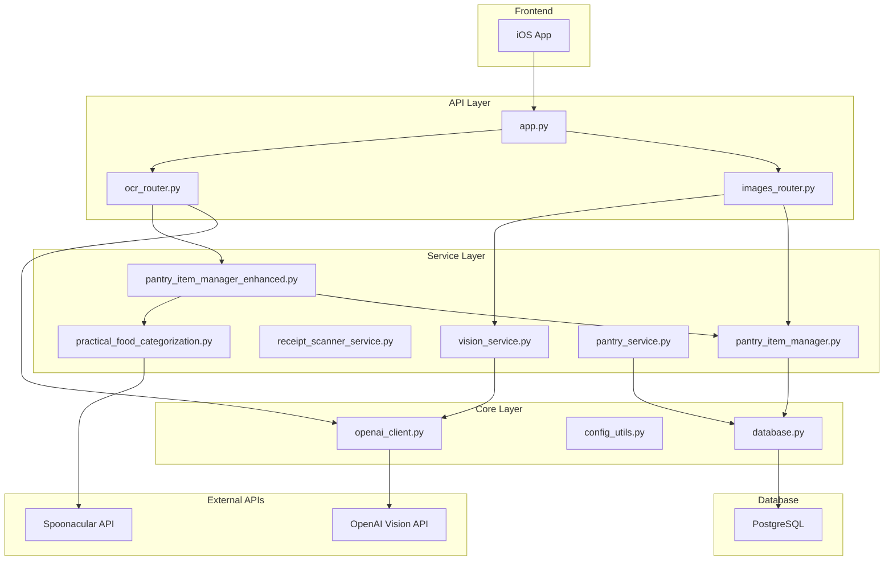

### OCR Router File Structure
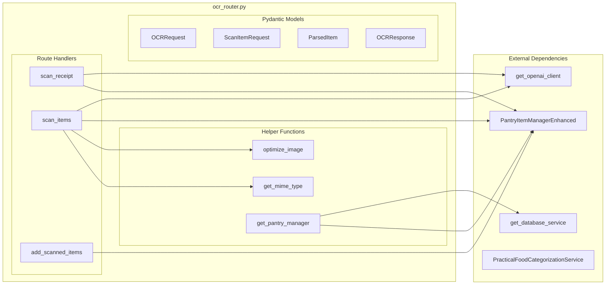

### Images Router File Structure
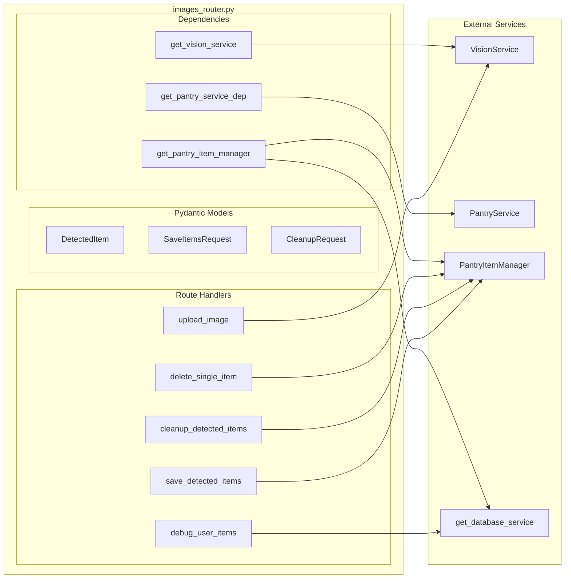

### Vision Service Structure
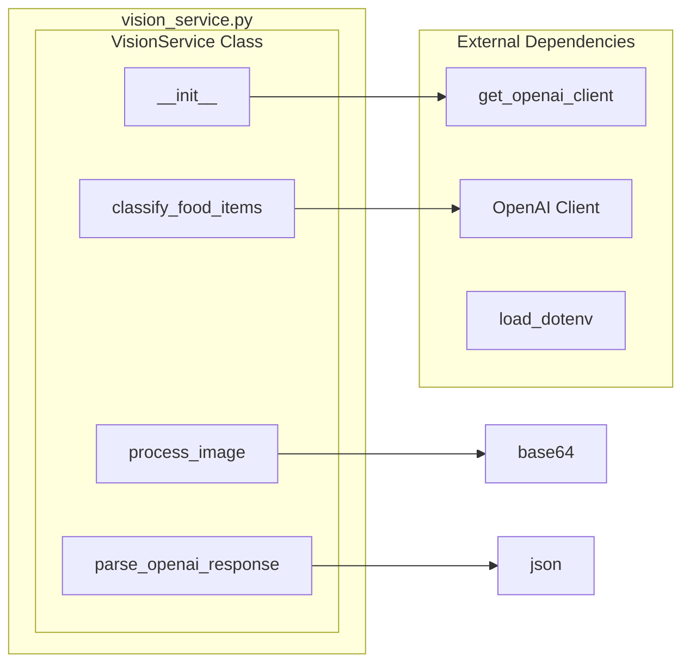

### Receipt Scanner Service Structure
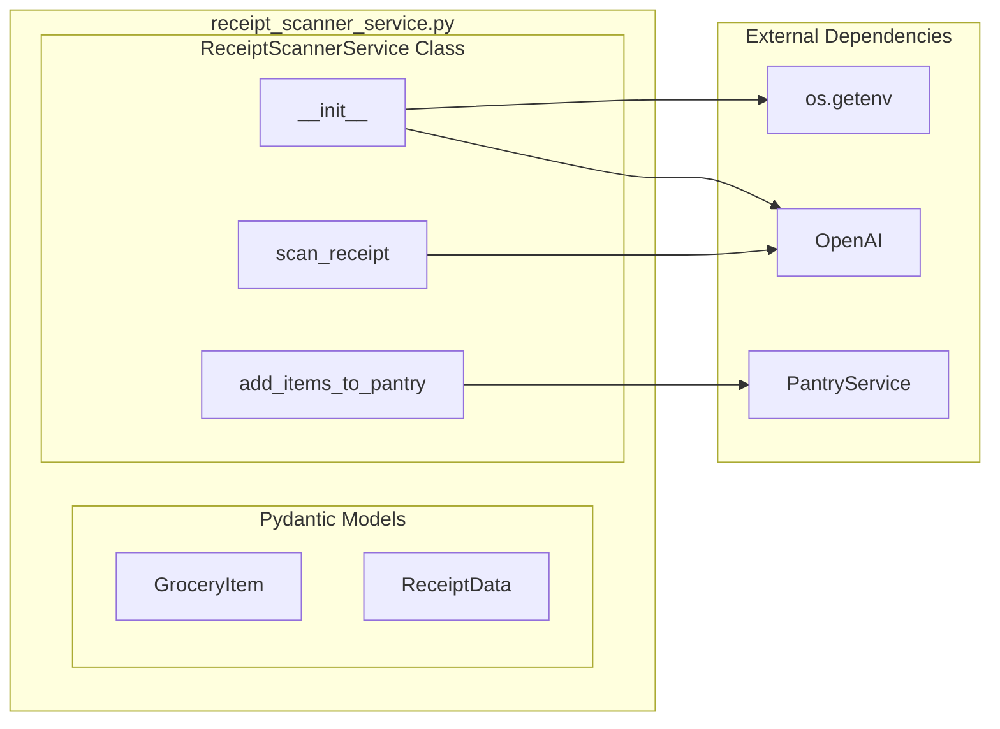

### Pantry Item Manager Enhanced Structure
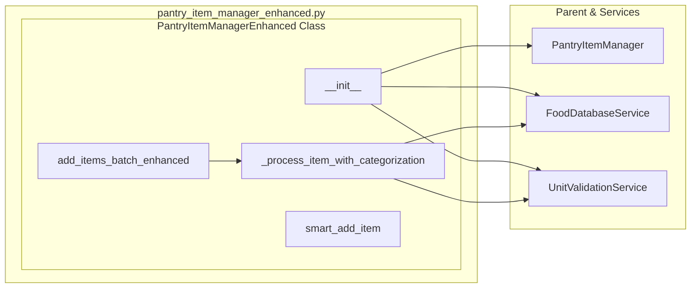

### Practical Food Categorization Service Structure
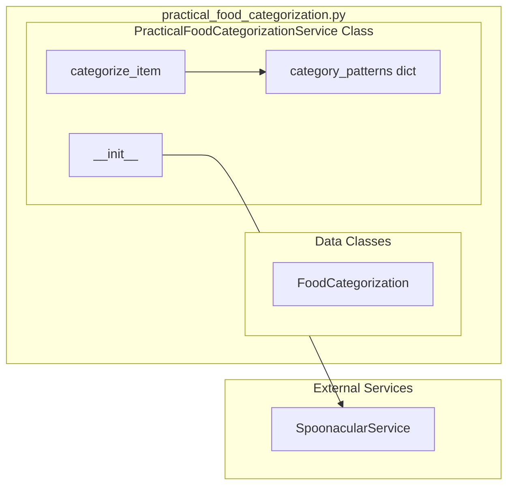

### OpenAI Client Structure
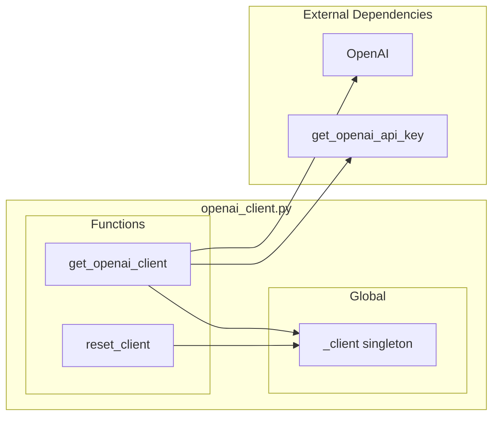

### Complete Inter-File Dependencies
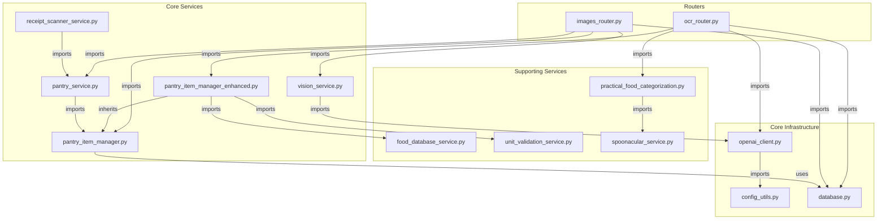

### Function Call Flow - Receipt Scanning
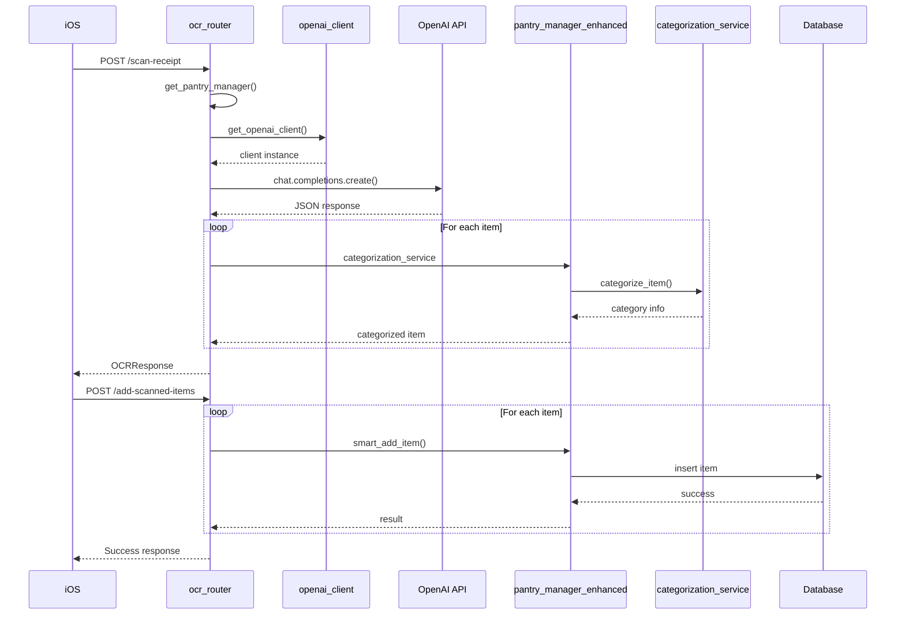

### Function Call Flow - Pantry Image Scanning
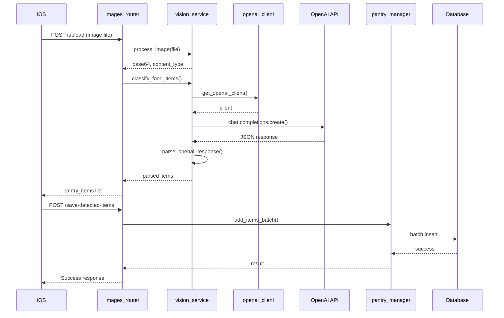

## Future Enhancements

1. **Barcode Integration**
   - Scan barcodes for product lookup
   - UPC database integration
   - Nutrition info retrieval

2. **Receipt Features**
   - Store loyalty card detection
   - Tax calculation verification
   - Multi-page receipt support

3. **Vision Improvements**
   - Custom model training
   - Offline processing options
   - Real-time video scanning

4. **Data Enrichment**
   - Nutrition database integration
   - Recipe suggestions
   - Price tracking/history