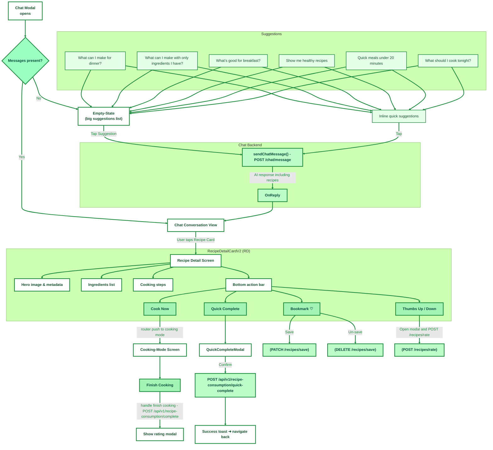

```mermaid
%%{init: {'theme': 'forest'}}%%
flowchart TD
  %% ========= CHAT MODAL =========
  A["Chat Modal\nopens"]:::ui --> B{Messages present?}:::decision
  B -- No --> ES["Empty-State\n(big suggestions list)"]:::ui
  ES -->|Tap Suggestion| SendMsg:::api
  B -- Yes --> CV["Chat Conversation View"]:::ui
  CV -->|User taps Recipe Card| RD:::ui

  %% ========= PRE-CANNED QUESTIONS =========
  subgraph Suggestions
    direction TB
    S1["What can I make for dinner?"]:::suggest
    S2["What can I make with only ingredients I have?"]:::suggest
    S3["What’s good for breakfast?"]:::suggest
    S4["Show me healthy recipes"]:::suggest
    S5["Quick meals under 20 minutes"]:::suggest
    S6["What should I cook tonight?"]:::suggest
  end
  S1 --> ES
  S2 --> ES
  S3 --> ES
  S4 --> ES
  S5 --> ES
  S6 --> ES
  S1 --> QS["Inline quick suggestions"]:::suggest
  S2 --> QS
  S3 --> QS
  S4 --> QS
  S5 --> QS
  S6 --> QS
  QS -->|Tap| SendMsg:::api

  %% ========= CHAT API & DATA FLOW =========
  subgraph API["Chat Backend"]
    SendMsg["sendChatMessage() - POST /chat/message"]:::api
    SendMsg -->|AI response including recipes| OnReply:::api
  end
  OnReply --> CV

  %% ========= RECIPE DETAIL =========
  subgraph RDgrp["RecipeDetailCardV2 (RD)"]
    direction TB
    RD["Recipe Detail Screen"]:::ui
    RD --> Img["Hero image & metadata"]:::ui
    RD --> IngList["Ingredients list"]:::ui
    RD --> Steps["Cooking steps"]:::ui
    RD --> BottomBtns["Bottom action bar"]:::ui
    BottomBtns --> CookBtn["Cook Now"]:::action
    BottomBtns --> QuickBtn["Quick Complete"]:::action
    BottomBtns --> Bookmark["Bookmark ♡"]:::action
    BottomBtns --> Rating["Thumbs Up / Down"]:::action
  end

  %% ========= ACTION FLOWS =========
  CookBtn -->|router push to cooking mode| CM["Cooking-Mode Screen"]:::ui
  CM --> FinishBtn["Finish Cooking"]:::action
  FinishBtn -->|handle finish cooking - POST /api/v1/recipe-consumption/complete| CMDone["Show rating modal"]:::ui

  QuickBtn --> QCModal["QuickCompleteModal"]:::ui
  QCModal -->|Confirm| QuickAPI["POST /api/v1/recipe-consumption/quick-complete"]:::api
  QuickAPI --> QCResult["Success toast ➜ navigate back"]:::ui

  Bookmark -->|Save| SaveAPI["(PATCH /recipes/save)"]:::api
  Bookmark -->|Un-save| UnsaveAPI["(DELETE /recipes/save)"]:::api

  Rating -->|Open modal and POST /recipes/rate| RateAPI["(POST /recipes/rate)"]:::api

  %% ========= STYLES =========
  classDef ui fill:#ffffff,stroke:#1b8a3c,stroke-width:3px,color:#14532d,font-weight:bold
  classDef api fill:#bdfcc9,stroke:#1b8a3c,stroke-width:3px,color:#064e3b,font-weight:bold
  classDef action fill:#a4f4b6,stroke:#1b8a3c,stroke-width:3px,color:#064e3b,font-weight:bold
  classDef suggest fill:#e6ffe9,stroke:#1b8a3c,stroke-width:2px,color:#14532d
  classDef decision fill:#9affc1,stroke:#1b8a3c,stroke-width:3px,color:#064e3b,font-weight:bold

  %% ========= EDGE COLORS =========
  linkStyle default stroke:#1b8a3c,stroke-width:3px,color:#1b8a3c
```
      
