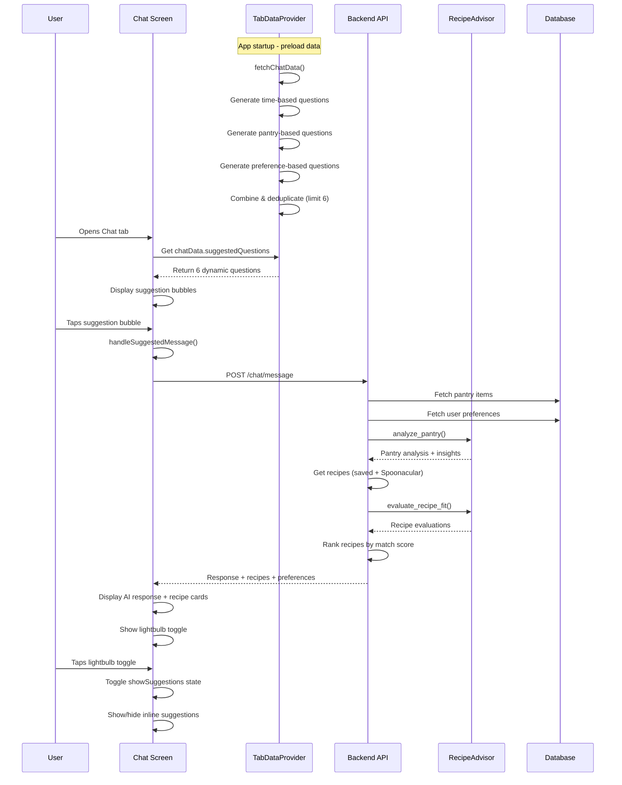

# Chat Lightbulb (Pre-populated Questions) Flow Documentation

## 1. User Flow

1. **User navigates to Chat tab** `/app/(tabs)/chat.tsx`
   - Chat screen loads with empty state
   - Shows "Ask me anything about your pantry!" message

2. **Pre-populated questions display**
   - Shows "Try asking:" section with suggested question bubbles
   - Questions are dynamically generated or use fallback defaults
   - User can tap any suggestion bubble to instantly send that message

3. **Lightbulb toggle interaction** (After first message sent)
   - Lightbulb icon (🔴 WORKING) appears in input bar: `Ionicons name={showSuggestions ? "bulb" : "bulb-outline"}`
   - User can tap to toggle suggestions visibility
   - When enabled: Shows horizontal scrollable quick suggestions below messages
   - When disabled: Hides inline suggestions

4. **Question selection and execution**
   - Tapping a suggestion automatically sends it as a chat message
   - Message appears in chat as user message
   - AI processes the message and returns recipes/response
   - New inline suggestions appear (if lightbulb is enabled)

5. **Navigation integration**
   - Chat can be accessed from navigation params with pre-filled suggestion
   - `params.suggestion` automatically sends the message on load

## 2. Data Flow

### Question Generation Pipeline (🟢 WORKING)
```
TabDataProvider.fetchChatData() →
├── Time-based suggestions (5am-11am: breakfast, 11am-2pm: lunch, 5pm-9pm: dinner)
├── Pantry-based suggestions (expiring items, random ingredients)  
├── Preference-based suggestions (dietary preferences, cuisines)
├── Static fallback suggestions
└── Deduplicate & limit to 6 questions
```

### Data Sources for Question Generation:
1. **Current time** - `new Date().getHours()` for meal-time suggestions
2. **Pantry items** - From `items` context, checking expiration dates
3. **User preferences** - From `preferences` context (dietary, allergens, cuisines)
4. **Expiring items logic** - Filter items expiring within 3 days
5. **Fallback defaults** - Hardcoded in `defaultSuggestedMessages`

### Message Processing Flow (🟢 WORKING)
```
User taps suggestion →
handleSuggestedMessage() →
sendMessage() →
API: /chat/message →
CrewAIService.process_message() →
├── Fetch pantry items
├── Fetch user preferences (if enabled)
├── Filter valid items
├── Analyze pantry with RecipeAdvisor
├── Get saved recipes + Spoonacular recipes
├── Rank and evaluate recipes
└── Return formatted response + recipes
```

## 3. Implementation Map

| Layer | File / Module | Responsibility |
|-------|---------------|----------------|
| **Frontend UI** | `/ios-app/app/(tabs)/chat.tsx` | 🟢 Chat screen, suggestion bubbles, lightbulb toggle |
| | `/ios-app/app/chat-modal.tsx` | 🟢 Modal version of chat (similar functionality) |
| **Data Context** | `/ios-app/context/TabDataProvider.tsx` | 🟢 Dynamic question generation, caching, refresh logic |
| **API Service** | `/ios-app/services/api.ts` | 🟢 `sendChatMessage()` function |
| **Backend Router** | `/backend_gateway/routers/chat_router.py` | 🟢 `/chat/message` endpoint |
| **Business Logic** | `/backend_gateway/services/recipe_advisor_service.py` | 🟢 `CrewAIService.process_message()` |
| **Recipe Analysis** | `/backend_gateway/services/recipe_advisor_service.py` | 🟢 `RecipeAdvisor` class for pantry analysis |
| **Question Storage** | Frontend state only | 🔴 No persistent storage of question history |

## 4. Diagram



## 5. Findings & Gaps

### ✅ Implemented & Working
- Dynamic question generation based on time, pantry, and preferences
- Suggestion bubble UI with proper styling and interactions
- Lightbulb toggle functionality for showing/hiding suggestions
- Integration with chat message processing pipeline
- Caching and refresh logic (5-minute cache duration)
- Fallback to default questions when generation fails
- Navigation parameter support for pre-filling suggestions

### ❌ Missing or Mock Items
- **Question personalization history**: No learning from user's past questions
- **Question popularity tracking**: No analytics on which questions users prefer
- **Seasonal/contextual questions**: No awareness of holidays, weather, or events
- **Shopping list integration**: Questions don't consider shopping list items
- **Nutrition-aware questions**: No questions based on nutritional gaps
- **Recipe completion integration**: No questions about recently cooked recipes

### ⚠️ Unclear Items (Need Follow-up)
- **Question refresh frequency**: 5-minute cache might be too short for suggestions
- **Question ordering logic**: Currently just deduplication, no smart ordering
- **Performance impact**: Dynamic generation on every app startup
- **Offline behavior**: What happens when backend is unavailable?
- **Question localization**: No support for different languages
- **A/B testing infrastructure**: No way to test different question sets

### 🔴 Implementation Status Issues
- **Mock mode detection**: Chat questions don't respect mock modes like recipes do
- **Error handling**: Limited fallback when question generation fails
- **Loading states**: No loading indicator while generating questions
- **Accessibility**: Suggestion bubbles missing accessibility labels