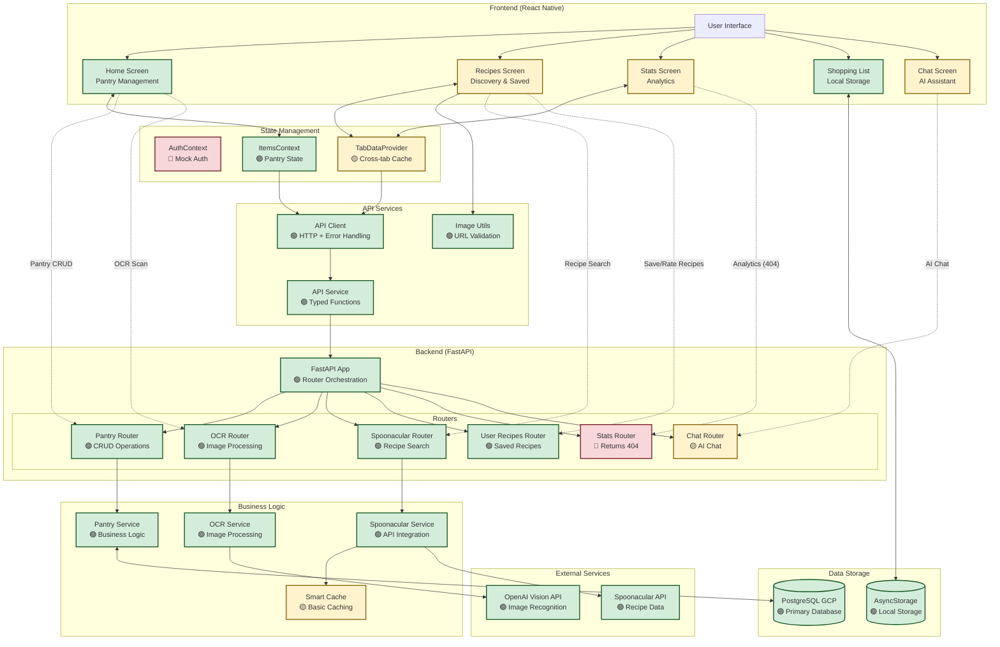

# PrepSense Comprehensive Application Flows

## 1. User Authentication & Onboarding Flow

🔴 **CONCEPT** - Mock authentication system in place

### User Flow
1. **App Launch**: App starts and shows splash screen with loading
2. **Auto Authentication**: AuthContext automatically authenticates user as "Samantha Smith" (mock user)
3. **Main Navigation**: User is immediately redirected to Home screen (index.tsx)
4. **No Onboarding**: No tutorial or setup flow currently implemented
5. **Profile Access**: User can access profile through admin button → profile navigation

### Data Flow
```
App Start → AuthContext.useEffect() → setAuthState({
  user: DEFAULT_USER (Samantha Smith),
  token: MOCK_TOKEN,
  isAuthenticated: true
}) → Navigate to /(tabs) → Home Screen
```

### Implementation Status
- **🔴 CONCEPT**: Real authentication disabled
- **🔴 CONCEPT**: No user registration flow
- **🔴 CONCEPT**: No password reset functionality
- **🔴 CONCEPT**: No onboarding tutorial

## 2. Core Pantry Management Flow

🟢 **WORKING** - Full CRUD operations implemented

### User Flow
1. **Home Screen Load**: User taps Home tab, screen displays loading indicator
2. **Item Display**: Pantry items shown in grouped format (by name/unit) with expiration colors
3. **Search & Filter**: User can search items and apply category/sort filters
4. **Item Interaction**:
   - **Tap item** → Opens consumption modal
   - **Swipe left** → Shows edit/delete actions
   - **Long press** → Opens action sheet with multiple options
5. **Quick Actions**: Floating action buttons for adding items, scanning receipts
6. **Pull to Refresh**: Swipe down to refresh pantry data

### Data Flow
```
Home Screen Load → useItemsWithFilters → ItemsContext → fetchPantryItems(userId: 111)
→ GET /api/v1/pantry/user/111/items → PantryService.get_user_pantry_items()
→ PostgreSQL SELECT → Transform items → Group by name/unit → Apply filters
→ Update UI with sorted/filtered items
```

### Adding Items Flow
1. **Add Button**: User taps enhanced add button (floating action)
2. **Add Options**: Modal shows: Add Image, Add Food Item, Scan Receipt, Complete Recipe
3. **Manual Entry**: Navigate to `/add-item` → Form with name, quantity, unit, expiration
4. **Image Scan**: Navigate to `/upload-photo` → Camera → OCR processing → Items detected screen
5. **Receipt Scan**: Navigate to `/receipt-scanner` → Camera → OCR processing → Multiple items detected
6. **Confirm Items**: `/items-detected` screen → Edit quantities/units → Save to database

### OCR & Image Processing Flow
```
Camera Capture → Upload to /api/v1/ocr/scan-receipt (or /scan-items)
→ OCRRouter.scan_receipt() → OpenAI Vision API OR Mock Data (if enabled)
→ Extract items with quantities/units/categories → Return JSON array
→ Frontend displays items in editable list → User confirms → Save to pantry
```

## 3. Recipe Discovery & Management Flow

🟡 **PARTIAL** - Core functionality working, advanced features incomplete

### User Flow
1. **Recipes Tab**: User taps Recipes tab → Three subtabs available
2. **From Pantry Tab**:
   - Shows recipes based on available pantry ingredients
   - Ingredient match counts displayed (e.g., "3 of 5 ingredients")
   - Missing ingredients shown in red
   - Tap recipe → Navigate to recipe details
3. **Discover Tab**:
   - Random recipes displayed initially
   - Search bar for recipe queries
   - Dietary filters (vegetarian, vegan, gluten-free)
   - Cuisine filters (Italian, Mexican, Asian)
   - Meal type filters (breakfast, lunch, dinner)
4. **My Recipes Tab**:
   - Saved recipes with rating system (thumbs up/down)
   - Favorites section
   - Recently cooked recipes
   - Delete saved recipes

### Data Flow
```
Recipes Screen → RecipesContainer → activeTab state change
→ [From Pantry] POST /api/v1/recipes/search/from-pantry (user_id: 111)
  → SpoonacularService.search_recipes_by_pantry()
  → Spoonacular API call + ingredient matching
→ [Discover] GET /api/v1/recipes/random OR POST /api/v1/recipes/search/complex
  → SpoonacularService.get_random_recipes() OR complex_search()
→ [My Recipes] GET /api/v1/user-recipes (user_id: 111)
  → UserRecipesService.get_user_recipes()
  → PostgreSQL SELECT from user_recipes table
```

### Recipe Interaction Flow
1. **Save Recipe**: Bookmark icon → POST /api/v1/user-recipes → Save to database
2. **Rate Recipe**: Thumbs up/down → PUT /api/v1/user-recipes/{id}/rating
3. **View Details**: Tap recipe card → Navigate to `/recipe-details` or `/recipe-spoonacular-detail`
4. **Complete Recipe**: From details screen → Ingredient deduction flow

## 4. Image Processing Flow

🟡 **PARTIAL** - OCR working, error handling improved recently

### User Flow
1. **Image Capture**: User taps camera icon from add button or quick actions
2. **Permission Check**: App requests camera permissions if needed
3. **Camera Interface**: Native camera opens with capture button
4. **Image Review**: Captured image shown with confirm/retake options
5. **Processing**: Loading screen shows "Analyzing image..." with spinner
6. **Results**: Items detected screen shows extracted items with editable fields
7. **Confirmation**: User reviews/edits items then saves to pantry

### Data Flow
```
Camera Capture → Image as base64 → POST /api/v1/ocr/scan-receipt
→ OCRRouter.scan_receipt() → Check if mock enabled
→ [Real] OpenAI Vision API with structured prompt
  → Extract items: name, quantity, unit, category, expiration
→ [Mock] Return MOCK_SCANNED_ITEMS array
→ PracticalFoodCategorizationService.categorize_items()
→ Return standardized item format → Frontend displays in ItemsDetected
```

### Image Caching & Optimization
```
Recipe Images → resolveRecipeImageUrl() → Check URL validity
→ isValidImageUrl() → Validate format and security
→ optimizeImageUrl() → Spoonacular size parameters
→ createImageSource() → Safe React Native Image source
→ CachedImage component → Local file system cache
```

### Error Handling for Images
- **Malformed URLs**: `cleanupSpoonacularUrl()` fixes duplicate size parameters
- **Invalid URLs**: Security validation blocks malicious patterns
- **Loading Failures**: Fallback to placeholder images
- **Network Issues**: Retry mechanisms with exponential backoff

## 5. Data Flow Architecture

### Frontend to Backend Communication
```
Frontend (React Native) → API Client (apiClient.ts) → HTTP Requests
→ FastAPI Backend (app.py) → Router Layer → Service Layer
→ Database Layer (PostgreSQL GCP) → Response → JSON → Frontend State
```

### Database Operations & Caching
```
User Request → Service Layer → Check Cache (Redis/Memory - 🔴 NOT IMPLEMENTED)
→ PostgreSQL Query → Transform Data → Update Cache → Return Response
```

### External API Integrations

#### Spoonacular API
```
Recipe Search → SpoonacularService → Rate Limiting Check (🔴 NOT IMPLEMENTED)
→ HTTP Request + API Key → Spoonacular Response → Transform Data
→ Cache Results (smart_cache.py) → Return to Frontend
```

#### OpenAI Vision API
```
Image Upload → OCR Router → OpenAI Client → Vision API Request
→ Structured Prompt for Food Recognition → JSON Response
→ Parse Items → Categorization Service → Return Structured Data
```

### State Management Architecture
```
Global State:
- AuthContext (user authentication)
- ItemsContext (pantry items)
- TabDataProvider (cross-tab data caching)

Local State:
- Component-specific React hooks
- Form validation state
- UI interaction state (modals, loading)
```

## 6. Error Handling & Recovery Flows

### Network Failures
```
API Request → Network Error → ApiClient.handleError()
→ Check Error Type → Timeout/Network/Server Error
→ Display User-Friendly Message → Offer Retry Option
→ Exponential Backoff for Retries (🟡 PARTIAL)
```

### API Rate Limiting
```
Spoonacular Request → 429 Rate Limited Response
→ Extract Rate Limit Headers (🔴 NOT IMPLEMENTED)
→ Queue Request with Delay (🔴 NOT IMPLEMENTED)
→ User sees "Please wait" message
```

### Cache Misses and Fallbacks
```
Data Request → Check Cache → Cache Miss
→ Fallback to API → API Failure
→ Return Stale Data if Available (🔴 NOT IMPLEMENTED)
→ OR Return Empty State with Error Message
```

### Offline Support
```
Network Unavailable → AsyncStorage Fallback (Shopping List only)
→ Queue Operations for Later Sync (🔴 NOT IMPLEMENTED)
→ Display Offline Indicator (🔴 NOT IMPLEMENTED)
```

## 7. Implementation Map

| Layer | File / Module | Responsibility | Status |
|-------|---------------|----------------|--------|
| **Frontend - Screens** | | | |
| Main Navigation | `ios-app/app/(tabs)/_layout.tsx` | Tab navigation with custom tab bar | 🟢 WORKING |
| Home Screen | `ios-app/app/(tabs)/index.tsx` | Pantry management interface | 🟢 WORKING |
| Recipes Screen | `ios-app/app/(tabs)/recipes.tsx` | Recipe discovery wrapper | 🟢 WORKING |
| Stats Screen | `ios-app/app/(tabs)/stats.tsx` | Analytics dashboard | 🟡 PARTIAL |
| Shopping List | `ios-app/app/(tabs)/shopping-list.tsx` | Local shopping list | 🟢 WORKING |
| Chat Screen | `ios-app/app/(tabs)/chat.tsx` | AI chat interface | 🟡 PARTIAL |
| **Frontend - Core Components** | | | |
| Recipes Container | `ios-app/components/recipes/RecipesContainer.tsx` | Recipe state management | 🟢 WORKING |
| Enhanced Add Button | `ios-app/components/EnhancedAddButton.tsx` | Floating action menu | 🟢 WORKING |
| Items Detected | `ios-app/app/items-detected.tsx` | OCR results processing | 🟢 WORKING |
| **Frontend - Services** | | | |
| API Client | `ios-app/services/apiClient.ts` | HTTP client with error handling | 🟢 WORKING |
| API Service | `ios-app/services/api.ts` | Typed API functions | 🟢 WORKING |
| Image Utils | `ios-app/utils/imageUtils.ts` | Image URL validation & optimization | 🟢 WORKING |
| **Frontend - Context** | | | |
| Auth Context | `ios-app/context/AuthContext.tsx` | Mock authentication system | 🔴 CONCEPT |
| Items Context | `ios-app/context/ItemsContext.tsx` | Global pantry state | 🟢 WORKING |
| Tab Data Provider | `ios-app/context/TabDataProvider.tsx` | Cross-tab data preloading | 🟡 PARTIAL |
| **Backend - Application** | | | |
| FastAPI App | `backend_gateway/app.py` | Main application with router includes | 🟢 WORKING |
| **Backend - Routers** | | | |
| Pantry Router | `backend_gateway/routers/pantry_router.py` | Pantry CRUD operations | 🟢 WORKING |
| OCR Router | `backend_gateway/routers/ocr_router.py` | Image processing endpoints | 🟢 WORKING |
| Spoonacular Router | `backend_gateway/routers/spoonacular_router.py` | Recipe search endpoints | 🟢 WORKING |
| User Recipes Router | `backend_gateway/routers/user_recipes_router.py` | Saved recipe management | 🟢 WORKING |
| Stats Router | `backend_gateway/routers/stats_router.py` | Analytics endpoints | 🔴 CONCEPT |
| Chat Router | `backend_gateway/routers/chat_router.py` | AI chat endpoints | 🟡 PARTIAL |
| **Backend - Services** | | | |
| Pantry Service | `backend_gateway/services/pantry_service.py` | Pantry business logic | 🟢 WORKING |
| OCR Service | `backend_gateway/services/ocr_service.py` | Image processing logic | 🟢 WORKING |
| Spoonacular Service | `backend_gateway/services/spoonacular_service.py` | External API integration | 🟢 WORKING |
| Smart Cache | `backend_gateway/utils/smart_cache.py` | Caching utilities | 🟡 PARTIAL |
| **Database** | | | |
| PostgreSQL (GCP) | Cloud SQL instance | Primary data storage | 🟢 WORKING |
| AsyncStorage | React Native local storage | Shopping list & preferences | 🟢 WORKING |

## 8. Comprehensive Flow Diagram



## 9. Findings & Gaps

### ✅ Implemented Features
- **Pantry Management**: Full CRUD operations with real-time updates
- **Recipe Discovery**: Spoonacular API integration with ingredient matching
- **Image Processing**: OCR with OpenAI Vision API for receipt/item scanning
- **Saved Recipes**: User recipe management with ratings and favorites
- **Shopping List**: Local storage implementation (fully offline)
- **Smart Caching**: Basic caching for API responses
- **Error Handling**: Improved image URL validation and error recovery
- **Navigation**: Smooth tab navigation with preloaded data

### ❌ Missing or Mock Features
- **Real Authentication**: Currently uses mock authentication system
- **Stats Comprehensive Endpoint**: Returns 404, falls back to individual API calls
- **Recipe Completion Integration**: Backend exists but UI integration incomplete
- **Advanced Caching**: No Redis or sophisticated cache invalidation
- **Offline Support**: Limited to shopping list only
- **Real-time Updates**: No WebSocket or push notification system
- **API Rate Limiting**: No rate limit handling for Spoonacular API
- **Recipe Recommendations**: AI recommendation system not exposed in UI

### ⚠️ Areas Needing Verification
- **Spoonacular API Quotas**: No monitoring or quota management
- **Database Performance**: Large datasets may impact performance
- **Memory Management**: Complex state management across multiple contexts
- **Image Loading**: No lazy loading or progressive image enhancement
- **Search Performance**: Complex recipe searches may be slow
- **Error Consistency**: Different error handling patterns across components

### 🔴 Technical Debt
- **Hardcoded User ID**: All API calls use userId: 111
- **Component Complexity**: Large files need refactoring (1500+ lines)
- **Mock Data Cleanup**: Commented mock code throughout codebase
- **API Endpoint Inconsistency**: Different parameter formats across endpoints
- **State Management**: Could benefit from more structured state patterns

### Recommended Priority Improvements
1. **Implement Real Authentication System**
2. **Create Stats Comprehensive Endpoint**
3. **Add API Rate Limiting and Monitoring**
4. **Implement Redis Caching Layer**
5. **Add Offline Support for Core Features**
6. **Optimize Image Loading and Caching**
7. **Standardize Error Response Format**
8. **Add Recipe Completion UI Integration**