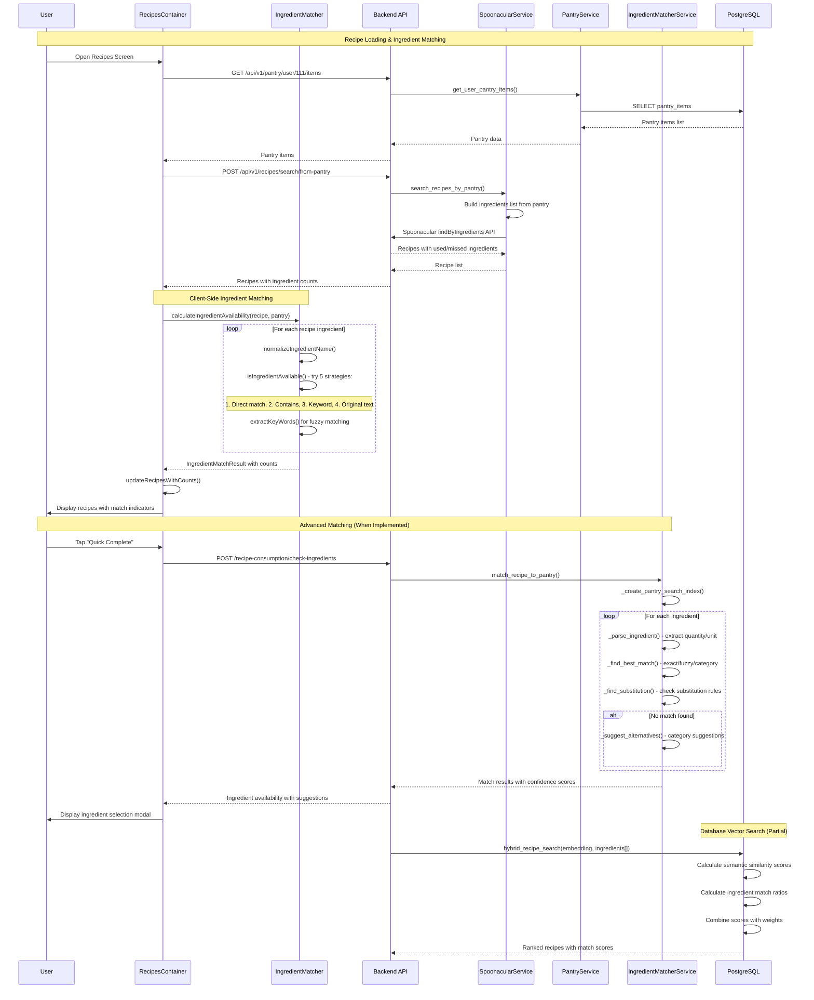

# Ingredient Matching System Flow Documentation

## 1. User Flow

1. **Recipe Selection**: User views recipe on RecipesScreen or recipe detail view
2. **Ingredient Availability Display**: System automatically shows ingredient match status
   - Available ingredients marked with green indicators
   - Missing ingredients marked with red indicators  
   - Partial matches shown with yellow/orange indicators
   - Match count displayed (e.g., "3 of 5 ingredients available")
3. **Recipe Filtering**: User can sort recipes by "missing ingredients" to prioritize makeable recipes
4. **Quick Complete Action**: User taps "Quick Complete" on recipe card
5. **Ingredient Selection Modal**: QuickCompleteModal opens showing:
   - Each recipe ingredient with availability status
   - Auto-selected pantry matches (prioritized by expiration)
   - Option to tap ingredients with multiple matches
6. **Alternative Selection**: User can tap ingredients to open PantryItemSelectionModal
7. **Recipe Completion**: User confirms selections and completes recipe
8. **Pantry Updates**: System subtracts used ingredients from pantry inventory

## 2. Data Flow

### Frontend Ingredient Matching Flow:
```
RecipesContainer.tsx → Load recipes → For each recipe:
  → calculateIngredientAvailability(recipe.ingredients, pantryItems)
  → ingredientMatcher.ts → normalizeIngredientName() 
  → isIngredientAvailable() → Multiple matching strategies:
    1. Direct normalized match
    2. Pantry item contains ingredient 
    3. Ingredient contains pantry item
    4. Keyword matching with extractKeyWords()
    5. Original text matching
  → Return IngredientMatchResult with counts
  → Update recipe usedIngredientCount/missedIngredientCount
  → Display updated counts in UI
```

### Backend Recipe Search Flow:
```
POST /api/v1/recipes/search/from-pantry → SpoonacularRouter
  → SpoonacularService.search_recipes_by_pantry()
  → GET user pantry: PantryService.get_user_pantry_items()
  → Build ingredient list: [product_name, ...]
  → Spoonacular API: findByIngredients endpoint
  → Return recipes with usedIngredients/missedIngredients
  → Frontend applies additional client-side matching
```

### Advanced Backend Matching (Partially Implemented):
```
IngredientMatcherService.match_recipe_to_pantry()
  → _create_pantry_search_index() → Index pantry by name/category
  → For each recipe ingredient:
    → _parse_ingredient() → Extract quantity/unit/name  
    → _find_best_match() → Try exact/normalized/fuzzy matching
    → _find_substitution() → Check substitution rules
    → _suggest_alternatives() → Provide category alternatives
  → Return match results with confidence scores
```

### Database Search Functions:
```
hybrid_recipe_search(query_embedding, available_ingredients[])
  → Semantic similarity scoring via vector embeddings
  → Ingredient matching via PostgreSQL array operations  
  → Combined scoring (semantic + ingredient weights)
  → Return ranked recipes with match scores
```

## 3. Implementation Map

| Layer | File / Module | Responsibility | Status |
|-------|---------------|----------------|---------|
| **Frontend Matching** | | |
| Core Matching | `ios-app/utils/ingredientMatcher.ts` | Primary ingredient matching algorithms | 🟢 WORKING |
| Recipe Logic | `ios-app/logic/recipesContainer.logic.ts` | Recipe filtering and count calculations | 🟢 WORKING |
| Recipe Container | `ios-app/components/recipes/RecipesContainer.tsx` | UI integration and state management | 🟢 WORKING |
| Quick Complete | `ios-app/components/modals/QuickCompleteModal.tsx` | Recipe completion with ingredient matching | 🟢 WORKING |
| **Frontend Testing** | | |
| Unit Tests | `ios-app/utils/__tests__/ingredientMatcher.test.ts` | Core matching algorithm tests | 🟢 WORKING |
| Integration Tests | `ios-app/__tests__/components/recipes/RecipesContainer.test.tsx` | Component integration tests | 🟢 WORKING |
| **Backend Services** | | |
| Advanced Matcher | `backend_gateway/services/ingredient_matcher_service.py` | Advanced fuzzy matching with categories | 🟡 PARTIAL |
| Unit Converter | `backend_gateway/services/ingredient_unit_converter.py` | Ingredient-specific unit conversions | 🟡 PARTIAL |
| Ingredient Parser | `backend_gateway/services/ingredient_parser_service.py` | Recipe ingredient parsing and normalization | 🟡 PARTIAL |
| **Backend Routers** | | |
| Recipe Search | `backend_gateway/routers/spoonacular_router.py` | Recipe search by pantry ingredients | 🟢 WORKING |
| Enhanced Recipes | `backend_gateway/routers/enhanced_recipe_router.py` | Advanced recipe filtering with match ratios | 🟡 PARTIAL |
| Recipe Consumption | `backend_gateway/routers/recipe_consumption_router.py` | Recipe completion and ingredient subtraction | 🟢 WORKING |
| **Database Functions** | | |
| Hybrid Search | `fix_search_functions.sql → hybrid_recipe_search()` | Semantic + ingredient matching in PostgreSQL | 🟡 PARTIAL |
| Vector Embeddings | `backend_gateway/migrations/add_vector_embeddings.sql` | Recipe vector embeddings for semantic search | 🟡 PARTIAL |

## 4. Diagram



## 5. Findings & Gaps

### ✅ Implemented Items
- **Frontend Core Matching**: `ingredientMatcher.ts` with 5 matching strategies working
- **Recipe Display Integration**: Ingredient counts displayed on recipe cards  
- **Client-Side Filtering**: Sort recipes by missing ingredient count
- **Basic Unit Conversion**: Weight/volume conversions within same category
- **Quick Complete Flow**: Recipe completion with ingredient subtraction
- **Test Coverage**: Unit tests for core matching algorithms
- **Database Schema**: Pantry items with quantities and units
- **Spoonacular Integration**: Recipe search by available ingredients

### ❌ Missing or Mock Items
- **Advanced Fuzzy Matching**: `IngredientMatcherService` exists but not integrated into main flow
- **Cross-Category Unit Conversions**: No ingredient-specific density conversions (cups to grams)
- **Substitution Engine**: Substitution rules defined but not used in frontend
- **Semantic Search**: Vector embeddings partially implemented but not in production use
- **Confidence Scoring**: Backend matching returns confidence scores but frontend doesn't use them
- **Batch Matching Optimization**: Individual API calls for each recipe, not batch processing
- **Machine Learning**: No learning from user selections to improve matching
- **Brand Name Normalization**: Limited brand name handling and cleaning
- **Synonym Database**: No ingredient synonym support (e.g., "scallions" = "green onions")

### ⚠ Unclear Items (Need Follow-up)
- **Performance at Scale**: How does matching perform with 100+ pantry items and 50+ recipes?
- **Match Accuracy**: What's the false positive/negative rate of current matching?
- **Unit Mismatch Handling**: How are "2 cups flour" vs "500g flour" mismatches handled?
- **Partial Quantity Matching**: Does system consider if user has enough quantity?
- **Multi-Language Support**: How does matching work with non-English ingredient names?
- **Cache Strategy**: Are pantry items and recipes cached between requests?

### Technical Implementation Status

#### Frontend Matching Algorithm (🟢 WORKING)
```typescript
// Current implementation in ingredientMatcher.ts
isIngredientAvailable(ingredient, pantry) {
  // 1. Direct normalized match (✅ Working)
  // 2. Pantry contains ingredient (✅ Working) 
  // 3. Ingredient contains pantry (✅ Working)
  // 4. Keyword matching (✅ Working)
  // 5. Original text matching (✅ Working)
  return boolean;
}
```

#### Backend Advanced Matching (🟡 PARTIAL)
```python
# IngredientMatcherService - exists but not integrated
match_recipe_to_pantry() -> {
  'perfect_matches': [],      # Exact matches
  'category_matches': [],     # Same category matches  
  'possible_substitutions': [], # Substitution suggestions
  'missing_ingredients': [],  # No matches found
  'match_score': 0.0,        # Overall match percentage
  'total_confidence': 0.0    # Confidence in matches
}
```

#### Database Search Functions (🟡 PARTIAL)
```sql
-- Hybrid search combining semantic + ingredient matching
hybrid_recipe_search(embedding, ingredients[], limits, weights)
-- Returns recipes with combined scores but not used in production
```

### Performance Considerations

- **Matching Speed**: O(n×m) complexity where n=recipes, m=pantry items
- **Memory Usage**: All pantry items loaded into memory for matching
- **Network Calls**: Separate API calls for pantry items and recipes
- **Database Queries**: Individual ingredient lookups, not optimized batch queries
- **Cache Strategy**: No caching of matching results between sessions

### Integration Gaps

1. **Frontend ↔ Backend**: Frontend uses simple matching, backend has advanced matching unused
2. **Confidence Scores**: Backend calculates confidence but frontend ignores it
3. **Substitutions**: Backend has substitution rules but frontend doesn't request them
4. **Semantic Search**: Database has vector functions but APIs don't use them
5. **Unit Conversion**: Backend has ingredient-specific conversions unused by frontend

This system represents a 🟡 **PARTIAL** implementation with solid core functionality but significant opportunities for improvement in matching accuracy, performance optimization, and feature integration.