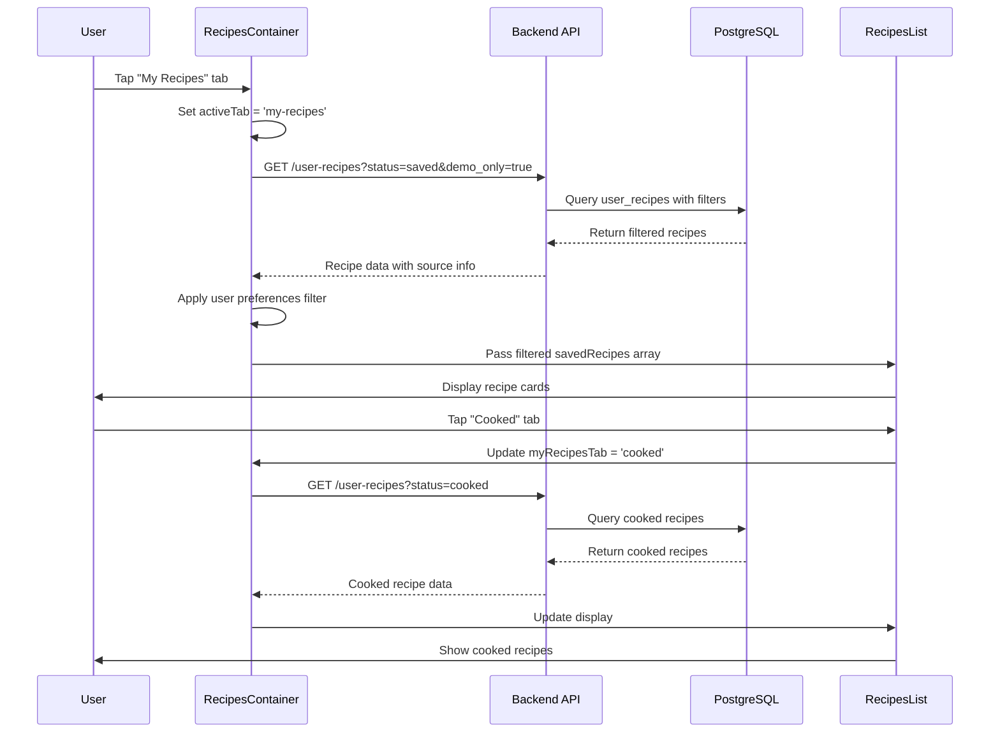

# My Recipes Flow Documentation

## 1. User Flow

1. **Navigation to My Recipes**: User taps "My Recipes" tab in bottom navigation (RecipesContainer.tsx)
2. **Tab Selection**: User sees "Saved" and "Cooked" sub-tabs within My Recipes section
3. **Filter Options**: User can filter by:
   - All recipes
   - Thumbs up (liked recipes)
   - Thumbs down (disliked recipes)
   - Favorites (marked as favorite)
4. **Recipe Display**: Recipes are shown in a scrollable list with:
   - Recipe image, title, rating status
   - Favorite indicator
   - Demo recipe indicator (currently showing)
5. **Recipe Actions**: User can:
   - Tap to view recipe details
   - Toggle favorite status
   - Rate recipes (thumbs up/down)
   - Mark recipes as cooked

## 2. Data Flow

### Backend API Flow:
1. **GET /user-recipes** - Retrieves user's saved recipes
   - Filters by `status` parameter: 'saved' or 'cooked'
   - Applies `demo_only=true` filter for "Saved" tab
   - Additional filters: rating, favorite status
   - Returns recipes from `user_recipes` table

### Frontend Data Flow:
1. **RecipesContainer.tsx** manages state and API calls
2. **fetchMyRecipes()** function calls backend with appropriate filters
3. **RecipesList.tsx** renders the filtered recipes
4. **User preference filtering** applied client-side to respect allergens/dietary restrictions

### Database Structure:
- **user_recipes table** stores all saved recipes with fields:
  - `source`: 'spoonacular', 'chat', 'demo', 'generated', etc.
  - `status`: 'saved' or 'cooked'
  - `is_demo`: Boolean flag for demo recipes
  - `rating`: 'thumbs_up', 'thumbs_down', 'neutral'
  - `is_favorite`: Boolean favorite flag

## 3. Implementation Map

| Layer | File / Module | Responsibility |
|-------|---------------|----------------|
| **Frontend Route** | `/ios-app/app/(tabs)/recipes.tsx` | Main recipes tab route |
| **Main Container** | `/ios-app/components/recipes/RecipesContainer.tsx` | State management, API orchestration |
| **Filters Component** | `/ios-app/components/recipes/RecipesFilters.tsx` | My Recipes filter UI (saved/cooked, rating filters) |
| **List Component** | `/ios-app/components/recipes/RecipesList.tsx` | Recipe rendering and display |
| **Recipe Cards** | `/ios-app/components/recipes/AnimatedSavedRecipeCard.tsx` | Individual saved recipe card display |
| **Backend Router** | `/backend_gateway/routers/user_recipes_router.py` | API endpoints for user recipes CRUD |
| **Service Layer** | `/backend_gateway/services/user_recipes_service.py` | Business logic for recipe management |
| **Database** | PostgreSQL `user_recipes` table | Recipe storage and filtering |

## 4. Diagram

## 5. Findings & Gaps

### ✅ Currently Working:
- Basic My Recipes display with saved/cooked tabs
- Rating and favorite filtering
- Demo recipe prioritization in "Saved" tab
- Recipe saving mechanism from Spoonacular detail pages
- User preferences filtering (allergens, dietary restrictions)

### ❌ Issues Identified:
- **CRITICAL: Spoonacular recipes appearing in My Recipes**: The recipe detail page (`recipe-spoonacular-detail.tsx`) saves Spoonacular recipes with `source: 'spoonacular'` to the `user_recipes` table, but the filtering logic doesn't exclude these from My Recipes display
- **Inconsistent filtering logic**: The "Saved" tab shows demo recipes only (`demo_only=true`) but doesn't properly distinguish between user's personal recipes vs external Spoonacular recipes
- **Data source confusion**: Spoonacular recipes should not be stored in `user_recipes` table - they should remain external and only be bookmarked/referenced

### ⚠️ Need Investigation:
- **Recipe ownership boundaries**: Need clear separation between user's personal/generated recipes vs external Spoonacular recipe references
- **Recipe completion flow**: How recipe completion affects the saved vs cooked status transition
- **Data cleanup needed**: Existing Spoonacular recipes in `user_recipes` table need to be cleaned up or properly categorized

### 🔧 Technical Debt:
- Dynamic column existence checking (`is_demo`, `status`) suggests incomplete migrations
- Multiple fallback queries indicate schema inconsistency across environments
- Complex filtering logic in `get_user_recipes()` method needs refactoring