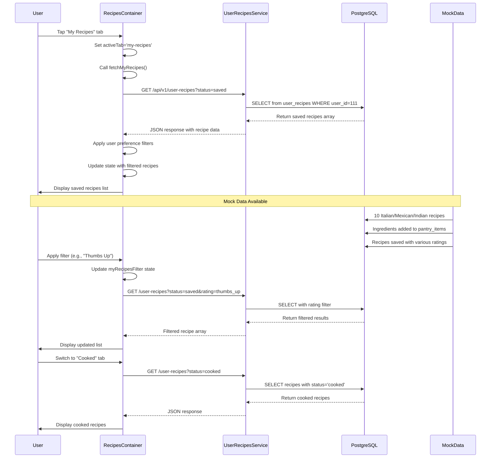

# My Recipes Flow Documentation

## 1. User Flow
1. User opens PrepSense app and navigates to the Recipes screen
2. User taps on "My Recipes" tab (third tab after "From Pantry" and "Discover")
3. System displays sub-tabs: "Saved" and "Cooked"
4. On "Saved" tab: User sees all recipes they have saved from previous searches/recommendations
5. On "Cooked" tab: User sees recipes they have marked as completed/cooked
6. User can apply filters: "All", "Thumbs Up", "Thumbs Down", "Favorites"
7. User can tap on any recipe to view details or mark as cooked
8. User can refresh the list by pulling down
9. System filters recipes based on user preferences (allergens, dietary preferences, cuisines)

## 2. Data Flow

### Frontend Request Flow:
1. **RecipesContainer.tsx** manages the My Recipes tab state
2. When `activeTab` changes to 'my-recipes', `fetchMyRecipes()` is triggered
3. Function builds query parameters based on current filters:
   - `state.myRecipesTab` → `?status=saved` or `?status=cooked`
   - `state.myRecipesFilter` → Additional filters for rating/favorites
4. HTTP GET request sent to: `${Config.API_BASE_URL}/user-recipes${filterParam}`
5. Response is filtered by user preferences (allergens, dietary restrictions)
6. Filtered recipes are stored in component state via `SET_SAVED_RECIPES` action

### Backend Processing:
1. **FastAPI Router** (`user_recipes_router.py`) receives request at `/api/v1/user-recipes`
2. **UserRecipesService** processes the query with filters:
   - `user_id: 111` (hardcoded for demo)
   - Optional filters: `source`, `is_favorite`, `rating`, `status`, `limit`, `offset`
3. **PostgreSQL Query** executed with dynamic WHERE conditions
4. **Recipe Data Transformation**:
   - JSON recipe_data parsed (JSONB column)
   - Timestamps converted to ISO format
   - Recipe metadata enriched
5. **Response** returned as array of SavedRecipe objects

### Database Layer:
1. **user_recipes table** stores saved recipes with columns:
   - `id`, `user_id`, `recipe_id`, `recipe_title`, `recipe_image`
   - `recipe_data` (JSONB), `source`, `rating`, `is_favorite`, `status`
   - `created_at`, `updated_at`, `cooked_at`
2. **Mock Data** added via `scripts/add_mock_recipes_and_ingredients.py`
3. **Current Data**: 10+ recipes saved for user_id 111 with various sources and ratings

## 3. Implementation Map

| Layer | File / Module | Responsibility |
|-------|---------------|----------------|
| **UI Components** | `components/recipes/RecipesContainer.tsx` | Main container managing My Recipes tab state and data fetching |
| | `components/recipes/RecipesList.tsx` | Renders the list of saved recipes with cards |
| | `components/recipes/RecipesFilters.tsx` | Filter UI for Saved/Cooked tabs and rating filters |
| | `components/recipes/RecipesTabs.tsx` | Tab switching between Pantry/Discover/My Recipes |
| | `components/recipes/ImprovedRecipesScreen.tsx` | **🔴 STUB** - Legacy screen with TODO for My Recipes |
| **API Layer** | `backend_gateway/routers/user_recipes_router.py` | **🟢 WORKING** - REST endpoints for CRUD operations |
| | `backend_gateway/services/user_recipes_service.py` | **🟢 WORKING** - Business logic for recipe management |
| | `backend_gateway/config/database.py` | Database connection management |
| **Data Layer** | PostgreSQL `user_recipes` table | **🟢 WORKING** - Persistent storage with JSONB recipe data |
| | `scripts/add_mock_recipes_and_ingredients.py` | **🟢 WORKING** - Mock data population script |
| **Context** | `context/TabDataProvider.tsx` | **🟡 PARTIAL** - Caches recipe data but not fully integrated |
| | `context/UserPreferencesContext.tsx` | **🟢 WORKING** - User dietary preferences for filtering |
| **Utils** | `utils/ingredientMatcher.ts` | **🟢 WORKING** - Standardized ingredient availability calculation |
| | `utils/contentValidation.ts` | **🟢 WORKING** - Recipe validation utilities |

## 4. Diagram

## 5. Findings & Gaps

### ✅ Implemented Items:
- Complete backend API with CRUD operations for user recipes
- PostgreSQL database schema with proper JSONB storage for recipe data
- Frontend container component with state management for My Recipes
- Filter system for Saved/Cooked recipes with rating and favorites support
- User preference filtering (allergens, dietary restrictions, cuisines)
- Mock data populated with 10 high-protein recipes matching user preferences
- Database connection working with recipes successfully stored and retrievable

### ❌ Missing or Mock Items:
- **Recipe Save Functionality**: Users cannot save recipes from Pantry/Discover tabs to My Recipes
- **Recipe Action Buttons**: Missing "Save Recipe" buttons in RecipeDetailCard components
- **Mark as Cooked**: UI missing to mark recipes as cooked from recipe details
- **Recipe Rating Interface**: No UI to rate recipes with thumbs up/down
- **Favorite Toggle**: Missing heart/star buttons to mark recipes as favorites
- **ImprovedRecipesScreen Integration**: Legacy screen has TODO comment instead of calling API

### ⚠ Unclear Items (Need Follow-up):
- **TabDataProvider Caching**: Context provider exists but integration with My Recipes flow is incomplete
- **Authentication**: Hardcoded user_id=111, needs proper user authentication
- **Real-time Updates**: No real-time sync when recipes are saved from other tabs
- **Image Handling**: Recipe images use mixed sources (static files vs URLs)
- **Error Handling**: Limited error retry logic for network failures
- **Offline Support**: No offline caching for saved recipes

### Key Issue Identified:
The main gap is that while the backend and database are fully functional with mock data, the **recipe saving workflow is missing**. Users can see saved recipes in My Recipes, but there's no way to actually save recipes from the Pantry or Discover tabs into the My Recipes collection. The CRUD endpoints exist, but the UI integration is incomplete.