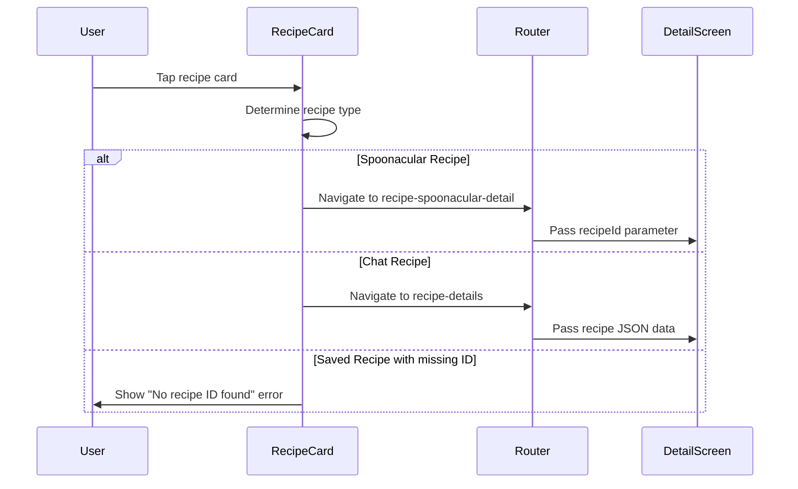
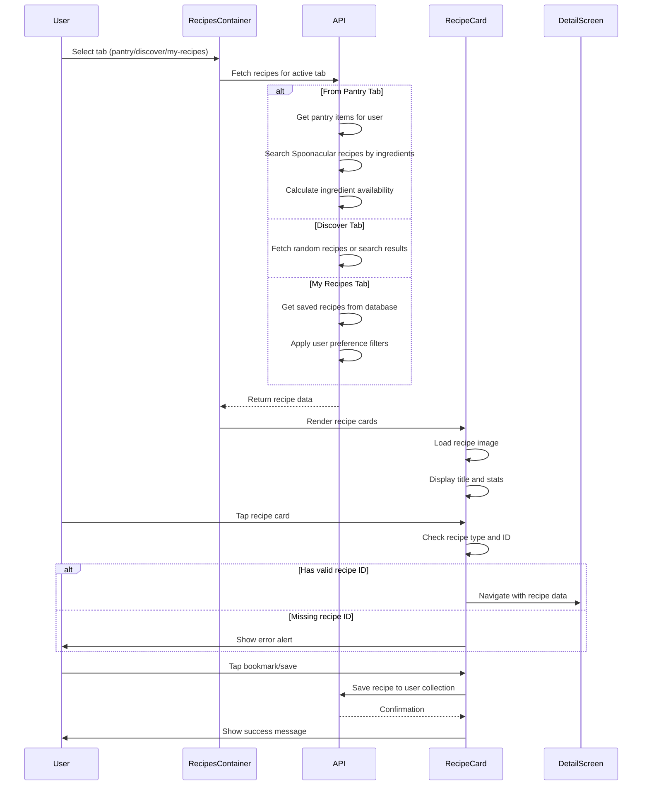

# Recipe Cards Flow Documentation

## 1. User Flow

### Recipe Card Display Process
1. User navigates to Recipes tab (pantry/discover/my-recipes)
2. App loads recipes based on active tab:
   - **From Pantry**: Displays recipes matching pantry ingredients
   - **Discover**: Shows random recipes or search results
   - **My Recipes**: Shows saved recipes with filters
3. Recipe cards render in a grid layout (2 columns)
4. Each card displays:
   - Recipe image (with fallback handling)
   - Recipe title (truncated to 2 lines)
   - Ingredient availability stats (have/missing counts)
   - Action buttons (bookmark/favorite/delete)
5. User can tap recipe card to view details
6. Navigation occurs to appropriate detail screen based on recipe type

### Recipe Card Interaction Flow
1. **Card Press**: Navigates to recipe detail screen
2. **Bookmark/Save**: Saves recipe to "My Recipes" collection
3. **Rating**: Thumbs up/down for saved recipes
4. **Favorite Toggle**: Marks recipe as favorite
5. **Delete**: Removes recipe from saved collection (with confirmation)

### Image Loading Process
1. Card component attempts to load recipe image
2. If image fails or is empty, fallback image is used
3. Shimmer animation shows during loading state
4. Image opacity animates in when loaded

## 2. Data Flow

### Recipe Data Sources
```mermaid
flowchart TD
    A[User Action] --> B{Active Tab?}
    B -->|pantry| C[Fetch From Pantry API]
    B -->|discover| D[Fetch Random/Search API]
    B -->|my-recipes| E[Fetch Saved Recipes API]
    
    C --> F[/recipes/search/from-pantry]
    D --> G[/recipes/random or /recipes/search/complex]
    E --> H[/user-recipes]
    
    F --> I[Spoonacular Service]
    G --> I
    H --> J[User Recipes Service]
    
    I --> K[Recipe Processing]
    J --> L[Saved Recipe Processing]
    
    K --> M[Ingredient Count Calculation]
    L --> N[Image URL Processing]
    
    M --> O[Recipe Cards Display]
    N --> O
```

### Recipe ID Management
- **Spoonacular Recipes**: Use `recipe.id` (number)
- **Chat-generated Recipes**: Use `recipe.recipe_data.id` or generated UUID
- **Saved Recipes**: Use database `id` field, with optional `recipe_id` reference

### Navigation Data Flow


## 3. Implementation Map

| Layer | File / Module | Responsibility |
|-------|---------------|----------------|
| **UI Components** | `AnimatedRecipeCard.tsx` | Spoonacular recipe card with animations |
| | `AnimatedSavedRecipeCard.tsx` | Saved recipe card with rating/favorite actions |
| | `RecipesList.tsx` | Legacy recipe card rendering (grid layout) |
| **Container Logic** | `RecipesContainer.tsx` | State management, data fetching, filtering |
| | `RecipesTabs.tsx` | Tab navigation and search functionality |
| | `RecipesFilters.tsx` | Filter controls for each tab |
| **Navigation** | `recipe-spoonacular-detail.tsx` | Spoonacular recipe detail screen |
| | `recipe-details.tsx` | Chat-generated recipe detail screen |
| **Data Services** | `recipeService.ts` | Recipe CRUD operations |
| | `apiClient.ts` | HTTP client for API calls |
| | `api.ts` | Legacy API service methods |
| **Backend APIs** | `user_recipes_router.py` | Saved recipes CRUD endpoints |
| | `spoonacular_router.py` | Spoonacular API integration |
| | `enhanced_recipe_router.py` | Recipe search and processing |
| **Data Models** | `types/index.ts` | TypeScript interfaces (limited) |
| | Recipe interfaces defined in components | Recipe, SavedRecipe, ExtendedIngredient |
| **Utilities** | `ingredientMatcher.ts` | Ingredient availability calculation |
| | `contentValidation.ts` | Recipe content validation |
| | `imageCacheService.ts` | Image caching and optimization |

## 4. Diagram



## 5. Findings & Gaps

### ✅ Implemented Features
- Recipe card rendering with image loading
- Tab-based recipe browsing (pantry/discover/my-recipes)  
- Ingredient availability calculation
- Recipe saving and rating functionality
- Navigation to detail screens
- Fallback image handling
- Animated card interactions
- Pull-to-refresh functionality
- Search and filtering

### ❌ Missing or Mock Implementations
- **Image Loading Issues**: My Pantry recipes don't show images properly
- **Recipe ID Resolution**: Inconsistent ID field handling causes navigation errors
- **Error Handling**: Generic "No recipe ID found" errors without specific troubleshooting
- **Image URL Processing**: Missing logic to handle relative URLs from backend
- **Type Safety**: Recipe interfaces scattered across files, no centralized types
- **Offline Support**: No caching for recipe images or data
- **Performance**: No virtualization for large recipe lists

### ⚠ Areas Needing Investigation
- **Image URL Construction**: Saved recipes may have relative URLs that need base URL prepending
- **Recipe ID Mapping**: Chat-generated recipes may have different ID structures
- **Navigation Flow**: Complex conditional logic for determining detail screen route
- **Data Consistency**: Multiple recipe interfaces with different field names
- **Error Recovery**: No fallback when recipe details fail to load
- **Memory Management**: Large recipe datasets may cause performance issues

### Specific Issues Found

#### "No Recipe ID Found" Error
- **Location**: `RecipesList.tsx:247, 260`
- **Cause**: Missing or undefined `recipe_id`/`id` fields in saved recipes
- **Impact**: Users cannot open recipe details for affected recipes

#### My Pantry Recipe Image Issues  
- **Location**: `AnimatedSavedRecipeCard.tsx:78-82`
- **Cause**: Relative image URLs not converted to absolute URLs
- **Fix Applied**: Config.API_BASE_URL prepending for relative URLs
- **Status**: Partially implemented, may need backend coordination

#### Recipe Type Confusion
- **Location**: Multiple components using different recipe interfaces
- **Issue**: `Recipe` vs `SavedRecipe` types have different field structures
- **Impact**: Inconsistent data access patterns and potential runtime errors