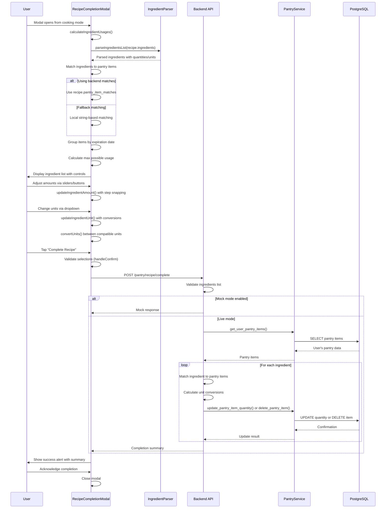

# Recipe Completion Modal Flow Documentation

## 1. User Flow

1. **Modal Trigger**: User completes cooking steps and opens RecipeCompletionModal from cooking-mode screen
2. **Ingredient Calculation**: Modal automatically calculates ingredient usage from recipe and available pantry items
3. **Ingredient Review**: User sees each ingredient with:
   - Requested quantity and unit from recipe
   - Available pantry items grouped by expiration date
   - Slider controls for precise amount selection
   - Unit conversion options (dropdown)
   - Quick amount buttons (None, 1/4, Half, 3/4, All)
4. **Pantry Item Details**: User can expand dropdown to see all available items with expiration dates
5. **Amount Adjustment**: User adjusts usage amounts per ingredient using:
   - Continuous slider with calculated step sizes
   - Quick preset buttons for common fractions
   - Unit conversion to different compatible units
6. **Validation**: System validates selections and shows warnings for:
   - Shortfall amounts (when using less than requested)
   - Missing ingredients (not available in pantry)
7. **Completion**: User taps "Complete Recipe" to finalize and subtract ingredients
8. **Processing**: Backend processes ingredient subtraction with unit conversions
9. **Feedback**: Success message shows updated/depleted item counts
10. **State Update**: Modal closes and cooking mode reflects completion

## 2. Data Flow

### Initial Setup Flow:
1. **RecipeCompletionModal** receives recipe data and pantry items as props
2. **calculateIngredientUsages()** triggered on modal open:
   - Validates recipe ingredients array for undefined/null values
   - Uses `parseIngredientsList()` to extract quantities and units
   - Matches ingredients to pantry items using backend matches or fallback local matching
   - Groups pantry items by expiration date (FIFO consumption)
   - Calculates maximum possible usage per ingredient
   - Sets default selection amounts

### Ingredient Matching Process:
1. **Backend Matches** (Priority): Uses `recipe.pantry_item_matches` from previous API call
2. **Fallback Local Matching**: String-based matching with variations:
   - Exact name matches
   - Partial string containment (both directions)
   - Word-level partial matches
3. **Item Grouping**: Groups duplicate items by expiration date for proper FIFO handling

### Unit Conversion Flow:
1. **Unit Compatibility**: `getCompatibleUnits()` determines convertible units
2. **Real-time Conversion**: `convertUnits()` handles conversions between:
   - Volume units (ml, l, cups, tbsp, tsp, fl oz)
   - Weight units (g, kg, lb, oz)
   - No cross-category conversions (volume ↔ weight)
3. **Step Calculation**: `calculateStepSize()` determines appropriate slider increments

### Completion Flow:
1. **Validation**: Checks for available ingredients and positive selections
2. **API Call**: POST to `/pantry/recipe/complete` with ingredient usage data
3. **Backend Processing**: `complete_recipe()` in pantry_router.py:
   - Matches ingredient names to pantry items
   - Calculates unit conversions if needed
   - Updates or deletes pantry items
   - Returns summary of changes

## 3. Implementation Map

| Layer | File / Module | Responsibility |
|-------|---------------|----------------|
| **Frontend Components** | |
| Main Modal | `ios-app/components/modals/RecipeCompletionModal.tsx` | 🟢 WORKING - Complete ingredient selection UI |
| Cooking Screen | `ios-app/app/cooking-mode.tsx` | 🟢 WORKING - Modal integration and completion handling |
| **Frontend Utils** | |
| Ingredient Parser | `ios-app/utils/ingredientParser.ts` | 🟢 WORKING - Extracts quantities/units from strings |
| Number Formatting | `ios-app/utils/numberFormatting.ts` | 🟢 WORKING - Display formatting for quantities |
| **Frontend Services** | |
| API Service | `ios-app/services/api.ts` | 🟢 WORKING - Recipe completion API calls |
| API Client | `ios-app/services/apiClient.ts` | 🟢 WORKING - HTTP request handling |
| **Backend Routers** | |
| Pantry Router | `backend_gateway/routers/pantry_router.py` | 🟢 WORKING - `/pantry/recipe/complete` endpoint |
| Recipe Consumption | `backend_gateway/routers/recipe_consumption_router.py` | 🟢 WORKING - Alternative endpoints (not used by modal) |
| **Backend Services** | |
| Pantry Service | `backend_gateway/services/pantry_service.py` | 🟢 WORKING - Pantry CRUD operations |
| Recipe Completion | `backend_gateway/services/recipe_completion_service.py` | 🟡 PARTIAL - Advanced matching (exists but not used) |
| **Unit System** | |
| Units Constants | `backend_gateway/constants/units.py` | 🟢 WORKING - Comprehensive unit definitions |
| **Database** | |
| Pantry Items | PostgreSQL `pantry_items` table | 🟢 WORKING - Quantity updates and deletions |

## 4. Diagram



## 5. Findings & Gaps

### ✅ Implemented Items
- **Frontend Modal UI**: Complete ingredient selection interface with sliders, dropdowns, and quick buttons
- **Ingredient Parsing**: Robust extraction of quantities and units from recipe strings
- **Unit Conversion System**: Frontend and backend support for volume/weight conversions
- **Step-based Sliders**: Intelligent step size calculation based on units and quantities
- **FIFO Item Selection**: Expiration date prioritization for ingredient consumption
- **Input Validation**: Comprehensive validation of ingredient data and user selections
- **Real-time Unit Conversion**: Live conversion between compatible units in UI
- **Pantry Updates**: Database quantity updates and item deletion when depleted
- **Error Handling**: Graceful handling of API errors and invalid data
- **Mock Mode Support**: Remote control mock data system for testing

### ❌ Missing or Mock Items
- **Advanced Fuzzy Matching**: Modal relies on simple string matching for ingredient-to-pantry matching
- **Cross-Category Unit Conversion**: Cannot convert between volume, weight, and count units
- **Ingredient Density Tables**: No support for ingredient-specific volume-to-weight conversions
- **Multi-Item Consumption Logic**: Limited handling of consuming from multiple pantry items for single ingredient
- **Cooking History Tracking**: Completed recipes not stored in dedicated history table
- **Batch Database Operations**: Individual API calls per ingredient (not transactional)
- **Smart Matching Algorithms**: No ML or fuzzy matching for ingredient names
- **Synonym Database**: No support for ingredient synonyms (e.g., "scallions" = "green onions")
- **Brand Name Normalization**: Limited handling of brand-specific product names

### ⚠ Unclear Items (Need Follow-up)
- **Multiple Item Selection**: How does the system handle consuming from multiple pantry items of the same ingredient?
- **Partial Conversion Failures**: What happens when unit conversion fails mid-process?
- **Concurrent Access**: Race conditions when multiple users update same pantry items?
- **Rollback Strategy**: How are failed ingredient subtractions handled?
- **Quantity Precision**: Are float precision issues handled properly in calculations?
- **Expiration Date Handling**: How are expired items treated in the selection process?

### Technical Implementation Details

#### Frontend Unit Conversion Constants
```typescript
const UNIT_CONVERSIONS: Record<string, Record<string, number>> = {
  'tsp': { 'tbsp': 1/3, 'cup': 1/48, 'ml': 5, 'l': 0.005, 'oz': 0.167 },
  'tbsp': { 'tsp': 3, 'cup': 1/16, 'ml': 15, 'l': 0.015, 'oz': 0.5 },
  // ... comprehensive conversion table
}
```

#### Step Size Calculation Logic
```typescript
const calculateStepSize = (maxValue: number, unit: string): number => {
  // Unit-specific step sizes for precise control
  const stepSizes = {
    'tsp': 0.25, 'tbsp': 0.25, 'cup': 0.125,
    'g': maxValue <= 100 ? 5 : maxValue <= 500 ? 10 : 25,
    // ... adaptive step sizing
  }
}
```

#### Backend Matching Algorithm
```python
# Simple string-based matching with scoring:
# 100: Exact match, 90: Singular/plural, 80: Contains, 70: Contained, 60: Substitutions
# No fuzzy matching or ML algorithms currently implemented
```

### Performance & Scalability Issues
- **N+1 Database Problem**: Individual database calls per ingredient update
- **No Transaction Management**: Ingredient updates not wrapped in database transactions
- **Frontend Calculation Overhead**: Complex calculations performed in UI thread
- **No Caching**: Recipe and pantry data not cached between operations
- **Large Recipe Handling**: UI may become unwieldy with 20+ ingredients

### Error Recovery Scenarios
1. **API Timeout**: Frontend shows generic error, no retry mechanism
2. **Partial Update Failures**: Some ingredients updated, others fail - no rollback
3. **Unit Conversion Failures**: Falls back to original units without user notification
4. **Invalid Ingredient Data**: Filtered out with console warnings
5. **Concurrent Modifications**: Last-write-wins, no conflict resolution

## 6. Integration Points

### With Cooking Mode Screen
- **Data Flow**: Recipe data passed via props from cooking-mode.tsx
- **Completion Callback**: `onConfirm` handles API calls and success feedback
- **State Management**: Modal state managed by parent screen

### With Backend APIs
- **Primary Endpoint**: `/pantry/recipe/complete` for ingredient subtraction
- **Alternative System**: `/recipe-consumption/*` endpoints available but not used
- **Mock System**: RemoteControl_7.py provides mock data toggle

### With Unit System
- **Frontend Conversions**: Used for UI display and user selections
- **Backend Conversions**: Used for database storage normalization
- **Compatibility Checking**: Prevents invalid unit combinations

This flow represents a 🟡 **PARTIAL** implementation with solid UI/UX and basic functionality, but significant gaps in matching intelligence, error handling robustness, and performance optimization.