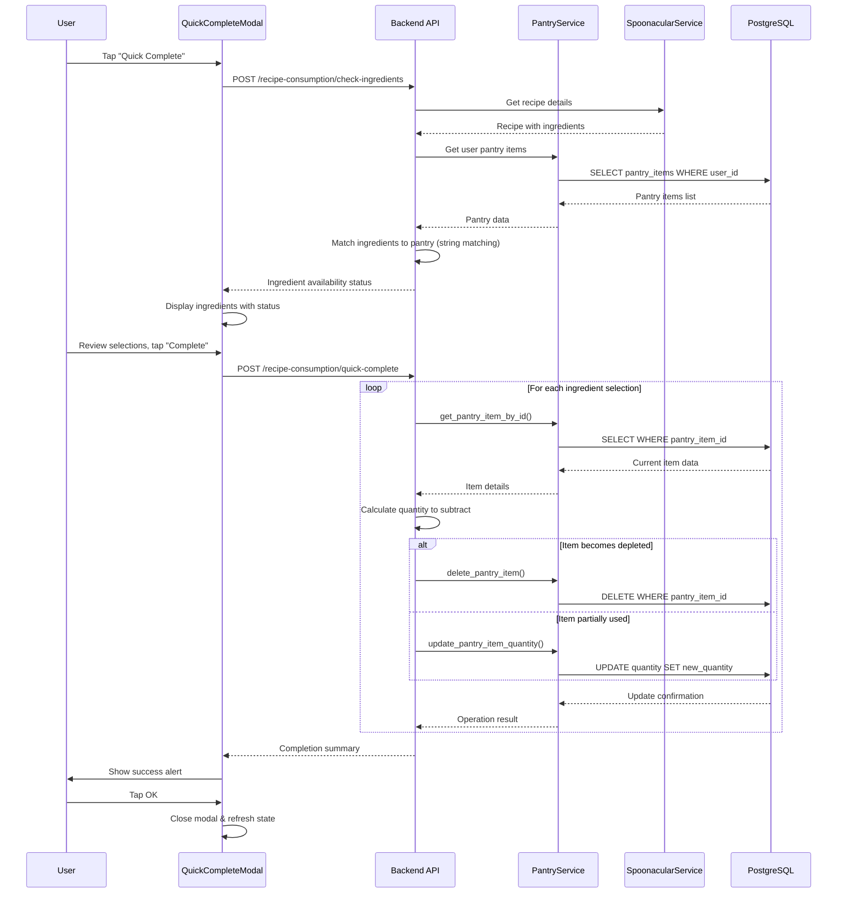

# Recipe Ingredient Subtraction/Drawdown Flow Documentation

## 1. User Flow

1. **Recipe Selection**: User selects a recipe from the RecipesScreen or recipe detail view
2. **Quick Complete Button**: User taps "Quick Complete" button on recipe card (RecipeDetailCardV3.tsx)
3. **Modal Opens**: QuickCompleteModal opens with loading state
4. **Ingredient Check**: System fetches ingredient availability data via `/recipe-consumption/check-ingredients` API
5. **Ingredient Display**: Modal shows each ingredient with:
   - Required quantity and unit
   - Status indicator (available/partial/missing)
   - Auto-selected pantry item (prioritized by expiration date)
   - Multiple options indicator if applicable
6. **Item Selection**: User can tap ingredients with multiple pantry matches to open PantryItemSelectionModal
7. **Confirmation**: User taps "Complete Recipe" button
8. **Processing**: System processes ingredient subtraction via `/recipe-consumption/quick-complete` API
9. **Success Feedback**: Success alert shows completion message with updated/depleted item counts
10. **State Update**: Modal closes and parent component refreshes pantry state

## 2. Data Flow

### Frontend → Backend Request Flow:
1. **QuickCompleteModal.tsx** → `fetchIngredientAvailability()` → POST `/recipe-consumption/check-ingredients`
2. **Backend** processes via `check_ingredients_availability()` in `recipe_consumption_router.py`
3. **SpoonacularService** fetches recipe details and ingredients
4. **PantryService** retrieves user's pantry items
5. **Ingredient Matching** performed using simple string matching algorithms
6. **Response** returns ingredient status and pantry matches sorted by expiration

### Backend → Database Update Flow:
1. **QuickCompleteModal.tsx** → `handleQuickComplete()` → POST `/recipe-consumption/quick-complete`
2. **Backend** processes via `quick_complete_recipe()` in `recipe_consumption_router.py`
3. **For each ingredient selection**:
   - Get current pantry item via `get_pantry_item_by_id()`
   - Calculate quantity to subtract (min of required vs available)
   - Update or delete pantry item via `update_pantry_item_quantity()` or `delete_pantry_item()`
4. **Database Updates** executed via PostgreSQL transactions
5. **Response** returns completion record with updated/depleted items

## 3. Implementation Map

| Layer | File / Module | Responsibility |
|-------|---------------|----------------|
| **Frontend Components** | |
| Modal UI | `ios-app/components/modals/QuickCompleteModal.tsx` | Main ingredient selection interface |
| Selection Modal | `ios-app/components/modals/PantryItemSelectionModal.tsx` | Multiple item selection |
| Recipe Card | `ios-app/components/recipes/RecipeDetailCardV3.tsx` | Quick complete button |
| **Frontend Services** | |
| API Client | `ios-app/services/apiClient.ts` | HTTP request handling |
| Recipe Service | `ios-app/services/recipeService.ts` | Recipe-related API calls |
| **Backend Routers** | |
| Recipe Consumption | `backend_gateway/routers/recipe_consumption_router.py` | Main API endpoints |
| **Backend Services** | |
| Pantry Service | `backend_gateway/services/pantry_service.py` | Pantry CRUD operations |
| Spoonacular Service | `backend_gateway/services/spoonacular_service.py` | Recipe data retrieval |
| Recipe Completion | `backend_gateway/services/recipe_completion_service.py` | 🔴 CONCEPT - Advanced matching/conversion |
| **Unit Conversion** | |
| Units Constants | `backend_gateway/constants/units.py` | Unit definitions and conversions |
| **Database** | |
| Pantry Items Table | PostgreSQL `pantry_items` | Item storage with quantities |
| Products Table | PostgreSQL `products` | Product definitions |

## 4. Diagram



## 5. Findings & Gaps

### ✅ Implemented Items
- Basic ingredient availability checking
- Simple string-based ingredient matching
- Pantry item quantity updates and deletion
- Frontend modal with ingredient selection
- Expiration date prioritization for item selection
- Unit conversion system (weight/volume categories)
- PostgreSQL database operations
- Error handling and user feedback

### ❌ Missing or Mock Items
- **Advanced Fuzzy Matching**: Current matching uses simple string contains/equals - no fuzzy matching algorithms
- **Comprehensive Unit Conversions**: Missing count-to-weight conversions (e.g., "2 tomatoes" to "500g")
- **Ingredient-Specific Conversions**: No ingredient density tables for volume-to-weight conversions
- **Brand Name Handling**: Limited brand name cleaning and normalization
- **Synonym Support**: No ingredient synonym database (e.g., "scallions" = "green onions")
- **Recipe Completion Service**: `RecipeCompletionService` exists but not used in main flow
- **Cooking History**: Completion events not stored in dedicated cooking_history table
- **Batch Operations**: Individual database calls per ingredient (not optimized)

### ⚠ Unclear Items (Need Follow-up)
- **Unit Mismatch Handling**: What happens when "bunch of cilantro" vs "2 tbsp cilantro"?
- **Partial Ingredient Matching**: How are partial matches weighted and selected?
- **Multi-User Concurrency**: Race conditions when multiple users access same pantry items?
- **Rollback Strategy**: What happens if ingredient subtraction fails mid-process?
- **Conversion Accuracy**: Are volume-to-weight conversions accurate for different ingredients?

### Technical Details

#### String Matching Algorithm (`RecipeCompletionService.match_ingredient_to_pantry`)
```python
# Scoring system:
# 100: Exact match (ingredient_name == item_name)
# 90:  Singular/plural variations (removing 's'/'es')
# 80:  Ingredient contained in item name
# 70:  Item name contained in ingredient
# 60:  Known substitutions (limited hardcoded list)
```

#### Unit Conversion Implementation
- **Categories**: Weight (g base), Volume (ml base), Count (no conversion)
- **Supported**: Standard metric/imperial conversions within same category
- **Limitations**: No cross-category conversions, no ingredient-specific densities

#### Database Schema Dependencies
```sql
-- Primary tables used
pantry_items (pantry_item_id, pantry_id, product_id, quantity, unit_of_measurement)
pantry (pantry_id, user_id)
products (product_id, product_name)
```

#### Error Scenarios Identified
1. **Unit Mismatch**: "2 cups flour" recipe vs "500g flour" pantry → No conversion available
2. **Count Units**: "3 eggs" recipe vs pantry items without count tracking
3. **Brand Variations**: "Heinz Ketchup" vs "ketchup" matching issues
4. **Pluralization**: "tomatoes" vs "tomato" matching (partially handled)
5. **Partial Updates**: Database update failures mid-process leave inconsistent state

## 6. Performance Considerations

- **Database Calls**: Multiple individual SELECT/UPDATE calls per ingredient (N+1 problem)
- **Concurrency**: No locking mechanism for pantry item updates
- **Caching**: No caching of recipe or pantry data between check and complete operations
- **Transaction Management**: Individual operations not wrapped in single transaction

This flow represents a 🟡 **PARTIAL** implementation with basic functionality working but significant gaps in matching accuracy, unit conversion coverage, and error handling robustness.