# Recipe Recommendation System Flow Documentation

## 1. User Flow

### Chat Recipe Recommendations
1. User opens chat interface via:
   - Navigation to `/chat.tsx` (main tab)
   - Modal via `/chat-modal.tsx` (from lightbulb suggestions)
2. User sees pre-canned suggestions or types custom message
3. System shows preference choice modal (first message only)
4. AI processes message with/without preferences
5. Recipe cards displayed inline with chat response
6. User taps recipe card → navigates to `/recipe-details.tsx`

### Lightbulb Icon Pre-canned Questions
1. User taps lightbulb FAB (floating action button) on any tab
2. System shows floating suggestions based on:
   - Time of day (breakfast/lunch/dinner)
   - Expiring pantry items
   - User preferences
   - Random pantry ingredients
3. User taps suggestion → navigates to `/chat-modal.tsx` with pre-filled message
4. Follows chat flow from step 3 above

### Recipe Browsing Flow
1. User navigates to `/recipes.tsx` tab
2. System shows three tabs: "Pantry", "Discover", "My Recipes"
3. User filters by dietary preferences, cuisines, cooking time
4. User taps recipe card → navigates to `/recipe-spoonacular-detail.tsx`

## 2. Data Flow

### Chat Message Processing
```
sendChatMessage(message, userId, usePreferences) 
  → /chat/message API endpoint
  → CrewAIService.process_message()
  → RecipeAdvisor.analyze_pantry()
  → RecipePreferenceScorer.score_recipes()
  → Returns: {response, recipes[], user_preferences, show_preference_choice}
```

### Recipe Image Generation
```
generateRecipeImage(recipeName, style, useGenerated)
  → /chat/generate-recipe-image API endpoint  
  → If useGenerated: DALL-E 2 API
  → Else: Unsplash API search
  → Returns: {image_url, recipe_name}
```

### Lightbulb Suggestions Generation
```
TabDataProvider.fetchChatData()
  → Analyzes current time, pantry items, preferences
  → Generates dynamic suggestions array
  → Cached for 5 minutes
  → Used by AddButton.tsx for pre-canned options
```

### Recipe Browsing Data Flow
```
RecipesContainer.tsx initialization
  → searchRecipesFromPantry(userId) for "Pantry" tab
  → SpoonacularService.search_recipes_by_ingredients() 
  → Applies user preference filtering via RecipePreferenceScorer
  → Returns filtered/scored recipe list
```

## 3. Implementation Map

| Layer | File / Module | Responsibility |
|-------|---------------|----------------|
| **Frontend UI** | `/app/(tabs)/chat.tsx` | Main chat interface with preference integration |
| **Frontend UI** | `/app/chat-modal.tsx` | Modal chat interface (from lightbulb) |
| **Frontend UI** | `/app/components/AddButton.tsx` | Lightbulb FAB with dynamic suggestions |
| **Frontend UI** | `/app/(tabs)/recipes.tsx` → `RecipesContainer.tsx` | Recipe browsing interface |
| **Frontend UI** | `/app/recipe-details.tsx` | Chat-generated recipe modal |
| **Frontend UI** | `/app/recipe-spoonacular-detail.tsx` | Spoonacular recipe modal |
| **Frontend Context** | `/context/TabDataProvider.tsx` | Pre-generates lightbulb suggestions |
| **Frontend Context** | `/context/UserPreferencesContext.tsx` | Manages dietary preferences/allergens |
| **Frontend Services** | `/services/api.ts` | API communication layer |
| **Backend Router** | `/backend_gateway/routers/chat_router.py` | Chat message processing endpoint |
| **Backend Router** | `/backend_gateway/routers/chat_streaming_router.py` | Streaming chat responses |  
| **Backend Service** | `/backend_gateway/services/recipe_advisor_service.py` | Core recommendation logic |
| **Backend Service** | `/backend_gateway/services/spoonacular_service.py` | External recipe API integration |
| **Backend Service** | `/backend_gateway/services/recipe_preference_scorer.py` | Preference-based recipe scoring |
| **Backend Service** | `/backend_gateway/services/openai_recipe_service.py` | AI-generated recipe content |

## 4. Diagram

```mermaid
sequenceDiagram
    participant U as User
    participant LB as Lightbulb FAB
    participant CM as Chat Modal
    participant API as Backend API
    participant AI as CrewAI Service
    participant SP as Spoonacular API
    participant DB as Database
    
    Note over U,DB: Lightbulb Pre-canned Questions Flow
    U->>LB: Tap lightbulb icon
    LB->>LB: Generate dynamic suggestions<br/>(time, pantry, preferences)
    LB-->>U: Show floating suggestions
    U->>CM: Tap suggestion
    CM->>API: /chat/message with suggestion
    
    Note over U,DB: Chat Recipe Recommendation Flow  
    U->>CM: Type message or use suggestion
    CM->>API: POST /chat/message(message, user_id, use_preferences)
    API->>DB: Fetch user preferences & pantry
    API->>AI: process_message(pantry, preferences, message)
    AI->>AI: analyze_pantry()<br/>evaluate_recipe_fit()
    
    alt First message with preferences
        API-->>CM: {response, recipes, user_preferences, show_preference_choice: true}
        CM-->>U: Show preference choice modal
        U->>CM: Choose "Yes" or "No"
        CM->>API: Resend message with preference flag
    end
    
    API-->>CM: {response, recipes[], pantry_items[]}
    CM->>CM: Display recipe cards inline
    U->>CM: Tap recipe card
    CM->>U: Navigate to /recipe-details
    
    Note over U,DB: Recipe Browsing Flow
    U->>API: Navigate to recipes tab
    API->>DB: Fetch pantry items
    API->>SP: search_recipes_by_ingredients()
    SP-->>API: Recipe results
    API->>API: Apply preference filtering
    API-->>U: Filtered recipe list
    U->>U: Tap recipe → /recipe-spoonacular-detail
```



## 5. Findings & Gaps

### ✅ Implemented & Working
- Chat-based recipe recommendations with AI integration
- Lightbulb dynamic suggestion generation
- User preference integration in chat flow
- Recipe image generation (DALL-E 2 + Unsplash)
- Two separate recipe detail modals for different data sources
- Real-time pantry analysis for expiring ingredients
- Time-based suggestion generation (breakfast/lunch/dinner)

### 🟡 Partial Implementation
- **User preference integration in recipe browsing**: Preferences are applied in backend filtering but UI doesn't show "preference-matched" indicators
- **Recipe browsing preference filtering**: Filter UI exists but doesn't clearly show which recipes match user allergens/diet
- **Spoonacular vs Chat recipe consistency**: Two different modal implementations create inconsistent UX

### ❌ Missing or Mock Items
- **Unified recipe modal component**: Chat and Spoonacular recipes use different modals with different UIs
- **Preference indicator in recipe cards**: No visual indication when recipes match user dietary preferences
- **Cross-modal preference persistence**: Lightbulb suggestions don't carry preference context to chat
- **Recipe source transparency**: Users can't easily see if recipe is from AI, Spoonacular, or local database

### ⚠️ Areas Needing Clarification
- **Recipe data source priority**: When multiple sources (AI, Spoonacular, local) have same recipe, which takes precedence?
- **Preference enforcement strictness**: Should allergen restrictions completely filter out recipes or just warn users?
- **Modal navigation consistency**: Should both recipe flows use the same modal component for better UX?