# Recipe Recommendation System Critical Issues Analysis

## Executive Summary

This document analyzes two critical issues in the PrepSense recipe recommendation system:

1. **Lightbulb Canned Messages Issue**: Pre-populated suggestions don't lead to differentiated recipe recommendations
2. **Recipe Detail Modal Inconsistency**: Chat-generated and Spoonacular recipes use different modal implementations

## 1. User Flow Analysis

### Lightbulb Pre-canned Messages Flow
1. **User sees lightbulb FAB** on any tab (`AddButton.tsx`)
2. **User taps lightbulb** → Shows floating suggestions from hardcoded array
3. **User taps suggestion** → Navigates to `/chat-modal` with `params.suggestion`
4. **Chat modal loads** → Automatically sends the suggestion as a message
5. **Backend processes** → `CrewAIService.process_message()` treats all messages identically
6. **Result**: Same recipe recommendations regardless of which suggestion was selected

### Recipe Detail Modal Flow
1. **Chat-generated recipes** → Navigate to `/recipe-details.tsx` → Uses `RecipeDetailCardV3`
2. **Spoonacular recipes** → Navigate to `/recipe-spoonacular-detail.tsx` → Uses custom Spoonacular modal
3. **Result**: Two completely different UX experiences for recipe details

## 2. Data Flow Analysis

### Current Lightbulb Message Processing 🔴 BROKEN
```
AddButton suggestions (hardcoded) →
  chat-modal.tsx (params.suggestion) →
    sendChatMessage(message, userId, usePreferences) →
      /chat/message API endpoint →
        CrewAIService.process_message() →
          ❌ NO MESSAGE DIFFERENTIATION
          ❌ ALL SUGGESTIONS PROCESSED IDENTICALLY
          Same pantry analysis + same recipe ranking
```

### Expected Differentiated Processing 🟡 MISSING
```
Different suggestions should trigger:
├── "Breakfast ideas" → Time-specific + breakfast-tagged recipes
├── "Expiring ingredients" → Prioritize expiring items in pantry analysis
├── "Quick meals" → Filter by cooking time < 20 minutes
├── "Healthy recipes" → Prioritize nutrition-scored recipes
└── "Dietary preference" → Apply strict dietary filters
```

### Recipe Modal Data Flow Inconsistency 🔴 BROKEN
```
Chat Recipes:
  Recipe data (chat format) → 
    /recipe-details.tsx → 
      RecipeDetailCardV3 → 
        normalizeRecipeData() → 
          Converts to extended ingredients format

Spoonacular Recipes:
  Recipe data (Spoonacular format) → 
    /recipe-spoonacular-detail.tsx → 
      Custom Spoonacular modal → 
        Native Spoonacular data structure
```

## 3. Implementation Map

| Layer | File / Module | Current Status | Issue |
|-------|---------------|----------------|--------|
| **Frontend Suggestions** | `/ios-app/app/components/AddButton.tsx` | 🟢 Working | Hardcoded suggestions, no context |
| **Lightbulb Navigation** | `/ios-app/app/chat-modal.tsx` | 🟢 Working | No message differentiation |
| **Chat Processing** | `/backend_gateway/routers/chat_router.py` | 🔴 Issue | Ignores message context for recommendations |
| **Recipe Analysis** | `/backend_gateway/services/recipe_advisor_service.py` | 🔴 Issue | No suggestion-specific logic |
| **Chat Recipe Modal** | `/ios-app/app/recipe-details.tsx` | 🟢 Working | Uses RecipeDetailCardV3 |
| **Spoonacular Modal** | `/ios-app/app/recipe-spoonacular-detail.tsx` | 🟢 Working | Completely different implementation |
| **Modal Normalization** | `/ios-app/components/recipes/RecipeDetailCardV3.tsx` | 🟡 Partial | Only normalizes chat recipes |

## 4. Root Cause Analysis

### Issue 1: Lightbulb Canned Messages Don't Differentiate

**Root Cause**: The `CrewAIService.process_message()` function treats all incoming messages identically, regardless of their content or intent.

**Evidence**:
```typescript
// In recipe_advisor_service.py line 138-229
async def process_message(self, user_id: int, message: str, use_preferences: bool = True):
    # ❌ NO MESSAGE ANALYSIS OR DIFFERENTIATION
    # Same flow for all messages:
    # 1. Fetch pantry items
    # 2. Get saved recipes  
    # 3. Get Spoonacular recipes
    # 4. Rank identically
```

**Current Suggestions (hardcoded in AddButton.tsx)**:
- "What can I make for dinner?"
- "What can I make with only ingredients I have?"
- "What's good for breakfast?"
- "Show me healthy recipes"
- "Quick meals under 20 minutes"
- "What's expiring soon?"

**Problem**: All suggestions result in identical recipe recommendations because:
1. No message intent analysis
2. No time-of-day filtering  
3. No cooking-time constraints
4. No health/nutrition prioritization
5. No expiration-based ranking

### Issue 2: Recipe Detail Modal Inconsistency

**Root Cause**: Two separate modal implementations were created for different recipe sources instead of a unified modal system.

**Evidence**:
```typescript
// Chat recipes use:
/app/recipe-details.tsx → RecipeDetailCardV3 (comprehensive, normalized)

// Spoonacular recipes use:  
/app/recipe-spoonacular-detail.tsx → Custom modal (Spoonacular-specific)
```

**Inconsistencies**:
1. **Different layouts**: Chat modal has hero images, Spoonacular has basic layout
2. **Different data handling**: Chat normalizes data, Spoonacular assumes native format
3. **Different features**: Chat modal has quick-complete, Spoonacular has nutrition tabs
4. **Different styling**: Completely different color schemes and typography

## 5. Diagram

```mermaid
sequenceDiagram
    participant U as User
    participant LB as Lightbulb FAB
    participant CM as Chat Modal
    participant API as Backend API
    participant RA as Recipe Advisor
    
    Note over U,RA: CURRENT BROKEN FLOW
    U->>LB: Tap lightbulb
    LB->>LB: Show hardcoded suggestions
    U->>CM: Tap "Quick meals <20min"
    CM->>API: POST /chat/message("Quick meals <20min")
    API->>RA: process_message()
    RA->>RA: ❌ NO MESSAGE ANALYSIS
    RA->>RA: Same pantry analysis for all messages
    RA->>RA: Same recipe ranking for all messages
    API-->>CM: Same recipes regardless of suggestion
    
    Note over U,RA: EXPECTED DIFFERENTIATED FLOW
    U->>LB: Tap lightbulb 
    LB->>LB: Generate context-aware suggestions
    U->>CM: Tap "Quick meals <20min"
    CM->>API: POST /chat/message + intent metadata
    API->>RA: process_message_with_intent()
    RA->>RA: ✅ Analyze message intent: "quick_meals"
    RA->>RA: ✅ Apply time filter: cookingTime < 20
    RA->>RA: ✅ Prioritize simple recipes
    API-->>CM: Time-filtered, quick recipes
    
    Note over U,RA: MODAL INCONSISTENCY ISSUE
    alt Chat Recipe Selected
        CM->>U: Navigate to /recipe-details
        U->>U: RecipeDetailCardV3 modal
    else Spoonacular Recipe Selected  
        CM->>U: Navigate to /recipe-spoonacular-detail
        U->>U: Custom Spoonacular modal
        Note over U: Different UX, features, styling
    end
```



## 6. Specific Implementation Gaps

### 🔴 Critical Gaps

1. **Message Intent Analysis Missing**
   - **File**: `backend_gateway/services/recipe_advisor_service.py`
   - **Function**: `process_message()` line 138
   - **Gap**: No analysis of message content to determine intent
   - **Fix Required**: Add intent classification and context-aware processing

2. **Suggestion-Specific Recipe Filtering Missing**
   - **File**: `backend_gateway/services/recipe_advisor_service.py`
   - **Function**: `_get_spoonacular_recipes()`, `_rank_recipes()`
   - **Gap**: No time, health, or cooking-method filters applied based on suggestion
   - **Fix Required**: Add conditional filtering logic

3. **Unified Recipe Modal Missing**
   - **Files**: `/ios-app/app/recipe-details.tsx` and `/ios-app/app/recipe-spoonacular-detail.tsx`
   - **Gap**: Two completely different modal implementations
   - **Fix Required**: Consolidate into single modal with data normalization

### 🟡 Enhancement Gaps

4. **Dynamic Suggestion Generation**
   - **File**: `ios-app/app/components/AddButton.tsx`
   - **Line**: 22-32 (hardcoded suggestions)
   - **Gap**: No context-aware suggestion generation
   - **Enhancement**: Use TabDataProvider's dynamic suggestions

5. **Lightbulb Integration with TabDataProvider**
   - **File**: `ios-app/context/TabDataProvider.tsx`
   - **Function**: `fetchChatData()` line 187
   - **Gap**: Generated suggestions not used by lightbulb
   - **Enhancement**: Connect AddButton to TabDataProvider suggestions

### 🟢 Working Components

6. **Chat Message Processing Pipeline** ✅
7. **Recipe Data Normalization in RecipeDetailCardV3** ✅
8. **User Preference Integration** ✅
9. **Pantry Analysis and Recipe Ranking** ✅

## 7. Recommended Fixes

### Fix 1: Implement Message Intent Analysis

**Modify**: `backend_gateway/services/recipe_advisor_service.py`

```python
async def process_message(self, user_id: int, message: str, use_preferences: bool = True):
    # NEW: Analyze message intent
    intent = self._analyze_message_intent(message)
    
    # Apply intent-specific processing
    if intent['type'] == 'quick_meals':
        max_cooking_time = 20
        recipe_filters = {'quick': True, 'simple': True}
    elif intent['type'] == 'breakfast':
        time_filter = 'breakfast'
        recipe_filters = {'meal_type': 'breakfast'}
    elif intent['type'] == 'healthy':
        nutrition_priority = True
        recipe_filters = {'healthy': True}
    elif intent['type'] == 'expiring':
        prioritize_expiring = True
        recipe_filters = {'use_expiring': True}
    
    # Pass filters to recipe ranking
    ranked_recipes = self._rank_recipes(
        all_recipes, valid_items, user_preferences, 
        intent_filters=recipe_filters
    )
```

### Fix 2: Unify Recipe Modals

**Create**: `ios-app/app/components/UnifiedRecipeModal.tsx`

```typescript
export default function UnifiedRecipeModal({ recipe, source }: {
  recipe: Recipe | SpoonacularRecipe;
  source: 'chat' | 'spoonacular' | 'saved';
}) {
  // Normalize all recipe formats to common structure
  const normalizedRecipe = normalizeRecipeFromAnySource(recipe, source);
  
  // Use single modal implementation with feature flags
  return (
    <RecipeDetailCardV3 
      recipe={normalizedRecipe}
      showNutrition={source === 'spoonacular'}
      showQuickComplete={source === 'chat'}
      showSpoonacularAttribution={source === 'spoonacular'}
    />
  );
}
```

### Fix 3: Connect AddButton to Dynamic Suggestions

**Modify**: `ios-app/app/components/AddButton.tsx`

```typescript
import { useTabData } from '../../context/TabDataProvider';

function AddButton() {
  const { chatData } = useTabData();
  
  // Use dynamic suggestions from TabDataProvider instead of hardcoded
  const suggestedMessages = chatData?.suggestedQuestions || defaultSuggestedMessages;
  
  // Include context metadata with suggestions
  const handleSuggestionPress = (suggestion: string) => {
    const suggestionContext = inferSuggestionContext(suggestion);
    
    router.push({
      pathname: '/chat-modal',
      params: { 
        suggestion,
        context: JSON.stringify(suggestionContext)
      }
    });
  };
}
```

## 8. Success Metrics

### Before Fixes
- ❌ All lightbulb suggestions produce identical recipes
- ❌ Two inconsistent recipe detail experiences  
- ❌ No time/context awareness in recommendations
- ❌ No cooking time or health filtering

### After Fixes ✅
- ✅ Different suggestions produce contextually appropriate recipes
- ✅ Unified recipe detail modal experience
- ✅ Time-aware and context-sensitive recommendations
- ✅ Proper filtering by cooking time, health, and dietary needs

## 9. Implementation Priority

1. **High Priority**: Fix message intent analysis (Critical UX issue)
2. **High Priority**: Unify recipe modals (Critical consistency issue)  
3. **Medium Priority**: Connect AddButton to dynamic suggestions (Enhancement)
4. **Low Priority**: Advanced context awareness (Future enhancement)

**Estimated Development Time**: 2-3 days for critical fixes, 1-2 additional days for enhancements.