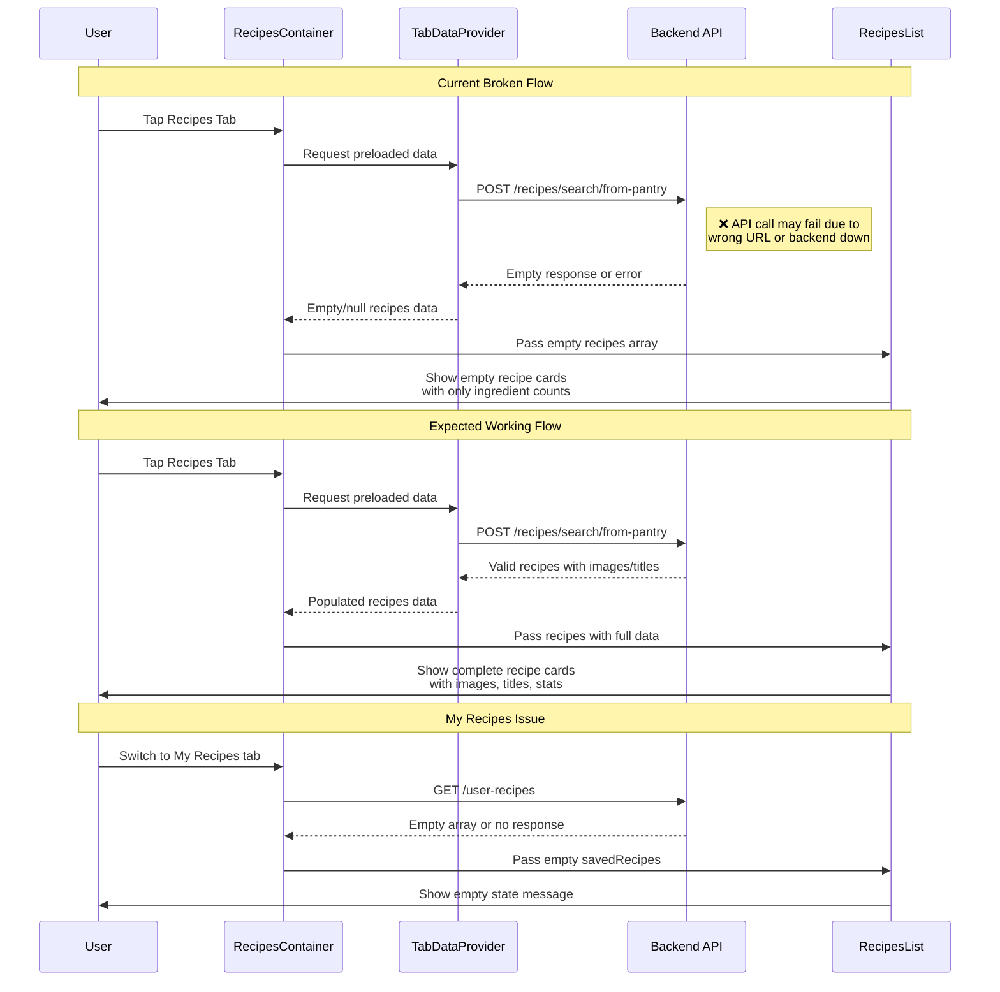

# Recipes Screen Display Issues Flow Documentation

## 1. User Flow

1. **App Launch**: User opens PrepSense app, TabDataProvider starts preloading data
2. **Navigation**: User taps "Recipes" tab in bottom navigation
3. **Screen Load**: RecipesContainer component renders with three tabs
4. **Tab Display**: Shows "From Pantry", "Discover", "My Recipes" tabs
5. **From Pantry Tab Issues**:
   - User sees empty recipe cards with only "✓ 0 have ✗ 0 missing" text
   - Gray placeholder areas where recipe images/content should be
   - No actual recipe titles or images display
6. **My Recipes Tab Issues**:
   - Shows empty state with bookmark icon
   - Text reads: "Bookmarks save recipes you want to try. Tap the bookmark icon on any recipe to add one."
   - No saved recipes display even if they exist in database
7. **User Experience**: User sees broken/incomplete recipe displays instead of functional recipe cards

## 2. Data Flow

### Expected Data Flow
1. **TabDataProvider**: Preloads data when items are initialized
2. **Pantry Recipe Search**: `POST /recipes/search/from-pantry` with user_id=111
3. **Backend Processing**: 
   - Gets user pantry items
   - Searches Spoonacular API with cleaned ingredient names
   - Calculates ingredient match counts
   - Returns filtered recipes with at least 1 matching ingredient
4. **Frontend Processing**:
   - RecipesContainer receives recipes from TabDataProvider
   - Ingredient counts recalculated client-side using ingredientMatcher
   - RecipesList renders recipe cards with images, titles, and stats

### Actual Broken Flow
1. **API Configuration Issue**: Config uses fallback localhost:8002 when ENV_API_URL not set
2. **Backend Connectivity**: API calls may be failing due to wrong base URL or backend not running
3. **Data Loading Issue**: TabDataProvider may be receiving empty responses or errors
4. **Component Rendering Issue**: RecipesList shows empty state or only ingredient counts without recipe content
5. **Image Loading Issue**: Recipe images not loading (placeholder areas shown)

### My Recipes Data Flow Issue
1. **Expected**: `GET /user-recipes` returns saved recipes array
2. **Actual**: Empty response or no recipes found, showing empty state message
3. **Possible Causes**: Database query issues, filtering problems, or authentication issues

## 3. Implementation Map

| Layer | File / Module | Responsibility | Status |
|-------|---------------|----------------|---------|
| **Frontend - Main Screen** | `ios-app/app/(tabs)/recipes.tsx` | Entry point, renders RecipesContainer | 🟢 Working |
| **Frontend - Container** | `ios-app/components/recipes/RecipesContainer.tsx` | Main recipes logic, state management | 🟡 Partial |
| **Frontend - List Component** | `ios-app/components/recipes/RecipesList.tsx` | Recipe card rendering and display | 🔴 Issues |
| **Frontend - Data Preloader** | `ios-app/context/TabDataProvider.tsx` | Preloads recipe data with caching | 🟡 Partial |
| **Frontend - Configuration** | `ios-app/config.ts` | API base URL configuration | 🔴 Misconfigured |
| **Backend - Pantry Router** | `backend_gateway/routers/spoonacular_router.py` | `/recipes/search/from-pantry` endpoint | 🟢 Working |
| **Backend - User Recipes Router** | `backend_gateway/routers/user_recipes_router.py` | `/user-recipes` endpoint | 🟢 Working |
| **Backend - Spoonacular Service** | `backend_gateway/services/spoonacular_service.py` | External API integration | 🟢 Working |
| **Database** | Google Cloud SQL PostgreSQL | Recipe and user data storage | 🟢 Working |

## 4. Diagram

## 5. Findings & Gaps

### ✅ Backend Implementation Working
- `/recipes/search/from-pantry` endpoint fully implemented
- Spoonacular API integration functional
- Ingredient matching and filtering logic complete
- Database queries and user recipe management working

### ❌ Frontend Display Issues
- **Config Misconfiguration**: Using fallback localhost:8002 instead of correct backend URL
- **Recipe Card Rendering**: RecipesList shows empty cards with only ingredient counts
- **Image Loading**: Recipe images not displaying (gray placeholder areas)
- **Data Processing**: Frontend not receiving or processing complete recipe data
- **Empty State Logic**: My Recipes shows empty state even with saved recipes

### ⚠️ Data Flow Problems
- **API Connectivity**: Frontend may not be connecting to correct backend URL
- **Environment Variables**: EXPO_PUBLIC_API_BASE_URL not properly set
- **TabDataProvider**: May be caching empty responses from failed API calls
- **Error Handling**: Limited error feedback when API calls fail
- **Backend Status**: Backend server may not be running on expected port

### 🔴 Critical Issues to Fix
1. **Backend Connectivity**: Verify backend is running and accessible
2. **API Configuration**: Set correct API base URL in frontend config
3. **Recipe Data Processing**: Debug why complete recipe data isn't reaching RecipesList
4. **Image Loading**: Fix recipe image display in cards
5. **Empty Response Handling**: Improve error handling for failed API calls

### Immediate Action Items
1. Check if backend server is running on correct port
2. Verify API base URL configuration matches backend
3. Test API endpoints directly to confirm they return data
4. Debug TabDataProvider data loading
5. Fix RecipesList component rendering logic
6. Add better error states and loading feedback