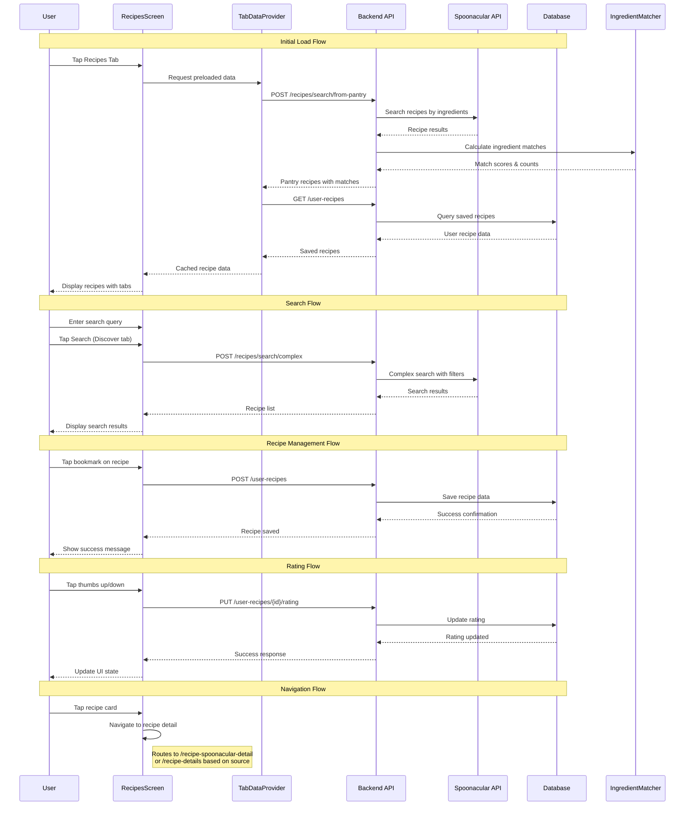

# Recipes Screen Flow Documentation

## 1. User Flow

1. **App Navigation**: User taps on "Recipes" tab in bottom navigation
2. **Initial Load**: Screen displays with three tabs: "From Pantry", "Discover", "My Recipes"
3. **Header Actions**: User sees sort button and chat button in header
4. **Search Bar**: Universal search bar available across all tabs
5. **Tab Selection**:
   - **From Pantry**: Shows recipes based on user's pantry items with ingredient match counts
   - **Discover**: Shows random recipes or search results with dietary/cuisine/meal-type filters
   - **My Recipes**: Shows saved recipes with "Saved" and "Cooked" sub-tabs
6. **Recipe Interaction**:
   - Tap recipe card → Navigate to recipe detail screen
   - Tap bookmark icon → Save recipe to "My Recipes"
   - In "My Recipes" → Rate recipes (thumbs up/down), favorite, or delete
7. **Filtering & Sorting**:
   - Apply dietary filters (vegetarian, vegan, gluten-free, etc.)
   - Apply cuisine filters (Italian, Mexican, Asian, etc.)
   - Apply meal-type filters (breakfast, lunch, dinner, etc.)
   - Sort by name, date, rating, or missing ingredients
8. **Pull to Refresh**: Refresh data by pulling down on the list
9. **Search Functionality**: Type in search bar and submit to find specific recipes

## 2. Data Flow

### Initial Data Loading
1. **TabDataProvider** preloads recipe data when user opens app
2. **Pantry Recipes**: `POST /recipes/search/from-pantry` with user_id=111
3. **My Recipes**: `GET /user-recipes` with various filters
4. **Ingredient Matching**: Client-side ingredient matching using `ingredientMatcher.ts`

### Search Operations
- **Pantry Tab**: Filters existing pantry recipes by title
- **Discover Tab**: `POST /recipes/search/complex` with search query and filters
- **Random Recipes**: `GET /recipes/random?number=20` when no search query

### Recipe Management
- **Save Recipe**: `POST /user-recipes` with recipe data
- **Update Rating**: `PUT /user-recipes/{recipe_id}/rating`
- **Toggle Favorite**: `PUT /user-recipes/{recipe_id}/favorite`
- **Delete Recipe**: `DELETE /user-recipes/{recipe_id}`
- **Mark as Cooked**: `PUT /user-recipes/{recipe_id}/mark-cooked`

### State Management
- **ItemsContext**: Provides pantry items for ingredient matching
- **TabDataProvider**: Caches recipe data with 5-minute expiration
- **Local State**: Search queries, filters, loading states, modal visibility

## 3. Implementation Map

| Layer | File / Module | Responsibility |
|-------|---------------|----------------|
| **Frontend - Main Screen** | `ios-app/app/(tabs)/recipes.tsx` | Main recipes screen with tabs, search, and recipe grid |
| **Frontend - Components** | `ios-app/components/recipes/RecipeDetailCardV3.tsx` | Recipe card component |
| **Frontend - Services** | `ios-app/services/recipeService.ts` | Recipe management API client |
| **Frontend - Services** | `ios-app/services/api.ts` | General API functions for recipes |
| **Frontend - Utils** | `ios-app/utils/ingredientMatcher.ts` | Client-side ingredient matching logic |
| **Frontend - Context** | `ios-app/context/TabDataProvider.tsx` | Recipe data preloading and caching |
| **Backend - Spoonacular Router** | `backend_gateway/routers/spoonacular_router.py` | External recipe search endpoints |
| **Backend - User Recipes Router** | `backend_gateway/routers/user_recipes_router.py` | User recipe management endpoints |
| **Backend - AI Recipes Router** | `backend_gateway/routers/ai_recipes_router.py` | AI-generated recipe endpoints |
| **Backend - Mock Router** | `backend_gateway/routers/mock_recipe_router.py` | Mock recipe endpoints for testing |
| **Backend - Services** | `backend_gateway/services/spoonacular_service.py` | Spoonacular API integration |
| **Backend - Services** | `backend_gateway/services/user_recipes_service.py` | User recipe database operations |
| **Database** | Google Cloud SQL PostgreSQL | Recipe storage and user preferences |

## 4. Diagram

## 5. Findings & Gaps

### ✅ Implemented Features
- Three-tab recipe browsing (Pantry, Discover, My Recipes)
- Client-side ingredient matching with sophisticated normalization
- Recipe search with dietary/cuisine/meal-type filters
- Recipe saving, rating, and favorite management
- Pull-to-refresh functionality
- Sorting by multiple criteria
- Preloaded data caching for performance
- Mock recipe system for testing

### ❌ Missing or Incomplete Features
- **Authentication Integration**: All endpoints use hardcoded user_id=111
- **Recipe Completion Tracking**: Mark-as-cooked endpoint exists but not fully integrated in UI
- **Advanced Filtering**: Pantry tab only shows basic meal-type filters
- **Offline Support**: No offline recipe caching mechanism
- **Recipe Recommendations**: AI recommendation system exists but not exposed in UI
- **Ingredient Substitution**: No ingredient replacement suggestions
- **Shopping List Integration**: Missing ingredients not automatically added to shopping list

### ⚠️ Areas Needing Verification
- **Spoonacular API Rate Limits**: No rate limiting or quota management visible
- **Image Loading Performance**: Recipe images loaded directly without optimization
- **Error Handling**: Limited error recovery for network failures
- **Data Consistency**: Ingredient matching may produce different results between frontend and backend
- **Memory Management**: Large recipe data sets may impact performance on lower-end devices
- **Search Performance**: Complex searches may be slow without proper indexing

### 🔴 Technical Debt
- **Hardcoded User ID**: Authentication system disabled throughout
- **Mock Data Cleanup**: Commented-out mock recipes still present in code
- **API Endpoint Inconsistency**: Some endpoints use different parameter formats
- **Component Complexity**: Main recipes screen file is 1500+ lines and should be split
- **State Management**: Complex local state could benefit from reducer pattern