# Screen Navigation Data Flows Documentation

## 1. User Flow

### Home Screen Navigation (Pantry Management)
1. User taps Home tab → Tab navigator triggers screen load
2. Screen displays loading indicator while fetching data
3. Pantry items displayed with search/filter capabilities
4. Users can swipe items to delete, tap to consume, or use quick actions
5. Pull-to-refresh triggers data reload

### Stats Screen Navigation (Analytics Dashboard)
1. User taps Stats tab → Tab navigator triggers screen load
2. Screen loads with time period selector (week/month/year)
3. Comprehensive stats display including pantry analytics, recipe stats, cooking trends
4. Interactive cards show detailed modals when tapped
5. Charts visualize cooking frequency over time

### Recipes Screen Navigation (Recipe Discovery)
1. User taps Recipes tab → Tab navigator triggers screen load
2. Three sub-tabs available: "From Pantry", "Discover", "My Recipes"
3. From Pantry: Shows recipes based on available pantry ingredients
4. Discover: Search functionality with dietary filters
5. My Recipes: Saved and cooked recipes with rating filters

### Shopping List Screen Navigation (Local Storage)
1. User taps Shopping List tab → Tab navigator triggers screen load
2. Data loads from local AsyncStorage (no API calls)
3. Items organized by completion status
4. Add new items functionality with quantity input
5. Bulk operations: add to pantry, clear checked items

## 2. Data Flow

### Home Screen Data Flow
```
Navigation Trigger → useItemsWithFilters hook → ItemsContext
                                             → fetchPantryItems(userId: 111)
                                             → GET /api/v1/pantry/user/111/items
                                             → PantryService.get_user_pantry_items()
                                             → PostgreSQL query to pantry_items table
                                             → Transform and group items by name/unit
                                             → Update UI with filtered/sorted items
```

### Stats Screen Data Flow (🟡 PARTIAL)
```
Navigation Trigger → loadStats() → TabDataProvider (preloaded)
                                → OR fallback API calls:
                                → GET /api/v1/stats/comprehensive?user_id=111&timeframe=month
                                → StatsRouter.get_comprehensive_stats()
                                → Multiple PostgreSQL queries (pantry, recipes, cooking history)
                                → GET /api/v1/cooking-history/trends?user_id=111&days=7
                                → GET /api/v1/user-recipes
                                → Aggregate data and display charts/cards
```

**Implementation Status**: 🟡 PARTIAL
- Stats endpoint returns 404 in current implementation
- Falls back to individual API calls for data assembly
- Uses preloaded data from TabDataProvider when available

### Recipes Screen Data Flow
```
Navigation Trigger → RecipesContainer → activeTab state change
                                    → fetchRecipesFromPantry() (for "From Pantry" tab)
                                    → POST /api/v1/recipes/search/from-pantry
                                    → SpoonacularService.search_recipes_by_pantry()
                                    → Spoonacular API call + ingredient matching
                                    → OR fetchRandomRecipes() (for "Discover" tab)
                                    → GET /api/v1/recipes/random
                                    → SpoonacularService.get_random_recipes()
                                    → OR fetchMyRecipes() (for "My Recipes" tab)
                                    → GET /api/v1/user-recipes
                                    → UserRecipesService.get_user_recipes()
                                    → PostgreSQL query to user_recipes table
```

### Shopping List Data Flow (🟢 WORKING)
```
Navigation Trigger → loadShoppingList()
                  → AsyncStorage.getItem('@PrepSense_ShoppingList')
                  → Parse JSON data
                  → Display items by completion status
                  → All operations are local (no API calls)
```

**Implementation Status**: 🟢 WORKING
- Fully local storage implementation
- No API dependencies
- Real-time updates with AsyncStorage

## 3. Implementation Map

| Layer | File / Module | Responsibility |
|-------|---------------|----------------|
| **Frontend Screens** | | |
| Home Screen | `ios-app/app/(tabs)/index.tsx` | Main pantry display, item management |
| Stats Screen | `ios-app/app/(tabs)/stats.tsx` | Analytics dashboard with charts |
| Recipes Screen | `ios-app/app/(tabs)/recipes.tsx` | Wrapper for RecipesContainer |
| Shopping List | `ios-app/app/(tabs)/shopping-list.tsx` | Local shopping list management |
| **Frontend Components** | | |
| Recipes Container | `ios-app/components/recipes/RecipesContainer.tsx` | Recipe state management, API coordination |
| Items Hook | `ios-app/hooks/useItemsWithFilters.ts` | Pantry data filtering and sorting |
| **Frontend Services** | | |
| API Service | `ios-app/services/api.ts` | HTTP client for backend APIs |
| API Client | `ios-app/services/apiClient.ts` | Base HTTP client with error handling |
| **Backend Routers** | | |
| Pantry Router | `backend_gateway/routers/pantry_router.py` | Pantry CRUD operations |
| Stats Router | `backend_gateway/routers/stats_router.py` | Comprehensive statistics endpoint |
| Spoonacular Router | `backend_gateway/routers/spoonacular_router.py` | Recipe search and discovery |
| User Recipes Router | `backend_gateway/routers/user_recipes_router.py` | Saved recipe management |
| **Backend Services** | | |
| Pantry Service | `backend_gateway/services/pantry_service.py` | Pantry business logic |
| Spoonacular Service | `backend_gateway/services/spoonacular_service.py` | External API integration |
| User Recipes Service | `backend_gateway/services/user_recipes_service.py` | Recipe management logic |
| **Context Providers** | | |
| Items Context | `ios-app/context/ItemsContext.tsx` | Global pantry state management |
| Tab Data Provider | `ios-app/context/TabDataProvider.tsx` | Cross-tab data preloading |
| **Database** | | |
| PostgreSQL (GCP) | Cloud SQL instance | Persistent data storage |
| AsyncStorage | React Native local storage | Shopping list persistence |

## 4. Diagram

```mermaid
sequenceDiagram
    participant U as User
    participant HS as Home Screen
    participant IC as ItemsContext
    participant API as API Service
    participant PR as Pantry Router
    participant PS as Pantry Service
    participant DB as PostgreSQL
    participant SS as Stats Screen
    participant SR as Stats Router
    participant RS as Recipes Screen
    participant RC as RecipesContainer
    participant SpR as Spoonacular Router
    participant SpS as Spoonacular Service
    participant SA as Spoonacular API
    participant SLS as Shopping List
    participant AS as AsyncStorage

    Note over U,AS: Home Screen Navigation
    U->>HS: Tap Home Tab
    HS->>IC: Initialize useItemsWithFilters
    IC->>API: fetchPantryItems(111)
    API->>PR: GET /api/v1/pantry/user/111/items
    PR->>PS: get_user_pantry_items(111)
    PS->>DB: SELECT * FROM pantry_items WHERE user_id=111
    DB-->>PS: Return pantry items
    PS-->>PR: Format response
    PR-->>API: JSON response
    API-->>IC: Pantry items array
    IC-->>HS: Filtered/sorted items
    HS-->>U: Display pantry with search/filter

    Note over U,AS: Stats Screen Navigation
    U->>SS: Tap Stats Tab
    SS->>SR: GET /api/v1/stats/comprehensive?user_id=111
    Note right of SR: 🟡 Returns 404 - Not implemented
    SS->>API: Fallback: fetchPantryItems(111)
    SS->>API: Fallback: fetch cooking history
    SS-->>U: Display analytics dashboard

    Note over U,AS: Recipes Screen Navigation
    U->>RS: Tap Recipes Tab
    RS->>RC: Initialize RecipesContainer
    RC->>API: fetchRecipesFromPantry() [From Pantry tab]
    API->>SpR: POST /api/v1/recipes/search/from-pantry
    SpR->>SpS: search_recipes_by_pantry()
    SpS->>SA: Spoonacular API call
    SA-->>SpS: Recipe data
    SpS-->>SpR: Processed recipes
    SpR-->>API: JSON response
    API-->>RC: Recipe array with ingredient matching
    RC-->>RS: Display recipes
    RS-->>U: Show recipe cards with availability

    Note over U,AS: Shopping List Navigation
    U->>SLS: Tap Shopping List Tab
    SLS->>AS: AsyncStorage.getItem('@PrepSense_ShoppingList')
    AS-->>SLS: Shopping list JSON
    SLS-->>U: Display local shopping list
```



## 5. Findings & Gaps

### ✅ Implemented Features

1. **Home Screen (Pantry Management)** - 🟢 WORKING
   - Full CRUD operations for pantry items
   - Real-time filtering and sorting
   - Swipe-to-delete functionality
   - Pull-to-refresh data updates
   - Proper error handling and loading states

2. **Shopping List Screen** - 🟢 WORKING  
   - Local AsyncStorage persistence
   - Add/edit/delete items functionality
   - Bulk operations (clear checked, add to pantry)
   - No API dependencies (fully offline)

3. **Recipes Screen (Basic)** - 🟡 PARTIAL
   - Recipe discovery from Spoonacular API
   - Pantry-based recipe matching
   - Search and filter functionality
   - Saved recipes management

### ❌ Missing or Mock Features

1. **Stats Screen Comprehensive Endpoint** - 🔴 CONCEPT
   - `/api/v1/stats/comprehensive` returns 404
   - Falls back to multiple individual API calls
   - No unified statistics aggregation
   - Charts use fallback data assembly

2. **Real-time Data Synchronization** - 🔴 CONCEPT
   - No WebSocket or real-time updates
   - Manual refresh required for data consistency
   - Cross-tab data coordination is partial

3. **Advanced Recipe Features** - 🟡 PARTIAL
   - Recipe completion workflow incomplete
   - Nutritional analysis not fully integrated
   - Cooking history tracking basic

### ⚠ Implementation Concerns

1. **API Error Handling** - 🟡 PARTIAL
   - Some endpoints lack proper error responses
   - User-facing error messages could be more descriptive
   - Timeout handling varies across services

2. **Data Caching Strategy** - 🟡 PARTIAL
   - Limited caching for Spoonacular API calls
   - No consistent cache invalidation strategy
   - TabDataProvider provides basic preloading

3. **Performance Optimization** - 🟡 PARTIAL
   - Large pantry lists may impact performance
   - Recipe ingredient matching is CPU intensive
   - Image loading optimization needed

### Recommended Improvements

1. **Implement Stats Comprehensive Endpoint**
   - Create unified endpoint for all statistics
   - Optimize database queries with proper indexing
   - Add caching layer for expensive calculations

2. **Enhance Error Handling**
   - Standardize error response format
   - Add retry mechanisms for failed requests
   - Implement graceful degradation

3. **Optimize Data Loading**
   - Implement proper pagination for large datasets
   - Add skeleton loading states
   - Optimize ingredient matching algorithms

4. **Add Real-time Features**
   - Consider WebSocket integration for live updates
   - Implement optimistic updates for better UX
   - Add conflict resolution for concurrent edits