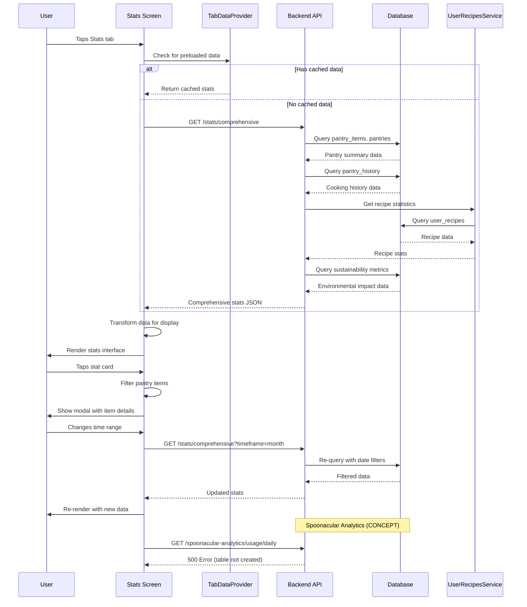

# Stats Page Comprehensive Flow Documentation

## 1. User Flow

1. **User navigates to Stats tab**
   - Taps "Stats" tab in bottom navigation
   - TabScreenTransition component handles visual transition
   - Loading state displays while data fetches

2. **Stats page renders with multiple sections**
   - Header with gradient showing "Your PrepSense Stats"
   - Time period selector (Week/Month/Year tabs)
   - Unit toggle (Metric/Imperial)
   - Quick stats overview cards
   - "Hot This Week" promotional banner
   - Pantry Analytics section with stat cards
   - Environmental Impact section
   - Recipe & Cooking Stats section
   - Time-based Trends chart
   - Interactive modals for detailed item views

3. **User can interact with:**
   - Time range tabs (Week/Month/Year) - triggers data reload
   - Unit toggle (Metric/Imperial) - updates display formatting
   - Stat cards with tap indicators - opens detailed item modals
   - Pull-to-refresh - refreshes all stats data
   - Modal views showing filtered pantry items

4. **Modal interactions:**
   - Tap stat cards to see detailed item lists
   - View expired, expiring, recently added, or all items
   - See item details including expiration status and quantities
   - Close modal to return to main stats view

## 2. Data Flow

### Backend Data Sources:
1. **Primary Stats Endpoint**: `/api/v1/stats/comprehensive`
   - Single endpoint providing all comprehensive statistics
   - Aggregates data from multiple database tables
   - Supports timeframe filtering (week/month/year)

2. **Database Tables Used**:
   - `pantry_items` - Core pantry inventory data
   - `pantries` - User pantry relationships
   - `pantry_history` - Cooking activity tracking
   - `user_recipes` - User recipe interactions
   - `user_pantry_full` - Optimized view for pantry queries

3. **Spoonacular Analytics** (🔴 CONCEPT):
   - `/api/v1/spoonacular-analytics/usage/daily`
   - `/api/v1/spoonacular-analytics/cost/projection`
   - `/api/v1/spoonacular-analytics/deduplication/stats`
   - Note: These endpoints exist but require database table creation

### Data Flow Sequence:
1. **Frontend initiates stats loading**:
   - Checks TabDataProvider for preloaded data
   - Falls back to direct API call if no cached data

2. **Backend processes comprehensive stats request**:
   - Executes complex SQL queries across multiple tables
   - Calculates pantry summary (total, expired, expiring items)
   - Generates category breakdowns and top products
   - Computes cooking history and streaks
   - Calculates sustainability metrics (food/CO2 saved)
   - Analyzes shopping patterns by day of week

3. **Data transformations**:
   - Raw database counts converted to user-friendly metrics
   - Environmental impact calculations (0.3kg per item, 2.5kg CO2 per kg food)
   - Time-based filtering and aggregation
   - Recipe frequency analysis and ranking

4. **Frontend data processing**:
   - Transforms API response into component state
   - Applies unit conversions (metric/imperial)
   - Generates chart data for cooking trends
   - Prepares modal data for detailed views

## 3. Implementation Map

| Layer | File / Module | Responsibility |
|-------|---------------|----------------|
| **Frontend UI** | `ios-app/app/(tabs)/stats.tsx` | 🟢 Main stats screen component |
| **Context Provider** | `ios-app/context/TabDataProvider.tsx` | 🟢 Stats data caching and preloading |
| **API Client** | `ios-app/services/api.ts` | 🟡 Basic API functions (fetchPantryItems) |
| **Backend Router** | `backend_gateway/routers/stats_router.py` | 🟢 Main stats API endpoints |
| **Analytics Router** | `backend_gateway/routers/spoonacular_analytics_router.py` | 🔴 Spoonacular usage analytics |
| **Database Service** | `backend_gateway/config/database.py` | 🟢 Database connection and query execution |
| **User Recipes Service** | `backend_gateway/services/user_recipes_service.py` | 🟢 Recipe statistics calculations |
| **Supply Chain Component** | `ios-app/components/SupplyChainImpactStats.tsx` | 🟢 Environmental impact visualization |
| **Database Tables** | Various SQL files | 🟢 Core tables (pantry_items, pantry_history, user_recipes) |
| **Analytics Tables** | `spoonacular_api_calls` table | 🔴 Requires creation for full analytics |

## 4. Diagram

## 5. Findings & Gaps

### ✅ Implemented & Working:
- Main stats screen with comprehensive UI
- Backend comprehensive stats endpoint
- Database queries for pantry, recipes, cooking history
- Real-time data transformations and calculations
- Environmental impact calculations
- Interactive modals for detailed item views
- Time range filtering (week/month/year)
- Unit conversion system (metric/imperial)
- Pull-to-refresh functionality
- Chart visualization for cooking trends
- TabDataProvider caching system

### ❌ Missing or Mock Items:
- Spoonacular API usage analytics (endpoints exist but database table missing)
- API cost tracking and projection features
- Recipe deduplication statistics
- Advanced milestone and achievement system
- Push notifications for expiring items
- Social sharing of achievements
- Advanced chart types (pie charts, bar charts for categories)
- Export functionality for stats data
- Comparative analytics (vs. previous periods)
- Supply chain impact integration in main stats page

### ⚠ Unclear Items (Need Follow-up):
- Performance optimization for large datasets
- Offline stats caching strategy
- Real-time updates vs. batch processing
- Data retention policies for historical stats
- Privacy controls for sharing stats
- Integration with external fitness/health apps
- Advanced filtering options in modals
- Accessibility features for visually impaired users

### 🔴 Implementation Status Notes:
- **Spoonacular Analytics**: All router endpoints marked as 🔴 CONCEPT - requires `spoonacular_api_calls` table creation
- **Supply Chain Stats**: Component exists but not integrated into main stats flow
- **Advanced Charts**: Limited to line charts, missing category breakdowns
- **Milestones System**: Basic logic exists but not fully implemented in backend

## 6. Technical Debt & Optimization Opportunities:

1. **Database Efficiency**:
   - Consider materialized views for complex stat calculations
   - Index optimization for date-range queries
   - Caching strategy for frequently accessed stats

2. **Frontend Performance**:
   - Implement skeleton loading states
   - Optimize chart rendering for large datasets
   - Add error boundaries for robust error handling

3. **API Design**:
   - Consider pagination for large item lists in modals
   - Implement incremental data loading
   - Add API versioning for future enhancements

4. **User Experience**:
   - Add contextual help tooltips
   - Implement data export functionality
   - Enhanced accessibility features

This documentation serves as the comprehensive reference for the PrepSense stats page implementation, covering both the current working system and identified areas for future development.