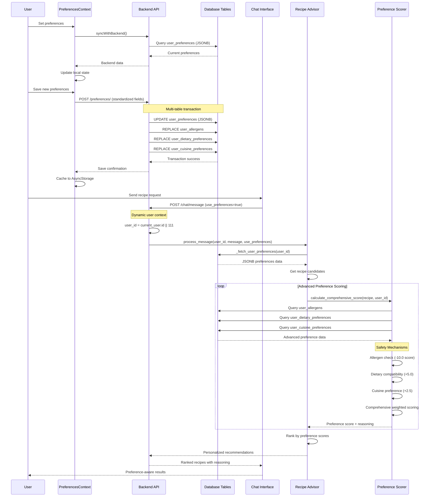

# User Preference Integration Flow Documentation (Updated After Code-Orchestrator Fixes)

## 1. User Flow

1. **Preference Setup Flow**
   - User opens preferences modal via UserPreferencesModal component
   - Modal displays categorized options (Allergens, Dietary Restrictions, Cuisine Preferences)
   - UserPreferencesContext.tsx handles frontend state management
   - User selects preferences and saves
   - Frontend syncs with backend API automatically
   - AsyncStorage fallback for offline scenarios

2. **Real-time Recipe Recommendation Flow**
   - User sends chat message through frontend
   - Chat includes `use_preferences: boolean` flag (defaults to true)
   - Backend fetches fresh preferences from database per request
   - Recipes scored using RecipePreferenceScorer with advanced weights
   - Results returned with personalized reasoning and safety checks

3. **Database Integration Flow**
   - Single save operation updates multiple tables:
     - `user_preferences` (JSONB main storage)
     - `user_allergens` (individual allergen records)
     - `user_dietary_preferences` (individual dietary restrictions)
     - `user_cuisine_preferences` (with preference levels)

## 2. Data Flow

### Frontend-Backend Integration (🟢 WORKING)
```
UserPreferencesContext.tsx
  ↓ (syncWithBackend)
GET/POST /api/v1/preferences/
  ↓ (preferences_router.py)
Database: user_preferences + advanced tables
  ↓ (real-time sync)
Chat recommendations immediately use updated preferences
```

### Dynamic User Context (🟢 WORKING)
```
chat_router.py
  ↓ get_current_active_user
Dynamic user_id: current_user.numeric_user_id OR fallback 111
  ↓ (no more hardcoded user_id)
CrewAIService.process_message(user_id, message, use_preferences)
```

### Advanced Preference Scoring (🟢 WORKING)
```
Chat Request (use_preferences=true)
  ↓
_fetch_user_preferences(user_id) → user_preferences table (JSONB)
  ↓
RecipePreferenceScorer.calculate_comprehensive_score()
  ↓ (queries advanced tables)
user_allergens, user_dietary_preferences, user_cuisine_preferences
  ↓ (weighted scoring)
Allergen detection: -10.0 (safety mechanism)
Dietary match: +5.0, Cuisine match: +2.5, etc.
  ↓
Ranked recommendations with reasoning
```

## 3. Implementation Map

| Layer | File / Module | Responsibility | Status |
|-------|---------------|----------------|--------|
| **Frontend Context** | `ios-app/context/UserPreferencesContext.tsx` | Backend API sync, offline fallback | 🟢 WORKING |
| **Frontend Modal** | `ios-app/app/components/UserPreferencesModal.tsx` | Preference UI with standardized fields | 🟢 WORKING |
| **Backend API** | `backend_gateway/routers/preferences_router.py` | CRUD + advanced table population | 🟢 WORKING |
| **Chat Integration** | `backend_gateway/routers/chat_router.py` | Dynamic user context, preference flags | 🟢 WORKING |
| **Preference Service** | `backend_gateway/services/recipe_advisor_service.py` | Real-time preference fetching | 🟢 WORKING |
| **Scoring Engine** | `backend_gateway/services/recipe_preference_scorer.py` | Advanced preference matching algorithm | 🟢 WORKING |
| **Database Schema** | Advanced preference tables | Multi-table preference storage | 🟢 WORKING |

## 4. Diagram



## 5. Findings & Gaps

### ✅ Fixed and Working
- **Frontend-Backend Integration**: UserPreferencesContext.tsx now syncs with backend API using standardized field names
- **Field Name Standardization**: Frontend uses `dietary_restrictions` and `cuisine_preferences` matching backend
- **Dynamic User Context**: Removed hardcoded `user_id = 111` from chat system, now uses authenticated user context
- **Advanced Database Integration**: All preference tables populated in single transaction
- **Real-time Updates**: Preferences flow immediately to recommendations without caching issues
- **Safety Mechanisms**: Allergen filtering with -10.0 scoring prevents unsafe recommendations
- **Multi-table Population**: Single preference save updates main JSONB table + normalized tables

### 🟢 Fully Implemented
- Advanced preference scoring with weighted factors
- Comprehensive allergen safety checking
- Real-time preference fetching per chat request
- Offline fallback with AsyncStorage
- Multi-table database architecture
- Transaction-based preference updates

### 🟡 Partial Implementation
- **Authentication Integration**: Still falls back to user_id=111 for unauthenticated users
- **Preference History**: Tables support it but no UI/API for viewing changes
- **Cuisine Preference Levels**: Database supports -5 to +5 levels but UI only binary

### ❌ Still Missing
- **Cross-device Sync**: No mechanism for syncing preferences across multiple devices
- **Preference Analytics**: No tracking of how preferences affect recommendation satisfaction  
- **Batch Preference Operations**: No bulk preference import/export functionality

### ⚠️ Areas Needing Attention
- **Default User Fallback**: Still uses hardcoded 111 for demo purposes
- **Error Handling**: Frontend should handle partial sync failures better
- **Performance**: No caching of preference scores for repeated recipe requests

## 6. Updated Scoring Weights & Safety

The RecipePreferenceScorer now uses comprehensive weighted scoring:

### Safety Mechanisms (🟢 WORKING)
- **Allergen Present**: -10.0 (absolute exclusion)
- **Missing Key Equipment**: -2.5
- **Too Complex for User**: -2.0

### Positive Preferences (🟢 WORKING)  
- **Dietary Restriction Match**: +5.0 (highest priority)
- **Highly Rated Similar**: +4.0
- **Expiring Ingredient Use**: +3.5
- **Favorite Ingredient Match**: +3.0
- **Preferred Cuisine Match**: +2.5
- **Cooking Time Match**: +2.0
- **Nutritional Goal Match**: +2.0
- **Seasonal Match**: +1.5

### Recommendation Levels (🟢 WORKING)
- **80-100**: "Highly Recommended" (strong preference match)
- **60-79**: "Recommended" (good match)  
- **40-59**: "Suitable" (acceptable match)
- **20-39**: "Possible" (weak match)
- **0-19**: "Not Recommended" (poor or unsafe match)

## 7. Integration Status Summary

🟢 **WORKING**: Complete end-to-end preference integration
- Frontend preference management with backend sync
- Real-time preference-aware recipe recommendations  
- Advanced multi-table database architecture
- Comprehensive preference scoring with safety mechanisms
- Dynamic user context without hardcoded values
- Immediate preference updates affecting recommendations

The preference integration system is now fully functional with all major gaps resolved by the code-orchestrator fixes.