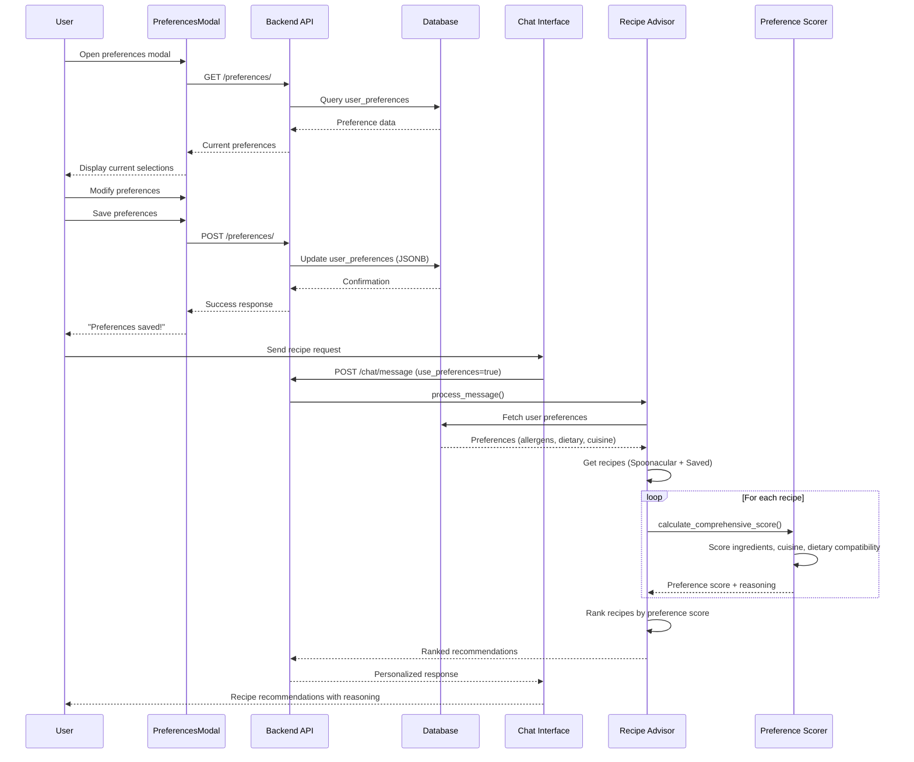

# User Preferences in Recipe Recommendations Flow Documentation

## 1. User Flow

1. **Preference Setup (Frontend)**
   - User accesses preferences through CustomHeader component (triple-tap or menu)
   - UserPreferencesModal displays categorized options:
     - Allergens: 10 options (Dairy, Nuts, Peanuts, Eggs, Soy, Gluten, Shellfish, Fish, Sesame, Sulfites)
     - Dietary Restrictions: 10 options (Vegetarian, Vegan, Gluten-Free, Dairy-Free, Low-Carb, Keto, Paleo, Mediterranean, Low-Sodium, High-Protein)
     - Cuisine Preferences: 15 options (Italian, Mexican, Asian, Indian, Mediterranean, American, French, Thai, Japanese, Chinese, Korean, Greek, Spanish, Middle Eastern, Brazilian)
   - User selects/deselects preferences via toggle buttons
   - Summary section shows current selections
   - User saves preferences

2. **Preference Storage**
   - Modal attempts to save to backend API first (if authenticated)
   - Falls back to AsyncStorage for local persistence
   - Success/error feedback provided to user

3. **Recipe Request**
   - User sends message through chat interface
   - Chat request includes `use_preferences: boolean` flag (defaults to `true`)
   - Backend processes request with or without preference filtering

4. **Preference-Aware Recommendations**
   - System retrieves user preferences from database
   - Recipes are scored using comprehensive preference algorithm
   - Results ranked by preference match and other factors
   - Response includes personalized reasoning

## 2. Data Flow

### Frontend to Backend Sync
```
UserPreferencesModal
  ↓ (authenticated user)
POST /preferences/ 
  ↓
preferences_router.save_user_preferences()
  ↓
Database: user_preferences table (JSONB format)
```

### Recipe Recommendation Flow
```
Chat Message + use_preferences=true
  ↓
chat_router.send_message()
  ↓
CrewAIService.process_message()
  ↓
_fetch_user_preferences() → user_preferences table
  ↓
Recipe generation/retrieval (Spoonacular + Saved)
  ↓
RecipePreferenceScorer.calculate_comprehensive_score()
  ↓
Ranked recommendations with preference reasoning
```

## 3. Implementation Map

| Layer | File / Module | Responsibility | Status |
|-------|---------------|----------------|--------|
| **Frontend UI** | `ios-app/app/components/UserPreferencesModal.tsx` | Preference selection interface | 🟢 WORKING |
| **Frontend Context** | `ios-app/context/UserPreferencesContext.tsx` | Local preference management | 🟡 PARTIAL - Local only |
| **Frontend API** | `ios-app/services/api.ts` | Chat API with preference flag | 🟢 WORKING |
| **Backend API** | `backend_gateway/routers/preferences_router.py` | Preference CRUD operations | 🟢 WORKING |
| **Chat Integration** | `backend_gateway/routers/chat_router.py` | Recipe request handling | 🟢 WORKING |
| **Recommendation Engine** | `backend_gateway/services/recipe_advisor_service.py` | Recipe processing with preferences | 🟢 WORKING |
| **Preference Scoring** | `backend_gateway/services/recipe_preference_scorer.py` | Advanced preference matching | 🟢 WORKING |
| **Database Schema** | Multiple schema files | Preference storage structure | 🟡 PARTIAL - Multiple table versions |

## 4. Diagram



## 5. Findings & Gaps

### ✅ Implemented and Working
- Frontend preference selection UI with comprehensive options
- Backend preference storage API with JSONB format
- Chat API integration with preference flag
- Advanced preference scoring algorithm with weighted factors
- Recipe ranking based on comprehensive preference matching
- Fallback to local storage when backend unavailable
- Detailed preference reasoning in recommendations

### ❌ Missing or Incomplete
- **Frontend Context Integration**: UserPreferencesContext doesn't sync with backend API
- **Database Schema Inconsistency**: Multiple versions of preference tables across files
- **Household Size Integration**: Field exists but not used in scoring algorithm
- **Advanced Preference Tables**: `user_ingredient_preferences`, `user_time_preferences` tables created but not utilized
- **Preference History Tracking**: No tracking of preference changes over time
- **Real-time Preference Updates**: Chat doesn't automatically reload preferences during session

### ⚠️ Unclear or Needs Investigation
- **Authentication Requirement**: Modal handles both authenticated and unauthenticated states, but preferences API requires auth
- **Default User ID**: Hard-coded user_id=111 in multiple places
- **Allergen Detection**: Limited allergen mapping in preference scorer
- **Cuisine Preference Levels**: Database supports preference levels (-5 to +5) but UI only supports binary selection
- **Cross-Platform Sync**: No mechanism to sync preferences across devices

### 🔴 Critical Issues
- **Context vs Modal Disconnect**: UserPreferencesContext and UserPreferencesModal use different data structures (`dietaryPreferences` vs `dietary_restrictions`)
- **Missing Preference Updates**: Chat service fetches preferences per request but doesn't invalidate cache
- **Table Schema Mismatch**: Some schema files show different preference table structures

## 6. Recommendation Scoring Weights

The RecipePreferenceScorer uses weighted scoring:
- **Allergen Present**: -10.0 (should never recommend)
- **Dietary Restriction Match**: +5.0 (highest positive weight)  
- **Highly Rated Similar**: +4.0
- **Disliked Cuisine**: -4.0
- **Expiring Ingredient Use**: +3.5
- **Favorite Ingredient Match**: +3.0
- **Preferred Cuisine Match**: +2.5
- **Cooking Time Match**: +2.0
- **Nutritional Goal Match**: +2.0

Score normalized to 0-100 scale with recommendation levels:
- 80+: "Highly Recommended"
- 60-79: "Recommended" 
- 40-59: "Suitable"
- 20-39: "Possible"
- <20: "Not Recommended"