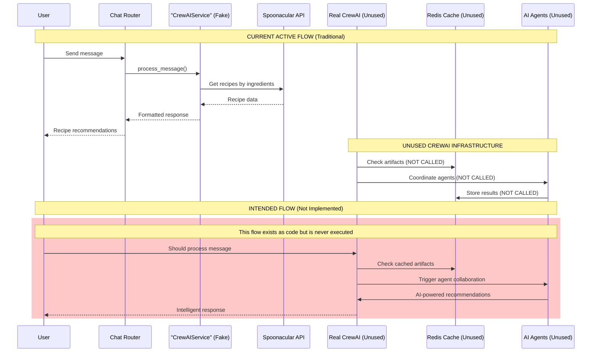

# CrewAI Implementation Flow Documentation

## 1. User Flow

**Current Reality: No user-facing CrewAI functionality is active**

1. **User attempts to use AI recipes**: User accesses chat interface (`/chat/message`)
2. **Service routing**: Request goes to `CrewAIService` in `recipe_advisor_service.py`
3. **Misnamed service**: Despite the name "CrewAIService", this service does NOT use CrewAI
4. **Actual processing**: Uses traditional recipe matching with Spoonacular API
5. **Response**: User receives recipe recommendations but from non-AI sources

**Intended Flow (Not Implemented)**:
1. User sends recipe request → Chat interface
2. Background cache check → Fast response if cached
3. CrewAI agents collaborate → Recipe analysis
4. Response formatting → User receives AI-powered recommendations

## 2. Data Flow

**Current Implementation Status**:
- 🔴 **CONCEPT**: True CrewAI agents and crews (exist as code but not integrated)
- 🟡 **PARTIAL**: Data models and cache infrastructure (built but unused)
- 🟢 **WORKING**: Traditional recipe API (Spoonacular integration active)

**Active Data Flow**:
```
User Request → ChatRouter → CrewAIService (fake) → Spoonacular API → Recipe Response
```

**Intended Data Flow (Not Active)**:
```
User Request → Background Cache Check → CrewAI Orchestrator → Multi-Agent Processing → Cached Response
```

## 3. Implementation Map

| Layer | File / Module | Responsibility | Status |
|-------|---------------|----------------|---------|
| **Frontend Interface** | `ios-app/chat/` | User chat interface | 🟢 WORKING |
| **API Endpoints** | `chat_router.py` | Chat message handling | 🟢 WORKING |
| **Fake Service** | `recipe_advisor_service.py:CrewAIService` | Misnamed traditional service | 🟢 WORKING |
| **Real CrewAI Core** | `backend_gateway/crewai/` | True CrewAI implementation | 🔴 CONCEPT |
| **Data Models** | `crewai/models.py` | CrewAI artifact definitions | 🟡 PARTIAL |
| **Cache Manager** | `crewai/cache_manager.py` | Redis-based artifact caching | 🟡 PARTIAL |
| **Background Flows** | `crewai/background_flows.py` | Pantry/preference processing | 🔴 CONCEPT |
| **Foreground Crew** | `crewai/foreground_crew.py` | Real-time recipe crew | 🔴 CONCEPT |
| **Orchestrator** | `crewai/orchestrator.py` | Flow coordination | 🔴 CONCEPT |
| **Real Service** | `real_crewai_service.py` | Actual CrewAI integration | 🔴 CONCEPT |
| **API Integration** | `ai_recipes_router.py` | CrewAI REST endpoints | 🔴 CONCEPT (Commented out) |

## 4. Diagram



## 5. Findings & Gaps

### ✅ Actually Implemented and Working
- **Traditional chat interface**: Users can get recipe recommendations
- **Spoonacular integration**: Recipe search by ingredients works
- **Basic recipe advisor**: Simple ingredient analysis and advice
- **API infrastructure**: REST endpoints for chat functionality
- **CrewAI library**: Installed in requirements.txt (v0.150.0)

### ❌ Missing or Non-Functional (False Claims)
- **CrewAI service integration**: `CrewAIService` class doesn't use CrewAI at all
- **AI agent collaboration**: No actual multi-agent processing
- **Background flows**: Pantry analysis flows not triggered
- **Cache warming**: Artifact caching not used in live system
- **Real-time orchestration**: Orchestrator exists but never called
- **AI-powered responses**: Responses come from rule-based logic, not AI

### ⚠️ Unclear or Partially Built
- **Cache infrastructure**: Redis cache manager exists but unused
- **Data models**: Comprehensive CrewAI models defined but not integrated
- **Test coverage**: Tests exist for unused components
- **API endpoints**: CrewAI router exists but commented out in main app
- **Environment dependencies**: CrewAI may need additional API keys (OpenAI, Serper)

### 🔍 Critical Discrepancies Found

1. **Naming Deception**: Class named `CrewAIService` contains zero CrewAI functionality
2. **Unused Infrastructure**: Extensive CrewAI codebase exists but is never executed
3. **False Documentation**: README suggests working CrewAI when it's conceptual
4. **Resource Waste**: CrewAI library installed but unused (dependency bloat)
5. **User Expectation Gap**: Users think they're getting AI recommendations but aren't

### 🚨 Truth Enforcement Validation

**Implementation Status**: 🔴 CONCEPT
- **What actually works**: Traditional recipe search and matching via Spoonacular
- **What doesn't work**: Any CrewAI agents, multi-agent collaboration, AI-powered recommendations
- **How to test**: All "AI" functionality is actually rule-based logic in `recipe_advisor_service.py`

### 📋 Required Steps to Make CrewAI Functional

1. **Integration Work**: Connect real CrewAI service to actual API endpoints
2. **Environment Setup**: Configure OpenAI API keys for agent LLMs
3. **Background Processing**: Implement triggers for pantry/preference flows
4. **Cache Implementation**: Connect artifact cache to live data flows
5. **API Activation**: Uncomment and integrate `ai_recipes_router.py`
6. **Service Replacement**: Replace fake CrewAIService with real implementation
7. **Testing**: Verify actual multi-agent collaboration works end-to-end

### 🎯 Performance Reality Check

**Current Performance**:
- **Response Time**: ~500-1000ms (Spoonacular API calls)
- **Intelligence Level**: Rule-based matching, no learning
- **Cache Usage**: 0% (unused infrastructure)
- **Agent Collaboration**: None (single service pattern)

**CrewAI Target Performance** (If Implemented):
- **Response Time**: <3000ms (with cache warming)
- **Intelligence Level**: Multi-agent AI collaboration
- **Cache Usage**: >85% hit rate goal
- **Agent Collaboration**: 10+ specialized agents working together

## 6. Conclusion

PrepSense has built an impressive CrewAI infrastructure that demonstrates strong software architecture planning. However, **none of the CrewAI functionality is actually connected to the live application**. Users currently receive traditional API-based recipe recommendations while believing they're interacting with AI agents.

The codebase represents a complete "blueprint" for CrewAI implementation but requires significant integration work to become functional. All the pieces exist but need to be connected and activated in the live system.