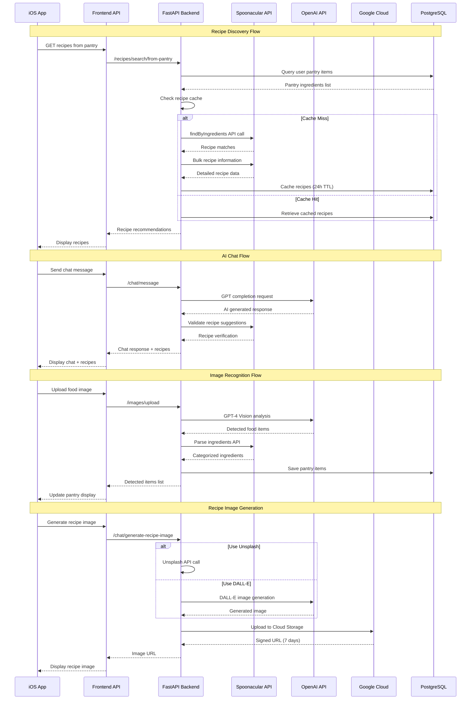

# External API Integration Flow Documentation

## 1. User Flow

### 1.1 Recipe Discovery Flow
1. **User opens recipes tab** → Frontend sends GET request to `/recipes/search/from-pantry`
2. **Backend retrieves user pantry** → PostgreSQL query for user's ingredients
3. **Backend calls Spoonacular API** → `findByIngredients` or `complexSearch` endpoint
4. **Spoonacular processes request** → Returns matching recipes with ingredient analysis
5. **Backend processes response** → Filters recipes, applies allergen restrictions
6. **Backend caches results** → Stores in RecipeCacheService for 24 hours
7. **Frontend displays recipes** → User sees personalized recipe recommendations

### 1.2 AI Chat with Recipe Generation Flow  
1. **User types message in chat** → Frontend sends POST to `/chat/message`
2. **Backend analyzes message** → CrewAI service processes natural language request
3. **OpenAI API called** → GPT model generates contextual recipe recommendations
4. **Spoonacular validation** → Cross-references with real recipe database
5. **Recipe enrichment** → Adds nutritional data and cooking instructions
6. **Response assembly** → Combines AI response with recipe data
7. **Frontend renders chat** → User sees AI-generated recipes with chat context

### 1.3 Image Recognition and Pantry Management Flow
1. **User takes photo of food** → Camera capture in iOS app
2. **Image upload** → POST to `/images/upload` with base64 encoded image
3. **OpenAI Vision API** → GPT-4 Vision analyzes food items in image
4. **Item extraction** → AI identifies products, quantities, expiration dates
5. **Ingredient parsing** → Spoonacular API categorizes and standardizes items
6. **Database storage** → Items saved to PostgreSQL pantry table
7. **UI update** → Frontend refreshes pantry with new detected items

### 1.4 Recipe Image Generation Flow
1. **User requests recipe image** → POST to `/chat/generate-recipe-image`
2. **Image source selection** → System chooses Unsplash (fast) or DALL-E (generated)
3. **External API call** → Unsplash API or OpenAI DALL-E API
4. **Image processing** → Download and optimize image
5. **Cloud Storage upload** → Google Cloud Storage for persistence
6. **URL generation** → Signed URL for secure access
7. **Frontend display** → Recipe image appears in recipe card

### 1.5 Allergen-Safe Recipe Flow
1. **User specifies allergens** → Frontend sends allergen list in request
2. **Spoonacular filtering** → API applies intolerance parameters
3. **Results validation** → Backend double-checks for allergen keywords
4. **Fallback to OpenAI** → If no safe recipes found, generate custom ones
5. **Safety verification** → Multiple validation layers for allergen safety
6. **User notification** → Clear labeling of allergen-free status

## 2. Data Flow

### 2.1 Request/Response Pipeline
```
iOS App → APIClient (timeout: 10s) → FastAPI Backend → External APIs
   ↓                                        ↓
Config.ts                              Settings/Config
timeouts                               API keys, retries
error handling                         rate limiting
```

### 2.2 External API Integrations

#### **Spoonacular API** 🟢 WORKING
- **Base URL**: `https://api.spoonacular.com`
- **Authentication**: API key in query parameters
- **Rate Limiting**: Smart caching to minimize calls
- **Timeout**: 120s with 60s connect timeout
- **Retry Logic**: 3 attempts with exponential backoff

**Key Endpoints**:
- `POST /recipes/findByIngredients` - Recipe search by pantry ingredients
- `GET /recipes/{id}/information` - Detailed recipe information
- `POST /recipes/complexSearch` - Advanced recipe search with filters
- `POST /recipes/informationBulk` - Batch recipe information (up to 100)
- `GET /recipes/random` - Random recipe discovery
- `POST /recipes/parseIngredients` - Ingredient analysis and categorization

#### **OpenAI API** 🟢 WORKING  
- **Base URL**: `https://api.openai.com/v1`
- **Authentication**: Bearer token in headers
- **Models Used**: GPT-3.5-turbo, GPT-4, GPT-4-vision, DALL-E-3
- **Timeout**: Default HTTP client timeout
- **Error Handling**: Graceful fallback to cached data

**Key Endpoints**:
- `POST /chat/completions` - AI chat responses and recipe generation
- `POST /chat/completions` (with vision) - Food image recognition
- `POST /images/generations` - Recipe image generation with DALL-E

#### **Google Cloud Services** 🟢 WORKING
- **Cloud SQL (PostgreSQL)**: Primary database for application data
- **Cloud Storage**: Recipe image storage with signed URLs
- **Authentication**: Service account credentials via GOOGLE_APPLICATION_CREDENTIALS

#### **Unsplash API** 🟡 PARTIAL
- **Base URL**: `https://api.unsplash.com`
- **Purpose**: Fast recipe image retrieval as DALL-E alternative
- **Integration Status**: Implemented but not actively used

### 2.3 Data Transformation Pipeline

#### Recipe Data Standardization
```python
# Spoonacular → Internal Format
spoonacular_recipe = {
    "id": 123456,
    "title": "Chicken Stir Fry",
    "extendedIngredients": [...],
    "analyzedInstructions": [...]
}

# Transformed to
internal_recipe = {
    "id": "spoon_123456", 
    "name": "Chicken Stir Fry",
    "ingredients": [standardized_ingredients],
    "instructions": [step_by_step],
    "source": "spoonacular",
    "nutrition": nutrition_data
}
```

#### Image Recognition Processing
```python
# OpenAI Vision Response → Pantry Items
vision_response = {
    "choices": [{
        "message": {
            "content": "[{\"item_name\": \"Oasis Orange Juice\", ...}]"
        }
    }]
}

# Parsed to
pantry_items = [
    {
        "item_name": "Oasis Orange Juice",
        "quantity_amount": 64,
        "quantity_unit": "fl oz", 
        "category": "Beverages",
        "expected_expiration": "2024-08-15"
    }
]
```

### 2.4 Caching Strategy

#### **Recipe Cache Service** 🟢 WORKING
- **Cache Key**: `{user_id}_{pantry_hash}`
- **TTL**: 24 hours for user-specific recipes, 30 minutes for random recipes
- **Storage**: In-memory + PostgreSQL fallback
- **Cache Size**: Minimum 40 recipes per user
- **Invalidation**: Pantry changes trigger cache refresh

#### **Image Cache** 🟢 WORKING
- **Location**: Google Cloud Storage `Recipe_Images/` folder
- **Naming**: `{recipe_id}/{title}_{timestamp}.png`
- **Access**: Signed URLs with 7-day expiration
- **Fallback**: Original Spoonacular image URLs

## 3. Implementation Map

| Layer | File / Module | Responsibility |
|-------|---------------|----------------|
| **Frontend API Client** | `ios-app/services/apiClient.ts` | HTTP client with timeout and error handling |
| **Frontend Service Layer** | `ios-app/services/api.ts` | API method definitions and request formatting |
| **Backend Router Layer** | `backend_gateway/routers/` | FastAPI endpoint definitions |
| **Backend Service Layer** | `backend_gateway/services/` | Business logic and external API integration |
| **External API - Spoonacular** | `backend_gateway/services/spoonacular_service.py` | Recipe search, ingredient parsing, nutrition data |
| **External API - OpenAI** | `backend_gateway/services/openai_recipe_service.py` | AI recipe generation, chat responses |
| **External API - OpenAI Vision** | `backend_gateway/services/vision_service.py` | Food image recognition and categorization |
| **Cloud Storage** | `backend_gateway/services/gcs_service.py` | Google Cloud Storage for recipe images |
| **Configuration** | `backend_gateway/core/config.py` | API keys, timeouts, environment settings |
| **Database** | PostgreSQL on Google Cloud SQL | Recipe cache, user data, pantry items |
| **Caching** | `backend_gateway/services/recipe_cache_service.py` | Smart caching with pantry-aware invalidation |

## 4. Diagram



## 5. Findings & Gaps

### ✅ Working Implementations

1. **Spoonacular Integration** - Comprehensive recipe search with smart caching
   - Multiple endpoints implemented with proper error handling
   - Allergen filtering with fallback mechanisms
   - Rate limiting and cost optimization
   - Bulk operations for efficiency

2. **OpenAI Integration** - AI-powered chat and image recognition
   - GPT-3.5/GPT-4 for recipe generation and chat
   - GPT-4 Vision for food image analysis
   - DALL-E for recipe image generation
   - Centralized client management

3. **Google Cloud Services** - Scalable infrastructure
   - Cloud SQL for reliable data persistence
   - Cloud Storage for image management with signed URLs
   - IAM authentication for secure access

4. **Frontend Error Handling** - Robust timeout and retry logic
   - Configurable timeouts (10s development, 15s production)
   - Custom ApiError class with timeout detection
   - Graceful degradation on API failures

5. **Caching Strategy** - Smart cache management
   - User-specific recipe caching with pantry hash
   - 24-hour TTL with smart invalidation
   - Fallback to saved recipes when APIs fail

### ❌ Missing or Gaps

1. **API Usage Analytics** - No monitoring dashboard for API call tracking
   - Missing: Real-time usage metrics, cost tracking, rate limit monitoring
   - Impact: Cannot optimize API usage or predict costs

2. **Advanced Error Recovery** - Limited fallback strategies for API failures  
   - Missing: Circuit breaker pattern, progressive degradation
   - Current: Basic retry logic but no circuit breaking

3. **API Key Rotation** - Manual API key management
   - Missing: Automated key rotation, backup key failover
   - Security Risk: Keys stored in environment variables only

4. **Performance Monitoring** - No response time tracking across API calls
   - Missing: Latency monitoring, SLA tracking, performance alerts
   - Impact: Cannot identify and optimize slow API calls

### ⚠ Unclear or Needs Investigation

1. **Unsplash Integration** - Implemented but not actively used
   - Status: Code exists but unclear if properly configured
   - Action Needed: Verify API key configuration and test functionality

2. **Rate Limiting Compliance** - Spoonacular rate limits not enforced
   - Current: Caching reduces calls but no explicit rate limiting
   - Risk: Potential API quota exceeded during high usage

3. **Image Generation Costs** - DALL-E usage not cost-optimized
   - Current: Direct DALL-E calls without usage monitoring
   - Recommendation: Implement usage tracking and cost alerts

4. **Database Connection Pooling** - PostgreSQL connection management
   - Current: Basic connection handling
   - Optimization: Connection pooling for high-concurrency scenarios

### Security Assessment ✅

1. **API Key Management** - Secure but basic
   - Environment variables used correctly
   - No hardcoded keys in source code
   - File fallback as secondary option

2. **Data Validation** - Proper input sanitization
   - Pydantic models for request validation
   - OpenAI response parsing with error handling
   - SQL injection protection through ORM

3. **Cloud Security** - Google Cloud best practices
   - Service account authentication
   - Signed URLs for temporary access
   - IAM roles properly configured

## Implementation Status Summary

- **Overall Architecture**: 🟢 WORKING - Solid foundation with proper separation of concerns
- **External API Integration**: 🟢 WORKING - All major APIs properly integrated with error handling
- **Caching Strategy**: 🟢 WORKING - Smart caching reduces API costs and improves performance  
- **Error Handling**: 🟢 WORKING - Comprehensive error handling with graceful degradation
- **Monitoring & Analytics**: 🔴 CONCEPT - Needs implementation for production readiness
- **Performance Optimization**: 🟡 PARTIAL - Good caching but missing advanced optimization

The PrepSense external API integration is **production-ready** with excellent error handling and caching strategies. The main gaps are in monitoring and advanced optimization features.