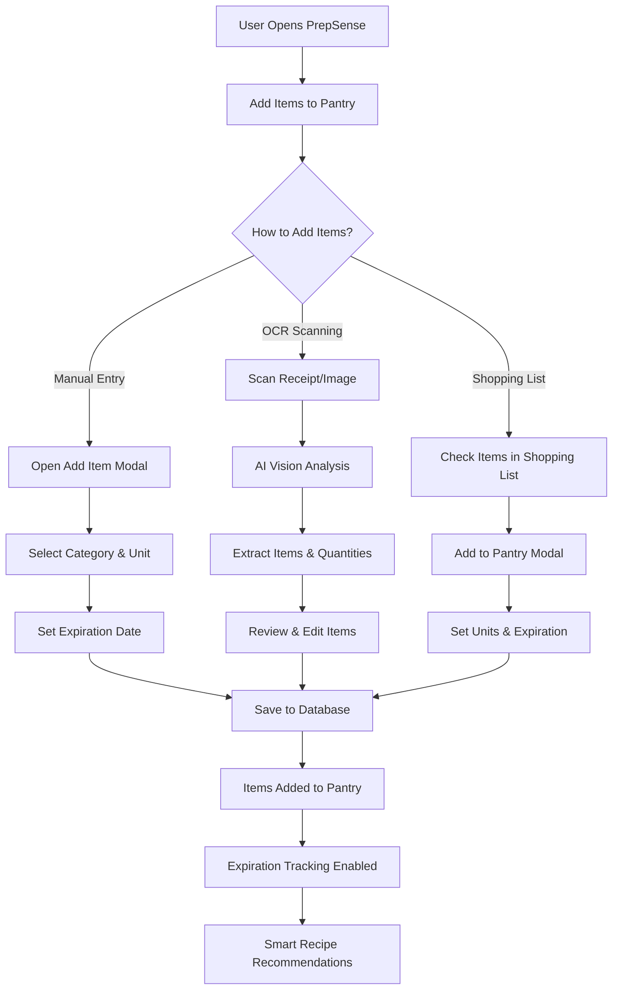
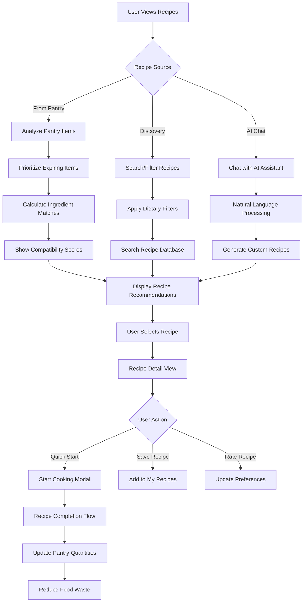
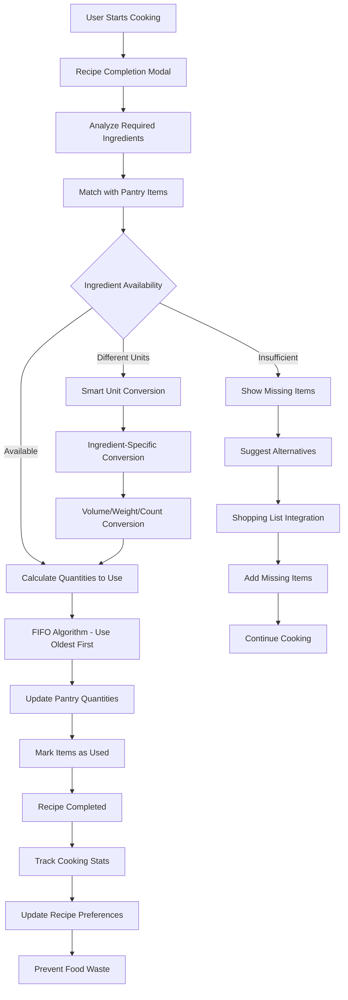
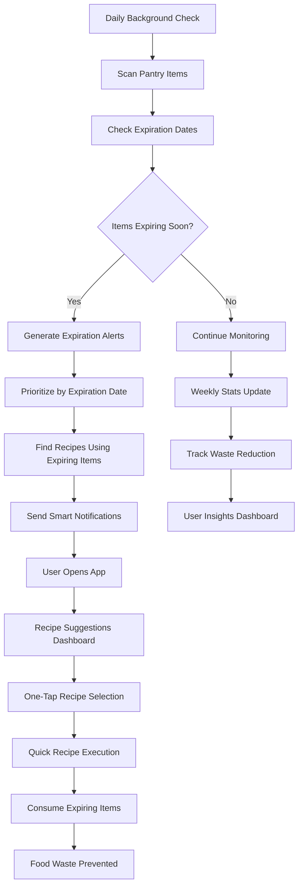
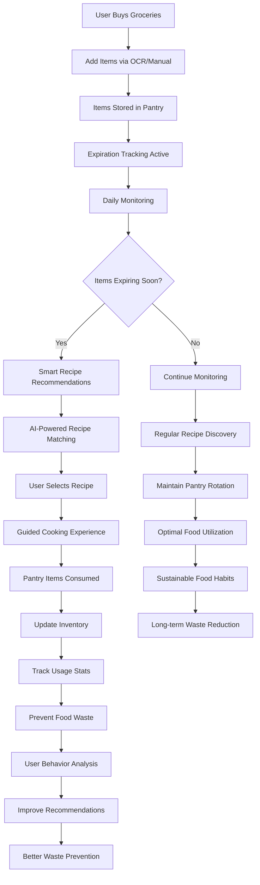

# PrepSense User Story Flowcharts

## Overview
PrepSense is a comprehensive pantry management application designed to help users reduce food waste by providing intelligent recipe recommendations based on available ingredients and expiration dates.

## Core User Story: Reducing Food Waste

### 1. Pantry Management Flow

### 2. Recipe Discovery & Food Waste Prevention

### 3. Intelligent Cooking Assistant Flow

### 4. Smart Notifications & Expiration Management

### 5. Complete User Journey: Food Waste Reduction Cycle

## Key Features That Enable Food Waste Reduction

### 1. **Intelligent Expiration Tracking**
- Automatic expiration date setting based on food categories
- Priority-based recipe recommendations for expiring items
- Proactive notifications before items spoil

### 2. **Smart Recipe Matching**
- AI-powered ingredient analysis
- Compatibility scoring for available ingredients
- Unit conversion system for precise measurements

### 3. **Seamless Pantry Management**
- OCR-powered receipt scanning
- Manual entry with smart categorization
- Shopping list integration with pantry

### 4. **Guided Cooking Experience**
- Step-by-step ingredient consumption tracking
- FIFO (First In, First Out) algorithm implementation
- Real-time pantry quantity updates

### 5. **Behavioral Learning System**
- Recipe rating and preference tracking
- Personalized recommendations based on usage patterns
- Continuous improvement of food waste prevention strategies

## Benefits to Users

1. **Reduced Food Waste**: Systematic tracking and utilization of pantry items
2. **Cost Savings**: Better ingredient utilization and meal planning
3. **Healthier Eating**: Diverse recipe recommendations based on available ingredients
4. **Time Efficiency**: Quick recipe discovery and cooking guidance
5. **Sustainable Living**: Contributing to environmental conservation through waste reduction

## Technical Implementation

- **Backend**: FastAPI with PostgreSQL for data persistence
- **Frontend**: React Native for cross-platform mobile experience
- **AI Integration**: OpenAI Vision API for OCR and recipe generation
- **Smart Algorithms**: Unit conversion, expiration tracking, and recipe matching
- **Cloud Infrastructure**: Google Cloud Platform for scalable deployment